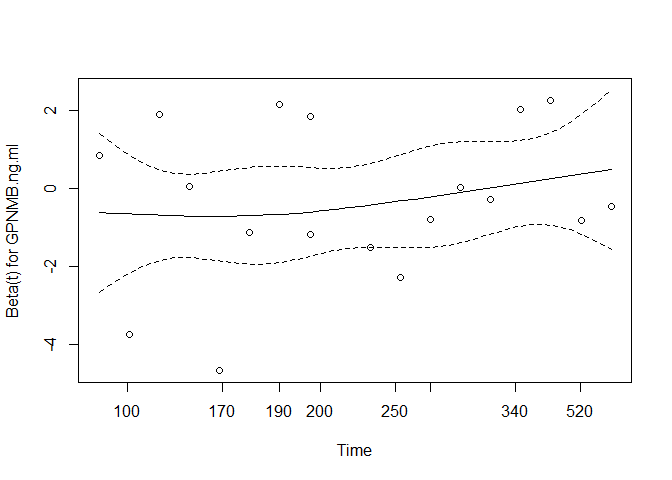
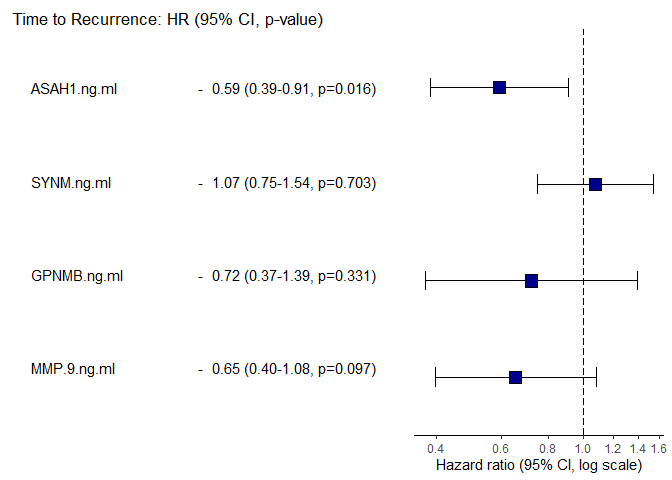
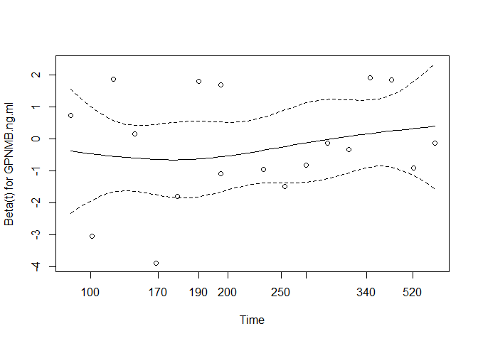
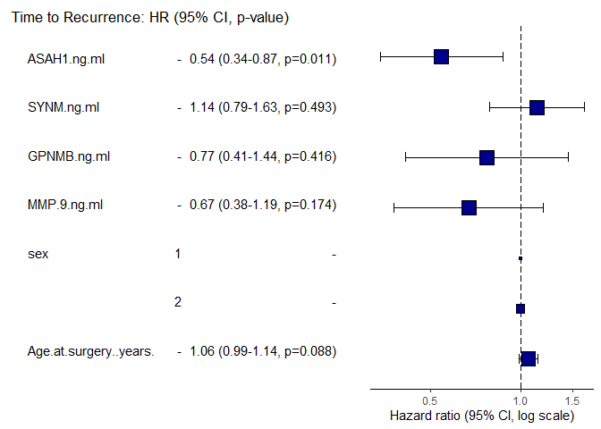

GBM Recurrence - Cox Proportional Hazards Model
================
Justin Sing - Miguel Cosenza-Contreras

- <a href="#initial-data-loading-and-wrangling"
  id="toc-initial-data-loading-and-wrangling"><span
  class="toc-section-number">1</span> Initial data loading and
  wrangling</a>
- <a href="#survival-analysis" id="toc-survival-analysis"><span
  class="toc-section-number">2</span> Survival analysis</a>
  - <a href="#cox-phm---including-only-sex-original-analysis"
    id="toc-cox-phm---including-only-sex-original-analysis"><span
    class="toc-section-number">2.1</span> Cox-PHM - including only sex
    (original analysis)</a>
    - <a href="#genarate-tabular-and-graphical-summaries"
      id="toc-genarate-tabular-and-graphical-summaries"><span
      class="toc-section-number">2.1.1</span> Genarate tabular and graphical
      summaries</a>
  - <a
    href="#cox-phm---including-only-sex-and-age-revision-version-analysis"
    id="toc-cox-phm---including-only-sex-and-age-revision-version-analysis"><span
    class="toc-section-number">2.2</span> Cox-PHM - including only sex and
    age (revision version analysis)</a>

``` r
knitr::opts_chunk$set(echo = TRUE, 
                      message = FALSE, 
                      warning = FALSE)

## Required packages ----
library(tidyverse)
```

    Warning: package 'ggplot2' was built under R version 4.3.1

    Warning: package 'purrr' was built under R version 4.3.1

    ── Attaching core tidyverse packages ──────────────────────── tidyverse 2.0.0 ──
    ✔ dplyr     1.1.2     ✔ readr     2.1.4
    ✔ forcats   1.0.0     ✔ stringr   1.5.0
    ✔ ggplot2   3.4.3     ✔ tibble    3.2.1
    ✔ lubridate 1.9.2     ✔ tidyr     1.3.0
    ✔ purrr     1.0.2     
    ── Conflicts ────────────────────────────────────────── tidyverse_conflicts() ──
    ✖ dplyr::filter() masks stats::filter()
    ✖ dplyr::lag()    masks stats::lag()
    ℹ Use the conflicted package (<http://conflicted.r-lib.org/>) to force all conflicts to become errors

``` r
library(ggpubr)
library(ggrepel)
library(cowplot)
```


    Attaching package: 'cowplot'

    The following object is masked from 'package:ggpubr':

        get_legend

    The following object is masked from 'package:lubridate':

        stamp

``` r
library(here)
```

    here() starts at C:/Users/migue/OneDrive/Documentos/R_Projects/5_projects/gbm/gbm_manuscript_data_analysis

``` r
library(survival)
```

    Warning: package 'survival' was built under R version 4.3.1

``` r
library(gt)


theme_set(theme(axis.text.x = element_text(hjust = 0.5, 
                                           vjust = 0, 
                                           size = 12, 
                                           angle = 360),
                axis.text.y = element_text(hjust = 0.5, 
                                           vjust = 0, 
                                           size = 12),
                panel.background = element_blank(),
                panel.grid.major = element_line(color = "grey"),
                panel.border = element_rect(colour = "black", 
                                            fill = NA, 
                                            linewidth = 1.5),
                axis.title=element_text(size = 12),
                legend.title = element_text(size = 12),
                legend.text = element_text(size = 11),
                legend.key.height = unit(4, 
                                         'mm'),
                legend.key.width = unit(4, 
                                        'mm'),
                legend.key.size = unit(10,
                                        'mm'),
                legend.position = "bottom"))
```

# Initial data loading and wrangling

Load the annotation with ASAH1 expression data

``` r
ttr_surv_data <- read_tsv(here::here("data/elisa_plasma_proteomics/ttr_survival_data.tsv"))
```

# Survival analysis

## Cox-PHM - including only sex (original analysis)

Fitting the model:

``` r
## COXPH ----
#ttr_surv_data
fit <- coxph(Surv(Time.to.reccurence..days., status) ~ sex +  ASAH1.ng.ml + SYNM.ng.ml + GPNMB.ng.ml + MMP.9.ng.ml, data = ttr_surv_data)
```

Model summary:

``` r
print(summary(fit))
```

    Call:
    coxph(formula = Surv(Time.to.reccurence..days., status) ~ sex + 
        ASAH1.ng.ml + SYNM.ng.ml + GPNMB.ng.ml + MMP.9.ng.ml, data = ttr_surv_data)

      n= 19, number of events= 18 
       (9 observations deleted due to missingness)

                    coef exp(coef) se(coef)      z Pr(>|z|)  
    sex         -0.03249   0.96803  0.58313 -0.056   0.9556  
    ASAH1.ng.ml -0.52807   0.58974  0.22298 -2.368   0.0179 *
    SYNM.ng.ml   0.06776   1.07011  0.18903  0.358   0.7200  
    GPNMB.ng.ml -0.32392   0.72331  0.33816 -0.958   0.3381  
    MMP.9.ng.ml -0.41722   0.65888  0.27693 -1.507   0.1319  
    ---
    Signif. codes:  0 '***' 0.001 '**' 0.01 '*' 0.05 '.' 0.1 ' ' 1

                exp(coef) exp(-coef) lower .95 upper .95
    sex            0.9680     1.0330    0.3087     3.036
    ASAH1.ng.ml    0.5897     1.6957    0.3809     0.913
    SYNM.ng.ml     1.0701     0.9345    0.7388     1.550
    GPNMB.ng.ml    0.7233     1.3825    0.3728     1.403
    MMP.9.ng.ml    0.6589     1.5177    0.3829     1.134

    Concordance= 0.718  (se = 0.077 )
    Likelihood ratio test= 7.88  on 5 df,   p=0.2
    Wald test            = 7.45  on 5 df,   p=0.2
    Score (logrank) test = 8.17  on 5 df,   p=0.1

Observation: Sex does not seem to represent a significant variable in
the model.

### Genarate tabular and graphical summaries

``` r
library(finalfit)

dependent_var <- "Surv(Time.to.reccurence..days., status)"
explanatory_vars <- c("ASAH1.ng.ml", "SYNM.ng.ml", "GPNMB.ng.ml", "MMP.9.ng.ml")

ttr_surv_data %>% 
    coxphmulti(dependent_var, explanatory_vars) %>% 
    cox.zph() %>% 
    {zph_result <<- .} %>% 
    plot(var=3)
```



``` r
#zph_result

ttr_surv_data %>%
  hr_plot(dependent_var, explanatory_vars, 
          dependent_label="Time to Recurrence")
```


``` r
ttr_surv_data %>%
  ff_plot(dependent_var, explanatory_vars, 
          dependent_label="Time to Recurrence")
```



## Cox-PHM - including only sex and age (revision version analysis)

This section was created as part of the revision process, to check for
the effect of age and sex in the model.

``` r
## COXPH ----
#ttr_surv_data
fit2 <- coxph(Surv(Time.to.reccurence..days., status) ~ sex + Age.at.surgery..years. + ASAH1.ng.ml + SYNM.ng.ml + GPNMB.ng.ml + MMP.9.ng.ml, data = ttr_surv_data)
```

Model summary:

``` r
print(summary(fit2))
```

    Call:
    coxph(formula = Surv(Time.to.reccurence..days., status) ~ sex + 
        Age.at.surgery..years. + ASAH1.ng.ml + SYNM.ng.ml + GPNMB.ng.ml + 
        MMP.9.ng.ml, data = ttr_surv_data)

      n= 19, number of events= 18 
       (9 observations deleted due to missingness)

                               coef exp(coef) se(coef)      z Pr(>|z|)  
    sex                    -0.22790   0.79620  0.62276 -0.366   0.7144  
    Age.at.surgery..years.  0.06170   1.06365  0.03614  1.707   0.0878 .
    ASAH1.ng.ml            -0.60744   0.54474  0.24005 -2.530   0.0114 *
    SYNM.ng.ml              0.12710   1.13553  0.18555  0.685   0.4934  
    GPNMB.ng.ml            -0.26025   0.77086  0.32028 -0.813   0.4165  
    MMP.9.ng.ml            -0.39958   0.67060  0.29407 -1.359   0.1742  
    ---
    Signif. codes:  0 '***' 0.001 '**' 0.01 '*' 0.05 '.' 0.1 ' ' 1

                           exp(coef) exp(-coef) lower .95 upper .95
    sex                       0.7962     1.2560    0.2349     2.698
    Age.at.surgery..years.    1.0636     0.9402    0.9909     1.142
    ASAH1.ng.ml               0.5447     1.8357    0.3403     0.872
    SYNM.ng.ml                1.1355     0.8806    0.7893     1.634
    GPNMB.ng.ml               0.7709     1.2973    0.4115     1.444
    MMP.9.ng.ml               0.6706     1.4912    0.3768     1.193

    Concordance= 0.735  (se = 0.076 )
    Likelihood ratio test= 10.88  on 6 df,   p=0.09
    Wald test            = 8.77  on 6 df,   p=0.2
    Score (logrank) test = 10.3  on 6 df,   p=0.1

``` r
?coxphmulti
```

Observation: p-value for age is 0.0878 in the model; while ASAH1
concentration is stil below 0.05.

``` r
dependent_var <- "Surv(Time.to.reccurence..days., status)"
explanatory_vars2 <- c("ASAH1.ng.ml", "SYNM.ng.ml", "GPNMB.ng.ml", "MMP.9.ng.ml",
                      "sex", "Age.at.surgery..years.") # includes sex and age

ttr_surv_data %>% 
    coxphmulti(dependent_var, explanatory_vars2) %>% 
    cox.zph() %>% 
    {zph_result2 <<- .} %>% 
    plot(var=3)
```



``` r
#zph_result2

ttr_surv_data %>%
  hr_plot(dependent_var, explanatory_vars2, dependent_label="Time to Recurrence")
```



``` r
ttr_surv_data %>%
  ff_plot(dependent_var, explanatory_vars2, dependent_label="Time to Recurrence")
```


When including Age and Sex in the model, ASAH1 concentrations are still
significantly associated with the time to recurrence. Age and sex are
not significant in the model.

``` r
ggsave(here::here("figures/cox_phm_summary_rev_version_w_age_n_sex.pdf"), 
       ttr_surv_data %>%
  ff_plot(dependent_var, explanatory_vars2, dependent_label="Time to Recurrence"), 
       width = 20, 
       height = 20,
       units = "cm")
```


``` r
ggsave(here::here("figures/cox_phm_summary_rev_version_w_age_n_sex.png"), 
       ttr_surv_data %>%
  ff_plot(dependent_var, explanatory_vars2, dependent_label="Time to Recurrence"), 
       width = 20, 
       height = 20,
       units = "cm")
```


``` r
dev.off()
```

    null device 
              1 
