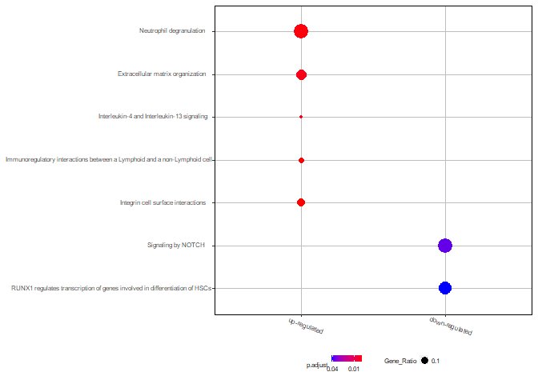

GBM recurrence - Shotgun proteomics analysis
================
Miguel Cosenza-Contreras

- <a href="#sample-annotation-info" id="toc-sample-annotation-info"><span
  class="toc-section-number">1</span> Sample annotation info</a>
  - <a href="#sample-annotation" id="toc-sample-annotation"><span
    class="toc-section-number">1.1</span> Sample annotation</a>
- <a href="#brief-note-on-data-analysis-and-processing"
  id="toc-brief-note-on-data-analysis-and-processing"><span
  class="toc-section-number">2</span> Brief note on data analysis and
  processing:</a>
- <a href="#id-coverage-before-sparicity-reduction-and-filtering"
  id="toc-id-coverage-before-sparicity-reduction-and-filtering"><span
  class="toc-section-number">3</span> ID Coverage before sparicity
  reduction and filtering</a>
- <a href="#exploratory-analysis" id="toc-exploratory-analysis"><span
  class="toc-section-number">4</span> Exploratory analysis</a>
  - <a href="#visualization-of-missing-values"
    id="toc-visualization-of-missing-values"><span
    class="toc-section-number">4.1</span> Visualization of missing
    values</a>
  - <a href="#plots-of-normalized-abundance-distribution"
    id="toc-plots-of-normalized-abundance-distribution"><span
    class="toc-section-number">4.2</span> Plots of normalized abundance
    distribution</a>
    - <a
      href="#normalized-ion-reporter-abundance-distribution-by-tmt-channelsample"
      id="toc-normalized-ion-reporter-abundance-distribution-by-tmt-channelsample">Normalized
      ion reporter abundance distribution by TMT channel/sample</a>
    - <a href="#normalized-ion-reporter-abundance-distribution-by-protein"
      id="toc-normalized-ion-reporter-abundance-distribution-by-protein">Normalized
      ion reporter abundance distribution by protein</a>
    - <a
      href="#normalized-ion-reporter-abundance-distribution-by-protein-and-batch"
      id="toc-normalized-ion-reporter-abundance-distribution-by-protein-and-batch">Normalized
      ion reporter abundance distribution by protein and batch</a>
  - <a href="#exploratory-pca" id="toc-exploratory-pca"><span
    class="toc-section-number">4.3</span> Exploratory PCA</a>
  - <a href="#pca-plot-on-samples-based-on-protein-abundance"
    id="toc-pca-plot-on-samples-based-on-protein-abundance"><span
    class="toc-section-number">4.4</span> PCA plot on samples based on
    protein abundance</a>
  - <a href="#exploratory-spls-da" id="toc-exploratory-spls-da"><span
    class="toc-section-number">4.5</span> Exploratory sPLS-DA</a>
  - <a href="#sparcity-reduction" id="toc-sparcity-reduction"><span
    class="toc-section-number">4.6</span> Sparcity reduction</a>
  - <a href="#missing-value-imputation-missforest"
    id="toc-missing-value-imputation-missforest"><span
    class="toc-section-number">4.7</span> Missing value imputation
    (<code>missForest</code>)</a>
- <a href="#differential-abundance-analysis-daa"
  id="toc-differential-abundance-analysis-daa"><span
  class="toc-section-number">5</span> Differential abundance analysis
  (DAA)</a>
  - <a href="#set-up-design-matrix" id="toc-set-up-design-matrix"><span
    class="toc-section-number">5.1</span> Set up design matrix</a>
  - <a href="#fit-linear-model-limma" id="toc-fit-linear-model-limma"><span
    class="toc-section-number">5.2</span> Fit linear model
    (<code>limma</code>)</a>
  - <a href="#volcano-plot-daa-visualization"
    id="toc-volcano-plot-daa-visualization"><span
    class="toc-section-number">5.3</span> Volcano plot (DAA
    visualization)</a>
  - <a href="#boxplots-specific-proteins"
    id="toc-boxplots-specific-proteins"><span
    class="toc-section-number">5.4</span> Boxplots specific proteins</a>
    - <a href="#asah1-vs-mpo-abundance-rec-vs-init"
      id="toc-asah1-vs-mpo-abundance-rec-vs-init"><span
      class="toc-section-number">5.4.0.1</span> ASAH1 vs MPO abundance (Rec vs
      Init)</a>
  - <a href="#differences-in-abundance-of-asah1-by-type-of-resection"
    id="toc-differences-in-abundance-of-asah1-by-type-of-resection"><span
    class="toc-section-number">5.5</span> Differences in abundance of ASAH1
    by type of resection</a>
- <a href="#id-coverage-after-sparcity-reduction"
  id="toc-id-coverage-after-sparcity-reduction"><span
  class="toc-section-number">6</span> ID coverage after sparcity
  reduction</a>
- <a href="#exploratory-analysis-after-sparcity-reduction"
  id="toc-exploratory-analysis-after-sparcity-reduction"><span
  class="toc-section-number">7</span> Exploratory analysis after sparcity
  reduction</a>
  - <a href="#plots-of-normalized-abundance-distribution-1"
    id="toc-plots-of-normalized-abundance-distribution-1"><span
    class="toc-section-number">7.1</span> Plots of normalized abundance
    distribution</a>
    - <a
      href="#normalized-ion-reporter-abundance-distribution-by-tmt-channelsample-1"
      id="toc-normalized-ion-reporter-abundance-distribution-by-tmt-channelsample-1">Normalized
      ion reporter abundance distribution by TMT channel/sample</a>
- <a href="#over-representation-analysestests-oras"
  id="toc-over-representation-analysestests-oras"><span
  class="toc-section-number">8</span> Over-representation analyses/tests
  (ORAs)</a>
  - <a href="#reactome" id="toc-reactome"><span
    class="toc-section-number">8.1</span> Reactome</a>
    - <a href="#dotplot-reactome" id="toc-dotplot-reactome"><span
      class="toc-section-number">8.1.1</span> Dotplot Reactome</a>
    - <a href="#cnet-plot-reactome" id="toc-cnet-plot-reactome"><span
      class="toc-section-number">8.1.2</span> Cnet plot Reactome</a>
- <a href="#protein-coverage-plots" id="toc-protein-coverage-plots"><span
  class="toc-section-number">9</span> Protein coverage plots</a>
  - <a href="#annotate-peptides-from-interesting-proteins"
    id="toc-annotate-peptides-from-interesting-proteins">Annotate peptides
    from interesting proteins</a>
  - <a href="#asah1" id="toc-asah1"><span
    class="toc-section-number">9.1</span> ASAH1</a>
  - <a href="#symn" id="toc-symn"><span
    class="toc-section-number">9.2</span> SYMN</a>
- <a href="#associate-protein-expression-with-time-to-recurrence"
  id="toc-associate-protein-expression-with-time-to-recurrence"><span
  class="toc-section-number">10</span> Associate protein expression with
  Time to Recurrence</a>
  - <a
    href="#whats-the-association-of-asah1synmgpnnmbmmp9-at-initial-stage-with-time-to-recurrence"
    id="toc-whats-the-association-of-asah1synmgpnnmbmmp9-at-initial-stage-with-time-to-recurrence"><span
    class="toc-section-number">10.1</span> What’s the association of
    ASAH1/SYNM/GPNNMB/MMP9 at Initial stage with time to recurrence?</a>
  - <a
    href="#whats-the-association-of-asah1synmgpnnmbmmp9-at-recurrent-stage-with-time-to-recurrence"
    id="toc-whats-the-association-of-asah1synmgpnnmbmmp9-at-recurrent-stage-with-time-to-recurrence"><span
    class="toc-section-number">10.2</span> What’s the association of
    ASAH1/SYNM/GPNNMB/MMP9 at Recurrent stage with time to recurrence?</a>

``` r
knitr::opts_chunk$set(echo = TRUE, 
                      message = FALSE, 
                      warning = FALSE)

source(here::here("scr/helper_functions.R"))
```

``` r
## Required packages ----
library(tidyverse)
library(mixOmics)
library(fs)
library(kableExtra)
library(sva)
library(limma)
library(naniar)
library(missForest)
library(clusterProfiler)
library(ReactomePA)
library(org.Hs.eg.db)
library(DT)
library(here)
library(janitor)
library(drawProteins)
library(seqinr)
library(ggpubr)
library(ggrepel)
library(extrafont)
```

``` r
theme_set(theme(axis.text.x = element_text(hjust = 0.5, 
                                           vjust = 0, 
                                           size = 6, 
                                           angle = 360),
                axis.text.y = element_text(hjust = 0.5, 
                                           vjust = 0, 
                                           size = 6),
                panel.background = element_blank(),
                panel.grid.major = element_line(color = "grey"),
                panel.border = element_rect(colour = "black", 
                                            fill = NA, 
                                            size = 1.5),
                axis.title=element_text(size = 8),
                legend.title = element_text(size = 8),
                legend.key.height = unit(3, 
                                         'mm'),
                legend.key.width = unit(3, 
                                        'mm'),
                legend.position = "bottom"))
```

The following report holds the code, results and interpretation of the
proteomics data analysis of Initial-Recurrent glioblastoma (GBM) samples
of matched patients.

# Sample annotation info

``` r
sample_annotation <- read_csv(here("data/sample_annotation.csv"))

# correct annotation

sample_annotation2 <- sample_annotation %>%
  mutate(patient = paste("x",
                         patient,
                         sep = ""),
         recurrence = case_when(recurrence == "initial" ~ "prim",
                                recurrence == "recurrent" ~ "rec",
                                TRUE ~ recurrence)) %>%
  mutate(paired_id = paste(patient, 
                           recurrence, 
                           sep = "_")) %>%
  filter(recurrence %in% c("prim", 
                           "rec"))

sample_annotationwo6 <- sample_annotation2 %>%
  filter(patient != "x6")
```

## Sample annotation

### Brief note on sample annotation:

Twenty-two patient matched samples (corresponding to 11 patients) were
processed for protein extraction, TMT-labelled and submitted via high-pH
fractionation and further analyzed via LC-MS/MS.

<table class="table table-striped table-hover" style="font-size: 14px; margin-left: auto; margin-right: auto;">
 <thead>
  <tr>
   <th style="text-align:left;"> sample_id </th>
   <th style="text-align:left;"> patient </th>
   <th style="text-align:left;"> recurrence </th>
   <th style="text-align:left;"> channel </th>
   <th style="text-align:left;"> mixture </th>
   <th style="text-align:right;"> irt_microl </th>
  </tr>
 </thead>
<tbody>
  <tr>
   <td style="text-align:left;"> empty </td>
   <td style="text-align:left;"> empty </td>
   <td style="text-align:left;"> empty </td>
   <td style="text-align:left;"> 126 </td>
   <td style="text-align:left;"> tmt_1 </td>
   <td style="text-align:right;"> 4 </td>
  </tr>
  <tr>
   <td style="text-align:left;"> 2013/210 </td>
   <td style="text-align:left;"> 1 </td>
   <td style="text-align:left;"> initial </td>
   <td style="text-align:left;"> 127N </td>
   <td style="text-align:left;"> tmt_1 </td>
   <td style="text-align:right;"> 4 </td>
  </tr>
  <tr>
   <td style="text-align:left;"> 2014/79 </td>
   <td style="text-align:left;"> 1 </td>
   <td style="text-align:left;"> recurrent </td>
   <td style="text-align:left;"> 127C </td>
   <td style="text-align:left;"> tmt_1 </td>
   <td style="text-align:right;"> 4 </td>
  </tr>
  <tr>
   <td style="text-align:left;"> 2015/18 </td>
   <td style="text-align:left;"> 2 </td>
   <td style="text-align:left;"> initial </td>
   <td style="text-align:left;"> 128N </td>
   <td style="text-align:left;"> tmt_1 </td>
   <td style="text-align:right;"> 6 </td>
  </tr>
  <tr>
   <td style="text-align:left;"> 2015/163 </td>
   <td style="text-align:left;"> 2 </td>
   <td style="text-align:left;"> recurrent </td>
   <td style="text-align:left;"> 128C </td>
   <td style="text-align:left;"> tmt_1 </td>
   <td style="text-align:right;"> 6 </td>
  </tr>
  <tr>
   <td style="text-align:left;"> 2012/49 </td>
   <td style="text-align:left;"> 3 </td>
   <td style="text-align:left;"> initial </td>
   <td style="text-align:left;"> 129N </td>
   <td style="text-align:left;"> tmt_1 </td>
   <td style="text-align:right;"> 6 </td>
  </tr>
  <tr>
   <td style="text-align:left;"> 2013/145 </td>
   <td style="text-align:left;"> 3 </td>
   <td style="text-align:left;"> recurrent </td>
   <td style="text-align:left;"> 129C </td>
   <td style="text-align:left;"> tmt_1 </td>
   <td style="text-align:right;"> 8 </td>
  </tr>
  <tr>
   <td style="text-align:left;"> 2013/84 </td>
   <td style="text-align:left;"> 4 </td>
   <td style="text-align:left;"> initial </td>
   <td style="text-align:left;"> 130N </td>
   <td style="text-align:left;"> tmt_1 </td>
   <td style="text-align:right;"> 8 </td>
  </tr>
  <tr>
   <td style="text-align:left;"> 2016/154 </td>
   <td style="text-align:left;"> 4 </td>
   <td style="text-align:left;"> recurrent </td>
   <td style="text-align:left;"> 130C </td>
   <td style="text-align:left;"> tmt_1 </td>
   <td style="text-align:right;"> 8 </td>
  </tr>
  <tr>
   <td style="text-align:left;"> pool </td>
   <td style="text-align:left;"> pool </td>
   <td style="text-align:left;"> pool </td>
   <td style="text-align:left;"> 131 </td>
   <td style="text-align:left;"> tmt_1 </td>
   <td style="text-align:right;"> 8 </td>
  </tr>
  <tr>
   <td style="text-align:left;"> pool </td>
   <td style="text-align:left;"> pool </td>
   <td style="text-align:left;"> pool </td>
   <td style="text-align:left;"> 131C </td>
   <td style="text-align:left;"> tmt_1 </td>
   <td style="text-align:right;"> 8 </td>
  </tr>
  <tr>
   <td style="text-align:left;"> pool </td>
   <td style="text-align:left;"> pool </td>
   <td style="text-align:left;"> pool </td>
   <td style="text-align:left;"> 126 </td>
   <td style="text-align:left;"> tmt_2 </td>
   <td style="text-align:right;"> 4 </td>
  </tr>
  <tr>
   <td style="text-align:left;"> empty </td>
   <td style="text-align:left;"> empty </td>
   <td style="text-align:left;"> empty </td>
   <td style="text-align:left;"> 127N </td>
   <td style="text-align:left;"> tmt_2 </td>
   <td style="text-align:right;"> 4 </td>
  </tr>
  <tr>
   <td style="text-align:left;"> 2015/139 </td>
   <td style="text-align:left;"> 5 </td>
   <td style="text-align:left;"> initial </td>
   <td style="text-align:left;"> 127C </td>
   <td style="text-align:left;"> tmt_2 </td>
   <td style="text-align:right;"> 4 </td>
  </tr>
  <tr>
   <td style="text-align:left;"> 2016/183 </td>
   <td style="text-align:left;"> 5 </td>
   <td style="text-align:left;"> recurrent </td>
   <td style="text-align:left;"> 128N </td>
   <td style="text-align:left;"> tmt_2 </td>
   <td style="text-align:right;"> 6 </td>
  </tr>
  <tr>
   <td style="text-align:left;"> 2015/150 </td>
   <td style="text-align:left;"> 6 </td>
   <td style="text-align:left;"> initial </td>
   <td style="text-align:left;"> 128C </td>
   <td style="text-align:left;"> tmt_2 </td>
   <td style="text-align:right;"> 6 </td>
  </tr>
  <tr>
   <td style="text-align:left;"> 2016/178 </td>
   <td style="text-align:left;"> 6 </td>
   <td style="text-align:left;"> recurrent </td>
   <td style="text-align:left;"> 129N </td>
   <td style="text-align:left;"> tmt_2 </td>
   <td style="text-align:right;"> 6 </td>
  </tr>
  <tr>
   <td style="text-align:left;"> 2015/161 </td>
   <td style="text-align:left;"> 7 </td>
   <td style="text-align:left;"> initial </td>
   <td style="text-align:left;"> 129C </td>
   <td style="text-align:left;"> tmt_2 </td>
   <td style="text-align:right;"> 8 </td>
  </tr>
  <tr>
   <td style="text-align:left;"> 2016/211 </td>
   <td style="text-align:left;"> 7 </td>
   <td style="text-align:left;"> recurrent </td>
   <td style="text-align:left;"> 130N </td>
   <td style="text-align:left;"> tmt_2 </td>
   <td style="text-align:right;"> 8 </td>
  </tr>
  <tr>
   <td style="text-align:left;"> 2016/65 </td>
   <td style="text-align:left;"> 8 </td>
   <td style="text-align:left;"> initial </td>
   <td style="text-align:left;"> 130C </td>
   <td style="text-align:left;"> tmt_2 </td>
   <td style="text-align:right;"> 8 </td>
  </tr>
  <tr>
   <td style="text-align:left;"> 2016/189 </td>
   <td style="text-align:left;"> 8 </td>
   <td style="text-align:left;"> recurrent </td>
   <td style="text-align:left;"> 131 </td>
   <td style="text-align:left;"> tmt_2 </td>
   <td style="text-align:right;"> 8 </td>
  </tr>
  <tr>
   <td style="text-align:left;"> pool </td>
   <td style="text-align:left;"> pool </td>
   <td style="text-align:left;"> pool </td>
   <td style="text-align:left;"> 131C </td>
   <td style="text-align:left;"> tmt_2 </td>
   <td style="text-align:right;"> 8 </td>
  </tr>
  <tr>
   <td style="text-align:left;"> pool </td>
   <td style="text-align:left;"> pool </td>
   <td style="text-align:left;"> pool </td>
   <td style="text-align:left;"> 126 </td>
   <td style="text-align:left;"> tmt_3 </td>
   <td style="text-align:right;"> 4 </td>
  </tr>
  <tr>
   <td style="text-align:left;"> pool </td>
   <td style="text-align:left;"> pool </td>
   <td style="text-align:left;"> pool </td>
   <td style="text-align:left;"> 127N </td>
   <td style="text-align:left;"> tmt_3 </td>
   <td style="text-align:right;"> 4 </td>
  </tr>
  <tr>
   <td style="text-align:left;"> empty </td>
   <td style="text-align:left;"> empty </td>
   <td style="text-align:left;"> empty </td>
   <td style="text-align:left;"> 127C </td>
   <td style="text-align:left;"> tmt_3 </td>
   <td style="text-align:right;"> 4 </td>
  </tr>
  <tr>
   <td style="text-align:left;"> 2016/70 </td>
   <td style="text-align:left;"> 9 </td>
   <td style="text-align:left;"> initial </td>
   <td style="text-align:left;"> 128N </td>
   <td style="text-align:left;"> tmt_3 </td>
   <td style="text-align:right;"> 6 </td>
  </tr>
  <tr>
   <td style="text-align:left;"> 2016/207 </td>
   <td style="text-align:left;"> 9 </td>
   <td style="text-align:left;"> recurrent </td>
   <td style="text-align:left;"> 128C </td>
   <td style="text-align:left;"> tmt_3 </td>
   <td style="text-align:right;"> 6 </td>
  </tr>
  <tr>
   <td style="text-align:left;"> 2016/145 </td>
   <td style="text-align:left;"> 10 </td>
   <td style="text-align:left;"> initial </td>
   <td style="text-align:left;"> 129N </td>
   <td style="text-align:left;"> tmt_3 </td>
   <td style="text-align:right;"> 6 </td>
  </tr>
  <tr>
   <td style="text-align:left;"> 2016/249 </td>
   <td style="text-align:left;"> 10 </td>
   <td style="text-align:left;"> recurrent </td>
   <td style="text-align:left;"> 129C </td>
   <td style="text-align:left;"> tmt_3 </td>
   <td style="text-align:right;"> 8 </td>
  </tr>
  <tr>
   <td style="text-align:left;"> 2016/231 </td>
   <td style="text-align:left;"> 11 </td>
   <td style="text-align:left;"> initial </td>
   <td style="text-align:left;"> 130N </td>
   <td style="text-align:left;"> tmt_3 </td>
   <td style="text-align:right;"> 8 </td>
  </tr>
  <tr>
   <td style="text-align:left;"> 2017/50 </td>
   <td style="text-align:left;"> 11 </td>
   <td style="text-align:left;"> recurrent </td>
   <td style="text-align:left;"> 130C </td>
   <td style="text-align:left;"> tmt_3 </td>
   <td style="text-align:right;"> 8 </td>
  </tr>
  <tr>
   <td style="text-align:left;"> empty </td>
   <td style="text-align:left;"> empty </td>
   <td style="text-align:left;"> empty </td>
   <td style="text-align:left;"> 131 </td>
   <td style="text-align:left;"> tmt_3 </td>
   <td style="text-align:right;"> 8 </td>
  </tr>
  <tr>
   <td style="text-align:left;"> empty </td>
   <td style="text-align:left;"> empty </td>
   <td style="text-align:left;"> empty </td>
   <td style="text-align:left;"> 131C </td>
   <td style="text-align:left;"> tmt_3 </td>
   <td style="text-align:right;"> 8 </td>
  </tr>
</tbody>
</table>

# Brief note on data analysis and processing:

Three proteomics data analysis approaches were used to explore the
spectral data and will be briefly described:

1.  General large scale proteomics.
2.  Proteolytic processing.
3.  Proteogenomics

The FragPipe bioinformatic pipeline was used for each of these
approaches with varying parameters depending on the type of explorative
approach.

**This report holds the code, analysis, visualizations and results for
the General large scale proteomics approach.**

**1. General large scale proteomics analyses** : In order to explore the
differential abundance of proteins between Recurrent and Initial tumor,
a fully-tryptic search was performed against the EBI Human canonical
proteome (version 2021_03), appended with common contaminants and iRT
peptides. A minimum percentage of %5 of the total summed reporter ion
intensities were required to consider a peptide and reporter ion for
quantitation.

**2. Proteolytic processing**: The large scale evaluation of
differential proteolytic activity between recurrent vs primary tumor was
executed via a semi-tryptic search against the EBI Human canonical
proteome (version 2021_03), appended with common contaminants and iRT
peptides. A minimum percentage of %5 of the total summed reporter ion
intensities were required to consider a peptide and reporter ion for
quantitation.

**3. Proteogenomics**: The explorative proteogenomics analysis started
with the generation of a GBM-specific database from publicly available
RNA-seq sequencing data from tumor specimens. Fastq files were obtain
from the SRA BioProject PRJNA627121 (Cell Rep, 2021 Mar 2;34(9):108787).
Eight samples containing paired reads were selected, based on: 1) the
higher number of reads per file; 2) having a similar proportion of males
and females and 3) not bearing isocitrate-dehyderogenase (IDH)-1
mutation (IDH WT). None of these patients undergo previous treatment,
therefore potential variants in the sequencing data are not expected to
be associated to treatment-related mutagenic processes. Spectral data
was then searched against this custom database using a fully-tryptic
approac. No minimum intensity threshold was set for reporter ion
intensity for quantitation.

Exceptionally when stated differently within each sub-approach described
above, all these searches were executed using the following parameters:
MSFragger was used as a search engine, setting a fully or semi-tryptic
specificity allowing for 1 missed cleavages. Precursor mass tolerance
was set to -20/20 and fragment mass tolerance of 20 ppm with mass
calibration and parameter optimization resulting in 5 ppm. Peptide
N-terminal acetylation and peptide N-terminal TMT labeling were set as
variable modifications. TMT labelling at K and carbamidomethylation of C
were set as fixed modifications. MSBooster was used for deep-learning
based predictions of retention time and spectra. Predicted features were
used by Percolator for post-processing scoring and false discovery rate
(FDR) control via target-decoy competition of all peptide-to-spectrum
matches (PSMs) obtained from MSFragger search. ProteinProphet was used
as a protein inference algorithm keeping all PSMs with probability score
bigger than 0.9. Final report and FDR estimation was based on the
filtered PSM and protein lists before protein scoring.

Relative quantitation of identified peptides within each sample was
performed via their reported ion intensities using TMT-integrator. Only
PSMs coming from unique peptides with a minimum probability of 0.9 and
an isotopic purity of at least 50% were considered for quantitation.
Quantitative values were normalized via median centering and summarized
by protein/gene and peptide using a virtual reference channel, to
finally generate protein and peptide normalized abundance matrices of
abundance used for further statistical processing in combination with
the sample annotation.

# Initial data loading and wrangling

``` r
## tmt-integrator output loading 
tmt_protdata_frag <- read_tsv(here("data/specific_search_fragpipe17/specific_no_ptms_2/tmt-report/abundance_protein_MD.tsv")) %>% 
  janitor::clean_names()

identified_proteins <- read_tsv(here("data/specific_search_fragpipe17/specific_no_ptms_2/combined_protein.tsv")) %>% 
  janitor::clean_names()

identified_peptides <- read_tsv(here("data/specific_search_fragpipe17/specific_no_ptms_2/combined_peptide.tsv")) %>%
  janitor::clean_names()

fasta_ident_prots <- read.fasta(here("data/specific_search_fragpipe17/specific_no_ptms_2/mix_2/protein.fas"), seqtype = "AA", as.string = TRUE)
```

``` r
# wide expression matrix with NAs
expr_matrix <- dplyr::select(tmt_protdata_frag,
                             Protein = index, 
                             starts_with("x"))

long_mat <- pivot_longer(expr_matrix,
                         cols = starts_with("x"),
                         names_sep = "_",
                         names_to = c("patient", 
                                      "recurrence"),
                         values_to = "Abundance")

long_mat_2 <- long_mat %>%
  mutate(paired_id = paste(patient, 
                           recurrence, 
                           sep = "_"))

paired_annot_uniq <- long_mat_2 %>%
  dplyr::select(patient, 
                recurrence, 
                paired_id) %>%
  distinct()

# correct annotation

sample_annotation2 <- sample_annotation %>%
  mutate(patient = paste("x", 
                         patient, 
                         sep = ""),
         recurrence = case_when(recurrence == "initial" ~ "prim",
                                recurrence == "recurrent" ~ "rec",
                                TRUE ~ recurrence)) %>%
  mutate(paired_id = paste(patient, 
                           recurrence, 
                           sep = "_")) %>%
  filter(recurrence %in% c("prim", 
                           "rec"))

## Annotated abundance data in long format ----

quant_annotated <- left_join(long_mat_2,
                             sample_annotation2, 
                             by = c("paired_id", 
                                    "patient",
                                    "recurrence")) %>%
  mutate(Channel_mix = paste(mixture, 
                             channel,  
                             sep = "_"))

## Wide xpression matrices without NAs
expr_matnona <- column_to_rownames(expr_matrix,
                                   "Protein") %>%
          as.matrix() %>%
          na.omit()
```

# ID Coverage before sparicity reduction and filtering

These numbers are based on the results from the output of FragPipe’s
TMT-integrator, before sparicity reduction and filtering.

``` r
ids_summary <- quant_annotated %>% 
  dplyr::select(Protein, mixture, Abundance) %>% 
  distinct(Protein, mixture, .keep_all = TRUE) %>%
  group_by(mixture) %>%
  summarise(`Nr of IDs` = sum(!is.na(Abundance))) %>% 
  bind_rows(.,
            tibble(mixture = "In all three",
                   `Nr of IDs` = nrow(expr_matnona))) %>%
  bind_rows(.,
            tibble(mixture = "Overall",
                   `Nr of IDs` = nrow(expr_matrix)))
```

- Number of identified proteins: 5954

- Number of identified and quantified proteins in all samples: 3228

``` r
ggplot(data = ids_summary,
       aes(y = `Nr of IDs`, x = mixture)) +
  geom_col(fill = "#008683") + 
  geom_text(size = 5, 
            position = position_stack(vjust = 0.5), 
            aes(label = `Nr of IDs`)) +
  coord_cartesian(ylim = c(0, 5000))+
  coord_flip() +
  labs(title = "Number of Identified and quantified Proteins by Mixture") +
  ylab("Nr of IDed and Quant Proteins") + 
  xlab("TMT Mixture") + 
  theme(axis.text.x = element_text(hjust = 0.5, 
                                   vjust = 0.1, 
                                   size = 10, 
                                   angle = 0),
        axis.text.y = element_text(hjust = 0.5, 
                                   vjust = 0.1, 
                                   size = 10, 
                                   angle = 0),
        panel.background = element_blank(),
        panel.grid.major = element_line(color = "grey"),
        panel.border = element_rect(colour = "black", 
                                    fill = NA, 
                                    size = 1.5),
        axis.title = element_text(size = 12,
                                face = "bold"))
```


# Exploratory analysis

## Visualization of missing values

``` r
vis_miss(expr_matrix) + 
          ggtitle("Distribution of missing values") + 
          theme(axis.text.x = element_text(hjust = 0.5, 
                                           vjust = 0.1, 
                                           size = 10, 
                                           angle = 90),
                axis.text.y = element_text(hjust = 0.5, 
                                           vjust = 0.1, 
                                           size = 10),
                panel.background = element_blank(),
                panel.grid.major = element_line(color = "grey"),
                panel.border = element_rect(colour = "black", 
                                            fill=NA, 
                                            size=1.5),
                axis.title = element_text(size = 12,
                                        face = "bold"))
```


There is an uneven distribution of missingness between TMT-batches.

## Plots of normalized abundance distribution

### Normalized ion reporter abundance distribution by TMT channel/sample

``` r
ggplot(quant_annotated,
                 mapping = aes(x = Channel_mix, 
                               y = Abundance, 
                               fill = recurrence)) +
          geom_boxplot() + 
          theme(axis.text.x = element_text(hjust = 0.5, 
                                           vjust = 0.1, 
                                           size = 10, 
                                           angle = 90),
                axis.text.y = element_text(hjust = 0.5, 
                                           vjust = 0.1, 
                                           size = 10),
                panel.background = element_blank(),
                panel.grid.major = element_line(color = "grey"),
                panel.border = element_rect(colour = "black", 
                                            fill = NA, 
                                            size = 1.5),
                axis.title = element_text(size = 12,
                                         face = "bold"))
```


The median-centering after TMT-integrator seem to show a slight
mixture-dependent centered median per sample. The paired distribution of
initial and recurrent tumor allows the biological effect to be more
important than any potential TMT-mixture-based batch effect.

The different abundance distribution can also be explained by a
different distribution of missing values.

PCA and sPLS-DA analysis allow to confirm this.

### Normalized ion reporter abundance distribution by protein

Select/sample *N* proteins to observe their abundance distributio.

``` r
which_prots <- sample_proteins(x = quant_annotated$Protein,
                               size = 50,
                               seed = 156)
```

50 proteins were randomly sampled to check for the normality of their
‘normalized’ Abundance distribution.

``` r
ggplot(quant_annotated %>% 
          filter(Protein %in% which_prots),
                 mapping = aes(x = reorder(Protein,
                                           Abundance,
                                           na.rm = TRUE), 
                               y = Abundance)) +
          geom_boxplot() + 
          geom_jitter(color = "black", 
                      size = 0.4, 
                      alpha = 0.9) +
          labs(subtitle = "Protein IDs arranged by median abudance",
               x = "Protein ID ") + 
          theme(axis.text.x = element_text(hjust = 0.5, 
                                           vjust = 0.1, 
                                           size = 10, 
                                           angle = 90),
                axis.text.y = element_text(hjust = 0.5, 
                                           vjust = 0.1, 
                                           size = 10),
                panel.background = element_blank(),
                panel.grid.major = element_line(color = "grey"),
                panel.border = element_rect(colour = "black", fill=NA, size=1.5),
                axis.title=element_text(size=12,face="bold"))
```


### Normalized ion reporter abundance distribution by protein and batch

50 proteins were randomly sampled to check for the normality of their
‘normalized’ Abundance distribution.

``` r
ggplot(quant_annotated %>% 
                         filter(Protein %in% which_prots),
                 mapping = aes(x = reorder(Protein,
                                           Abundance,
                                           na.rm = TRUE), 
                               y = Abundance, 
                               fill = mixture)) +
          geom_boxplot() + 
          geom_jitter(color = "black", 
                      size = 0.4, 
                      alpha = 0.9) +
          labs(subtitle = "Protein IDs arranged by median abudance",
                       x = "Protein ID ") + 
          facet_grid(.~mixture, 
                     scales = "free") +
          theme(axis.text.x = element_text(hjust = 0.5, 
                                           vjust = 0.1, 
                                           size = 10, 
                                           angle = 90),
                axis.text.y = element_text(hjust = 0.5, 
                                           vjust = 0.1, 
                                           size = 10),
                panel.background = element_blank(),
                panel.grid.major = element_line(color = "grey"),
                panel.border = element_rect(colour = "black", 
                                            fill = NA, 
                                            size = 1.5),
                axis.title = element_text(size = 12,
                                          face = "bold"))
```


The abundance distribution of individual proteins can be considered as
normaly distributed in general, which makes then suitable for
inferential statistics via linear models.

## Exploratory PCA

## Percentage of explained variance per component

The PCA was applied on the expression matrix without missing values

``` r
pca_res <- pca(t_expr_matnona, 
               ncomp = 10, 
               center = TRUE, 
               scale = TRUE)
```

``` r
plot(pca_res)
```


\~45% of variance based on protein abundance can be explained by
components 1 and 2 after PCA.

## PCA plot on samples based on protein abundance

``` r
# preprocess pca results 
pca_variates <- pca_res$variates$X %>% 
  as.data.frame() %>%
  rownames_to_column("Sample") %>%
  separate(col = "Sample",
           into = c("sample", 
                    "recurrence", 
                    "mixture"),
           sep = "\\_", 
           extra = "merge") %>%
  mutate(paired_id = paste(sample, 
                           recurrence, 
                           sep = "_")) %>%
  dplyr::select(-c(mixture, 
                   recurrence)) %>%
  left_join(. , sample_annotation2,
            by = "paired_id") %>%
  mutate(Stage = if_else(condition = recurrence == "prim", 
                         true = "Initial", 
                         false = "Recurrent"),
         Mix = case_when(mixture == "tmt_1" ~ "Mix1",
                         mixture == "tmt_2" ~ "Mix2",
                         mixture == "tmt_3" ~ "Mix3"))

pca_variateswopat6 <- pca_variates %>% 
  filter(patient != "x6")
```

``` r
ggplot(data = pca_variates,
       aes(x = PC1, 
           y = PC2)) +
  geom_point(size = 4, aes(shape = mixture, 
                           color = recurrence)) +  
  geom_text(aes(label = patient), 
            position = position_nudge(x = 4.5)) +
  labs(title = "PCA plot of samples\nBased on the abundance values of proteins") +
  xlab(paste("PC1", 
             round(pca_res$prop_expl_var$X[1]*100), 
             "% var explained")) + 
  ylab(paste("PC2", 
             round(pca_res$prop_expl_var$X[2]*100), 
             "% var explained")) + 
  theme(axis.text.x = element_text(hjust = 0.5, 
                                   vjust = 0, 
                                   size = 10, 
                                   angle = 360),
        axis.text.y = element_text(hjust = 0.95, 
                                   vjust = 0.2, 
                                   size = 10),
        panel.background = element_blank(),
        panel.grid.major = element_blank(),
        panel.border = element_rect(colour = "black", 
                                    fill=NA, 
                                    size=0.5),
        axis.title = element_text(size = 10),
        legend.text = element_text(size = 7),
        legend.title = element_text(size = 8),
        legend.key.height= unit(3, 'mm'),
        legend.key.width= unit(3, 'mm'),
        legend.position="bottom")
```


There is no evident batch effect after PCA analysis.

There is a good number of individual patients that show important
differences in their PCA variates values in recurrent vs primary.

``` r
ggplot(data = pca_variateswopat6,
       aes(x = PC1, y = PC2)) +
  geom_point(size = 4, aes(shape = mixture, 
                           color = recurrence)) +  
  geom_text(aes(label = patient), 
            position = position_nudge(x = 4.5)) +
  labs(title = "PCA plot of samples\nBased on the abundance values of proteins (patient 6 excluded)") +
  xlab(paste("PC1", 
             round(pca_res$prop_expl_var$X[1]*100), 
             "% var explained")) + 
  ylab(paste("PC2", 
             round(pca_res$prop_expl_var$X[2]*100), 
             "% var explained")) + 
  theme(axis.text.x = element_text(hjust = 0.5, 
                                   vjust = 0, 
                                   size = 10, 
                                   angle = 360),
        axis.text.y = element_text(hjust = 0.95, 
                                   vjust = 0.2, 
                                   size = 10),
        panel.background = element_blank(),
        panel.grid.major = element_blank(),
        panel.border = element_rect(colour = "black", 
                                    fill=NA, 
                                    size=0.5),
        axis.title = element_text(size = 10),
        legend.text = element_text(size = 7),
        legend.title = element_text(size = 8),
        legend.key.height= unit(3, 'mm'),
        legend.key.width= unit(3, 'mm'),
        legend.position="bottom")
```


``` r
pca_plot <- ggplot(data = pca_variateswopat6,
       aes(x = PC1, 
           y = PC2)) +
  geom_point(size = 4, aes(shape = Mix, 
                           color = Stage)) +  
  geom_text(aes(label = patient), 
            position = position_nudge(x = 4.5), 
            size = 2) +
  xlab(paste("PC1", 
             round(pca_res$prop_expl_var$X[1]*100), 
             "% var explained")) + 
  ylab(paste("PC2", 
             round(pca_res$prop_expl_var$X[2]*100), 
             "% var explained")) +
theme(axis.text.x = element_text(hjust = 0.5, 
                                 vjust = 0, 
                                 size = 7,
                                 angle = 360),
      axis.text.y = element_text(hjust = 0.95, 
                                 vjust = 0.2,
                                 size = 7),
      panel.background = element_blank(),
      panel.grid.major = element_blank(),
      panel.border = element_rect(colour = "black", 
                                  fill=NA, 
                                  size=0.5),
      axis.title = element_text(size = 7),
      legend.text = element_text(size = 7),
      legend.title = element_text(size = 8),
      legend.key.height= unit(3, 'mm'),
      legend.key.width= unit(3, 'mm'),
      legend.position="bottom")

ggsave(plot = pca_plot, 
       filename = here::here("figures/pca_proteomics_gbm.tiff"), 
       device = "tiff",
       units = "mm",
       width = 63,
       height = 50)

ggsave(plot = pca_plot, 
       filename = here::here("figures/pca_proteomics_gbm.eps"), 
       device = "eps",
       units = "mm",
       width = 63,
       height = 50)
```

## Exploratory sPLS-DA

``` r
plsda_rest1 <- plsda(X = t_expr_matnona,
                     Y = recurrence,
                     ncomp = 3)
```

``` r
plotIndiv(plsda_rest1,
          nd.names = TRUE, 
          ellipse = TRUE, 
          legend = FALSE, 
          title = "sPLS-DA_Rec-Prim", 
          size.title = rel(1.5), 
          size.xlabel = rel(1.5), 
          size.ylabel = rel(1.5), 
          siz.axis = rel(1.2), 
          point.lwd = 0.8, 
          cex = 3)  
```


Patient 6 in recurrence behaves suspiciously similar to initial samples.
We consider this to be an outlier associated to a potential problem
during sample prep.

Therefore we decided to exclude patient 6 from inferential analyses.

### sPLS-DA excluding ‘patient 6’

``` r
plsda_restwo6 <- plsda(X = t_expr_matnonawo6,
                       Y = recurrencewo6,
                       ncomp = 3)
```

``` r
plotIndiv(plsda_restwo6,
          nd.names = TRUE, 
          ellipse = TRUE, 
          legend = FALSE, 
          title = "sPLS-DA_Rec-Prim wo Pat6", 
          size.title = rel(1.5), 
          size.xlabel = rel(1.5), 
          size.ylabel = rel(1.5), 
          siz.axis = rel(1.2), 
          point.lwd = 0.8, 
          cex = 3)  
```


### GGplot-based visualization of Exploratory sPLS-DA

``` r
# preprocess pca results 
plsda_variates <- plsda_restwo6$variates$X %>% 
  as.data.frame() %>%
  rownames_to_column("Sample") %>%
  separate(col = "Sample",
           into = c("sample", 
                    "recurrence", 
                    "mixture"),
           sep = "\\_", 
           extra = "merge") %>%
  mutate(paired_id = paste(sample, 
                           recurrence, 
                           sep = "_")) %>%
  dplyr::select(-c(mixture, 
                   recurrence)) %>%
  left_join(. , sample_annotation2,
            by = "paired_id") 
```

``` r
ggplot(data = plsda_variates,
       aes(x = comp1, 
           y = comp2)) +
  geom_point(size = 4, aes(shape = mixture, 
                           color = recurrence)) +  
  geom_text(aes(label = patient), 
            position = position_nudge(x = 2)) +
  labs(title = "sPLS-DA plot of samples - pat6 excluded \nBased on the abundance values of proteins") +
  xlab(paste("sPLS-DA Comp-1", 
             round(plsda_restwo6$prop_expl_var$X[1]*100), 
             "% var explained")) + 
  ylab(paste("sPLS-DA Comp-2", 
             round(plsda_restwo6$prop_expl_var$X[2]*100), 
             "% var explained")) + 
  ggforce::geom_mark_ellipse(mapping = aes(color = recurrence)) +
  theme(axis.text.x = element_text(hjust = 0.5, 
                                   vjust = 0, 
                                   size = 10, 
                                   angle = 360),
        axis.text.y = element_text(hjust = 0.95, 
                                   vjust = 0.2, 
                                   size = 10),
        panel.background = element_blank(),
        panel.grid.major = element_blank(),
        panel.border = element_rect(colour = "black", 
                                    fill=NA, 
                                    size=0.5),
        axis.title = element_text(size = 10),
        legend.text = element_text(size = 7),
        legend.title = element_text(size = 8),
        legend.key.height= unit(3, 'mm'),
        legend.key.width= unit(3, 'mm'),
        legend.position="bottom")
```


The difference between initial and recurrent tumor is better resolved in
the sPLS-DA plot when excluding patient 6.

## Sparcity reduction

Only proteins that were identified and quantified in 2 out of 3 TMT
mixtures were kept for the inferential analysis. The proteins missing in
1 mixture were imputed with `missForest`.

``` r
# sel_proteins_missing function is listed in the helper functions
proteins2exclude <- sel_proteins_missing(quant_annotated,
                                         threshold = 1)
```

Exclude proteins from initial abundance matrix.

``` r
expr_matrix_filt <- expr_matrix2 %>%
  filter(!Protein %in% proteins2exclude)
```

### Missing values before and after filtering

``` r
nofiltnas_plot <- vis_miss(expr_matrix) + 
          ggtitle("Distribution of missing values",
                  subtitle = paste("All quant proteins. Total =", 
                                   nrow(expr_matrix))) + 
          theme(axis.text.x = element_text(hjust = 0.5, 
                                           vjust = 0.1, 
                                           size = 10, 
                                           angle = 90),
                axis.text.y = element_text(hjust = 0.5, 
                                           vjust = 0.1, 
                                           size = 10),
                panel.background = element_blank(),
                panel.grid.major = element_line(color = "grey"),
                panel.border = element_rect(colour = "black", 
                                            fill = NA, 
                                            size = 1.5),
                axis.title=element_text(size = 12,
                                        face = "bold"))

filtnas_plot <- vis_miss(expr_matrix_filt) + 
          ggtitle("Distribution of missing values",
                  subtitle = paste("Only present in 2/3 TMT mixtures. Total =",
                                   nrow(expr_matrix_filt))) + 
          theme(axis.text.x = element_text(hjust = 0.5, 
                                           vjust = 0.1, 
                                           size = 10, 
                                           angle = 90),
                axis.text.y = element_text(hjust = 0.5, 
                                           vjust = 0.1, 
                                           size = 10),
                panel.background = element_blank(),
                panel.grid.major = element_line(color = "grey"),
                panel.border = element_rect(colour = "black", 
                                            fill = NA, 
                                            size = 1.5),
                axis.title=element_text(size = 12,
                                        face = "bold"))
```

``` r
cowplot::plot_grid(nofiltnas_plot, 
                   filtnas_plot, 
                   ncol = 2)
```


## Missing value imputation (`missForest`)

``` r
mat_filt <- expr_matrix_filt %>%
  column_to_rownames("Protein") %>%
  as.matrix()

t_mat_filt <- t(mat_filt)

if(!file.exists(here("rds/missforest_imp_mat_filt.Rds"))){
  
 t_imp_mat_filt <- missForest::missForest(t_mat_filt)
 t_imp_filt_mat <- t_imp_mat_filt$ximp
 
 mat_filt_imp <- t(t_imp_filt_mat)
 
 saveRDS(t_imp_mat_filt,
         file = here("rds/missforest_imp_mat_filt.Rds"))
 
} else {
  
 t_imp_mat_filt <- readRDS(here("rds/missforest_imp_mat_filt.Rds"))
 t_imp_filt_mat <- t_imp_mat_filt$ximp
 
 mat_filt_imp <- t(t_imp_filt_mat)
  
}
```

# Differential abundance analysis (DAA)

**Protein to Gene annotation**

``` r
prot2gene <- identified_proteins %>%
  dplyr::select(Protein = protein_id, Gene = gene,
                Description = description)
```

**Prep protein abundance matrix**

``` r
mat_filt_impwo6 <- as.data.frame(mat_filt_imp) %>%
  rownames_to_column("Protein") %>%
  dplyr::select(-starts_with("x6")) %>%
  column_to_rownames("Protein") %>%
  as.matrix()

sample_annotationwo6 <- sample_annotation2 %>%
  filter(patient != "x6")
```

## Set up design matrix

Initial vs recurrent samples are patient-matched, therefore the design
matrix is setup so the linear model can account for the patient random
effect.

``` r
design_wo6 <- model.matrix(~ patientwo6 + recurrencewo6)

rownames(design_wo6) <- sample_annotationwo6$paired_id
```

Check design matrix:

``` r
print(design_wo6[1:4,])
```

            (Intercept) patientwo6x10 patientwo6x11 patientwo6x2 patientwo6x3
    x1_prim           1             0             0            0            0
    x1_rec            1             0             0            0            0
    x2_prim           1             0             0            1            0
    x2_rec            1             0             0            1            0
            patientwo6x4 patientwo6x5 patientwo6x7 patientwo6x8 patientwo6x9
    x1_prim            0            0            0            0            0
    x1_rec             0            0            0            0            0
    x2_prim            0            0            0            0            0
    x2_rec             0            0            0            0            0
            recurrencewo6rec
    x1_prim                0
    x1_rec                 1
    x2_prim                0
    x2_rec                 1

Check expression matrix:

``` r
mat_filt_impwo6[1:4,1:6]
```

                x1_prim   x1_rec  x2_prim   x2_rec  x3_prim   x3_rec
    A0A075B6H9 19.94963 18.06669 18.24085 18.60434 19.40524 18.81092
    A0A0A0MS15 18.53463 18.59081 17.84463 18.06341 19.35137 19.16811
    A0A0B4J1U7 22.16874 20.92584 20.55509 21.41375 22.41883 21.81234
    A0A0B4J1V0 18.23207 17.42065 16.90492 17.34192 17.97603 17.89968

## Fit linear model (`limma`)

``` r
source(here("scr/fit_limmawo6.R"))
```

``` r
# fit limma
limma_tab_wo6 <- fit_limmawo6(mat_filt_impwo6, 
                         design_wo6, 
                         method = 'robust', 
                         Limma = "Robust - w Patient effect",
                         prot2gene = prot2gene)

#get proteins increased in recurrence
increased_in_rec <- limma_tab_wo6 %>%
  filter(logFC > 0,
         adj.P.Val < 0.05) %>%
  pull(Protein)

#get proteins decreased in recurrence
decreased_in_rec <- limma_tab_wo6 %>%
  filter(logFC < 0,
         adj.P.Val < 0.05) %>%
  pull(Protein)
```

## Volcano plot (DAA visualization)

``` r
our_volcano(limma_tab_wo6, 
            FC_cutoff = 0, 
            pval_cutoff = 0.05, 
            color_diffex = "red", 
            color_nondifex = "#2a9d8f", 
            interesting_proteins = NULL, 
            vert_line_col = "red",
            hline_col = "red", 
            hline_pos = 0.05, 
            linetype = "dashed",
            increased_in = "Recurrent", 
            comparison_title = "Recurrent vs Initial") +
  theme(axis.text.x = element_text(hjust = 0.5, 
                                   vjust = 0, 
                                   size = 10, 
                                   angle = 360),
        axis.text.y = element_text(hjust = 0.95, 
                                   vjust = 0.2, 
                                   size = 10),
        panel.background = element_blank(),
        panel.grid.major = element_blank(),
        panel.border = element_rect(colour = "black", 
                                    fill = NA, 
                                    size = 0.5),
        axis.title = element_text(size = 10),
        legend.text = element_text(size = 7),
        legend.title = element_text(size = 8),
        legend.key.height= unit(3, 'mm'),
        legend.key.width= unit(3, 'mm'),
        legend.position="bottom") 
```


### Generate manuscript-ready volcano-plots

### Write tabular results (for supplementary tables)

``` r
write_tsv(x = limma_tab_wo6, 
          file = here("suppl_tables/diff_abundance_gbm_rec_vs_init_proteomics.tsv"))
```

## Boxplots specific proteins

``` r
quant_anwgene <- left_join(quant_annotated, 
                           prot2gene)

tab_2_paired_boxplot <-  quant_anwgene %>%
  filter(Gene %in% c("ASAH1", 
                     "SYNM", 
                     "GPNMB",
                     "MPO"))
# prep data
slim_data <- pivot_longer(expr_matrix_filt, 
                          cols = 2:length(names(expr_matrix_filt)), 
                          names_to = c("patient",
                                       "condition"),
                          values_to = "Intensity",
                          names_sep = "\\_") %>% 
  group_by(Protein)

slim_data2 <- pivot_wider(slim_data, 
                          values_from = Intensity, 
                          names_from = condition) %>%
  filter(patient != "x6")

slim_data3 <- slim_data2 %>% 
  mutate(Abs_diff = rec-prim) %>%
  mutate(rank = row_number(Abs_diff)) %>% 
  dplyr::rename(Initial = prim, 
                Recurrent = rec) %>%
  ungroup() %>%
  filter(Protein %in% c("Q13510", 
                        "Q14956", 
                        "O15061",
                        "P05164")) %>%
  mutate(Gene = case_when(Protein == "Q13510" ~ "ASAH1",
                          Protein == "Q14956" ~ "GPNMB",
                          Protein == "O15061" ~ "SYNM",
                          Protein == "P05164" ~ "MPO"))
```

``` r
ggpaired(slim_data3,
         cond1 = "Initial",
         cond2 = "Recurrent", 
         fill = "condition",
         ylab = "Normalized Abundance",
         label = NULL,
         repel = TRUE,
         facet.by = "Gene", 
         point.size = 0.2, 
         line.size = 0.1) 
```


#### ASAH1 vs MPO abundance (Rec vs Init)

``` r
tab_2_mporatio <- tab_2_paired_boxplot %>%
  filter(Gene %in% c("ASAH1", "MPO")) %>%
  dplyr::select(Gene,
                recurrence,
                Abundance,
                patient,
                sample_id) %>%
  mutate(Condition = case_when(recurrence == "prim" ~ "Initial", 
                               recurrence == "rec" ~ "Recurrent")) %>%
  dplyr::select(-recurrence)

mpo_ratio_prep <- tab_2_mporatio %>% 
  pivot_wider(values_from = Abundance,
              names_from = Gene) %>%
  filter(patient != "x6") %>%
  mutate(Ratio_MPO_vs_ASAH1 = ASAH1 - MPO) %>%
  dplyr::select(-c(MPO, ASAH1)) %>%
  pivot_wider(values_from = Ratio_MPO_vs_ASAH1,
              names_from = Condition) %>% 
  mutate(measure = "Delta(ASAH1 - MPO)")

mpo_ratio_prep2 <- tab_2_mporatio %>% 
  pivot_wider(values_from = Abundance,
              names_from = Gene) %>%
  filter(patient != "x6") 
```

``` r
paired_boxplots_asah1mporatio <- ggpaired(mpo_ratio_prep,
                                          cond1 = "Initial",
                                          cond2 = "Recurrent", 
                                          fill = "condition",
                                          ylab = "Abundance Delta(ASAH1 - MPO)",
                                          label = NULL,
                                          repel = TRUE,
                                          point.size = 0.2, 
                                          line.size = 0.1) +
      stat_compare_means(paired = TRUE, 
                         vjust = 2, 
                         size = 1.5) +
      theme(axis.text.x = element_text(hjust = 0.5, 
                                       vjust = 0, 
                                       size = 5, 
                                       angle = 360),
           axis.text.y = element_text(hjust = 0.95, 
                                      vjust = 0.2, 
                                      size = 5),
           panel.background = element_blank(),
           panel.grid.major = element_blank(),
           panel.border = element_rect(colour = "black", 
                                       fill = NA, 
                                       size = 0.5),
           axis.title = element_text(size = size),
           legend.position="none",
           strip.text = element_text(hjust = 0.5, 
                                     vjust = 0, 
                                     size = 4, 
                                     angle = 360,
                                     margin = margin(0.4,
                                                     0,
                                                     0.4,
                                                     0, "mm"),
                                     lineheight = 0.3))  
```

##### Compare Deltas of abundance (Boxplot)

``` r
print(paired_boxplots_asah1mporatio) 
```


##### Scatter plot ASAH1 vs MPO

``` r
scatter_asah1mpo <- ggplot(data = mpo_ratio_prep2,
                           aes(x = ASAH1,
                               y = MPO)) + 
                    geom_point(mapping = aes(color = Condition)) + 
                    geom_smooth(method = lm, 
                                se = FALSE, 
                                color = "black",
                                size = 0.5) 
```

``` r
print(scatter_asah1mpo)
```


## Differences in abundance of ASAH1 by type of resection

Load the patient clinical data

``` r
patients_proteomics <- patient_table %>%
  filter(`Mass Spectrometry` == "X") %>%
  dplyr::select(Sex, 
                `Age at surgery (years)`, 
                `Time-to-reccurence (days)`,
                `Type of resection`,
                `Tumor localization`, 
                Treatment,
                sample_id = `LAB-ID`) %>%
  mutate(`Time-to-reccurence (days)` = as.numeric(`Time-to-reccurence (days)`))
```

``` r
sample2patient_id <- mpo_ratio_prep2 %>% 
  dplyr::select(sample_id, 
                patient) %>% 
  distinct()

patients_proteomics <- left_join(patients_proteomics, 
                                 sample2patient_id) %>%
  dplyr::select(-matches("sample"))
```

``` r
resection_diff_asah1 <- left_join(mpo_ratio_prep2,
                                  patients_proteomics) %>% 
  dplyr::select(-MPO) %>%
  dplyr::rename(abundance_ASAH1 = ASAH1,
                type_resection = `Type of resection`) %>%
  na.exclude() %>%
  distinct()
```

``` r
resection_diff_asah1plot <- ggplot(data = resection_diff_asah1, 
                                   mapping = aes(x = Condition,
                                                 y = abundance_ASAH1,
                                                 fill = type_resection)) + 
  geom_boxplot()
```

``` r
resection_diff_asah1plot
```


``` r
twowayanova_resection <- aov(abundance_ASAH1 ~ Condition * type_resection, 
                             data = resection_diff_asah1)
```

``` r
summary(twowayanova_resection)
```

                             Df Sum Sq Mean Sq F value   Pr(>F)    
    Condition                 1 2.2899  2.2899  40.992 8.75e-06 ***
    type_resection            1 0.0295  0.0295   0.528    0.478    
    Condition:type_resection  1 0.0180  0.0180   0.322    0.578    
    Residuals                16 0.8938  0.0559                     
    ---
    Signif. codes:  0 '***' 0.001 '**' 0.01 '*' 0.05 '.' 0.1 ' ' 1

``` r
TukeyHSD(twowayanova_resection)
```

      Tukey multiple comparisons of means
        95% family-wise confidence level

    Fit: aov(formula = abundance_ASAH1 ~ Condition * type_resection, data = resection_diff_asah1)

    $Condition
                           diff       lwr      upr   p adj
    Recurrent-Initial 0.6767474 0.4526728 0.900822 8.8e-06

    $type_resection
                         diff        lwr       upr    p adj
    total-subtotal -0.0768152 -0.3008898 0.1472594 0.477892

    $`Condition:type_resection`
                                               diff        lwr        upr     p adj
    Recurrent:subtotal-Initial:subtotal  0.73673630  0.3090631  1.1644095 0.0007856
    Initial:total-Initial:subtotal      -0.01682632 -0.4444995  0.4108468 0.9994672
    Recurrent:total-Initial:subtotal     0.59993222  0.1722591  1.0276054 0.0049852
    Initial:total-Recurrent:subtotal    -0.75356262 -1.1812358 -0.3258895 0.0006284
    Recurrent:total-Recurrent:subtotal  -0.13680408 -0.5644772  0.2908691 0.7971618
    Recurrent:total-Initial:total        0.61675854  0.1890854  1.0444317 0.0039641

There is no significant difference in ASAH1 abundance based on type of
resection.

# ID coverage after sparcity reduction

``` r
ids_summary2 <- quant_annotated %>% 
  dplyr::select(Protein, 
                mixture, 
                Abundance) %>% 
  distinct(Protein, 
           mixture, 
           .keep_all = TRUE) %>%
  group_by(mixture) %>%
  summarise(`Nr of IDs` = sum(!is.na(Abundance))) %>% 
  bind_rows(.,
            tibble(mixture = "Quant_in_all",
                   `Nr of IDs` = nrow(expr_matnona))) %>%
  bind_rows(.,
            tibble(mixture = "Quant_2/3_mixtures",
                   `Nr of IDs` = nrow(mat_filt_impwo6))) %>%
  bind_rows(.,
            tibble(mixture = "Overall",
                   `Nr of IDs` = nrow(expr_matrix)))

ids_summary2 <- mutate(ids_summary2,
                       Mixture = case_when(mixture == "tmt_1" ~ "Mix_1",
                                           mixture == "tmt_2" ~ "Mix_2",
                                           mixture == "tmt_3" ~ "Mix_3",
                                           mixture == "Quant_in_all" ~ "Quant. in all",
                                           mixture == "Overall" ~ "Overall",
                                           mixture == "Quant_2/3_mixtures" ~ "Quant. in 2/3")) %>%
  mutate(Mixture = factor(Mixture, levels = c("Overall","Quant. in 2/3", "Quant. in all",
                                               "Mix_3", "Mix_2", "Mix_1")))
```

Number of identified proteins: 5954

Number of identified and quantified proteins in all samples: 3228

Number of identified and quantified proteins 2 out of 3 batches: 4464

``` r
ggplot(data = ids_summary2,
       aes(y = `Nr of IDs`, 
           x = mixture)) +
  geom_col(fill = "#008683") + 
  
  geom_text(size = 5, 
            position = position_stack(vjust = 0.5), 
            aes(label = `Nr of IDs`)) +
  coord_cartesian(ylim = c(0, 5000))+
  coord_flip() +
  labs(title = "Number of Identified and quantified Proteins by Mixture") +
  ylab("Nr of IDed and Quant Proteins") + 
  xlab("TMT Mixture") + 
  theme(axis.text.x = element_text(hjust = 0.5, 
                                   vjust = 0.1, 
                                   size = 14, 
                                   angle = 0),
        axis.text.y = element_text(hjust = 0.5, 
                                   vjust = 0.1, 
                                   size = 12, 
                                   angle = 0),
        panel.background = element_blank(),
        panel.grid.major = element_line(color = "grey"),
        panel.border = element_rect(colour = "black", 
                                    fill = NA, 
                                    size = 1.5),
        axis.title = element_text(size = 12, 
                                  face = "bold"))
```


# Exploratory analysis after sparcity reduction

## Plots of normalized abundance distribution

``` r
expr_matrix_filtwo6 <- as.data.frame(mat_filt_imp) %>%
  rownames_to_column("Protein") %>%
  dplyr::select(-starts_with("x6"))

long_mat_f <- pivot_longer(expr_matrix_filtwo6,
                         cols = starts_with("x"),
                         names_sep = "_",
                         names_to = c("patient", "recurrence"),
                         values_to = "Abundance")

long_mat_3 <- long_mat_f %>%
  mutate(paired_id = paste(patient, recurrence, sep = "_"))

paired_annot_uniq2 <- long_mat_3 %>%
  dplyr::select(patient, recurrence, paired_id) %>%
  distinct()

paired_annot_uniq2$paired_id
```

     [1] "x1_prim"  "x1_rec"   "x2_prim"  "x2_rec"   "x3_prim"  "x3_rec"  
     [7] "x4_prim"  "x4_rec"   "x5_prim"  "x5_rec"   "x7_prim"  "x7_rec"  
    [13] "x8_prim"  "x8_rec"   "x9_prim"  "x9_rec"   "x10_prim" "x10_rec" 
    [19] "x11_prim" "x11_rec" 

``` r
## Annotated abundance data in long format ----

quant_annotated_f <- left_join(long_mat_3,
                             sample_annotation2, 
                             by = c("paired_id", "patient","recurrence")) %>%
  mutate(Channel_mix = paste(mixture,channel,  sep = "_"),
         paired_id = factor(paired_id, levels = paired_annot_uniq2$paired_id)) %>%
  mutate(Sample = str_replace_all(paired_id, pattern = "prim", replacement = "init"),
         Stage = if_else(recurrence == "prim",
                         true = "Initial",
                         false = "Recurrent"))
```

``` r
expr_matrix_filtwo6 <- as.data.frame(mat_filt_imp) %>%
  rownames_to_column("Protein") %>%
  dplyr::select(-starts_with("x6"))

long_mat_f <- pivot_longer(expr_matrix_filtwo6,
                         cols = starts_with("x"),
                         names_sep = "_",
                         names_to = c("patient", "recurrence"),
                         values_to = "Abundance")

long_mat_3 <- long_mat_f %>%
  mutate(paired_id = paste(patient, recurrence, sep = "_"))

paired_annot_uniq2 <- long_mat_3 %>%
  dplyr::select(patient, recurrence, paired_id) %>%
  distinct()

paired_annot_uniq2$paired_id
```

     [1] "x1_prim"  "x1_rec"   "x2_prim"  "x2_rec"   "x3_prim"  "x3_rec"  
     [7] "x4_prim"  "x4_rec"   "x5_prim"  "x5_rec"   "x7_prim"  "x7_rec"  
    [13] "x8_prim"  "x8_rec"   "x9_prim"  "x9_rec"   "x10_prim" "x10_rec" 
    [19] "x11_prim" "x11_rec" 

``` r
## Annotated abundance data in long format ----

quant_annotated_f <- left_join(long_mat_3,
                             sample_annotation2, 
                             by = c("paired_id", "patient","recurrence")) %>%
  mutate(Channel_mix = paste(mixture,channel,  sep = "_"),
         paired_id = factor(paired_id, levels = paired_annot_uniq2$paired_id)) %>%
  mutate(Sample = str_replace_all(paired_id, pattern = "prim", replacement = "init"),
         Stage = if_else(recurrence == "prim",
                         true = "Initial",
                         false = "Recurrent"))
```

### Normalized ion reporter abundance distribution by TMT channel/sample

``` r
qcplot_f <- ggplot(quant_annotated_f,
                   mapping = aes(x = Sample, 
                                 y = Abundance, 
                                 fill = Stage)) +
                   geom_boxplot(outlier.size=0.1, size = 0.25) + 
                   theme(axis.text.x = element_text(hjust = 0.5, 
                                                    vjust = 0, 
                                                    size = 7, 
                                                    angle = 90),
                         axis.text.y = element_text(hjust = 0.5, 
                                                    vjust = 0, 
                                                    size = 6),
                         panel.background = element_blank(),
                         panel.grid.major = element_blank(),
                         panel.border = element_rect(colour = "black", 
                                                     fill = NA, 
                                                     size = 0.5),
                         axis.title=element_text(size = 8),
                         axis.title.x = element_blank(),
                         legend.text = element_text(size = 7),
                         legend.title = element_text(size = 8),
                         legend.key.height= unit(3, 'mm'),
                         legend.key.width= unit(3, 'mm'),
                         legend.position="bottom")
```


# Over-representation analyses/tests (ORAs)

## Prep tabular info for ORAs

``` r
tab_sig_prots_tryptic <- bind_rows(tibble(protein = increased_in_rec,
                                  characteristic = "up-regulated"),
                           tibble(protein = decreased_in_rec,
                                  characteristic = "down-regulated"))

limma_tab_wo62_tryptic <- limma_tab_wo6


unip2symb_tryptic <- bitr(limma_tab_wo62_tryptic$Protein, 
                  fromType = "UNIPROT", 
                  toType = c("SYMBOL", "ENTREZID"),
                  OrgDb = org.Hs.eg.db) %>%
  dplyr::rename(protein = UNIPROT) %>%
  mutate(Protein = protein)

tab_sig_prots_tryptic <- left_join(tab_sig_prots_tryptic, unip2symb_tryptic)

unip2symbIDed_tryptic <- bitr(identified_proteins$protein_id, 
                  fromType = "UNIPROT", 
                  toType = c("SYMBOL", "ENTREZID"),
                  OrgDb = org.Hs.eg.db)


limma_tab_wo62_tryptic <- left_join(limma_tab_wo62_tryptic, unip2symb_tryptic)


geneList <- limma_tab_wo62_tryptic$logFC
names(geneList) <- limma_tab_wo62_tryptic$Protein
geneList <-  sort(geneList, decreasing = TRUE)

geneListr <- limma_tab_wo62_tryptic$logFC
names(geneListr) <- limma_tab_wo62_tryptic$ENTREZID
geneListr <-  sort(geneListr, decreasing = TRUE)
```

## Reactome

``` r
group_comparison_react <- compareCluster(ENTREZID~characteristic, 
                                              data=tab_sig_prots_tryptic, 
                                              fun="enrichPathway",
                                              organism = "human",
                                              pvalueCutoff = 0.05,
                                              pAdjustMethod = "BH",
                                              qvalueCutoff = 0.2,
                                              universe = unip2symbIDed_tryptic$ENTREZID,
                                              minGSSize = 10,
                                              maxGSSize = 1000,
                                              readable = TRUE)
```

``` r
data_dotplot_react <- group_comparison_react@compareClusterResult %>%
  separate(col = "GeneRatio",
           into =  c("left_ratio", "right_ratio"),
           sep = "\\/",remove = FALSE) %>% 
  mutate(left_ratio = as.numeric(left_ratio),
         right_ratio = as.numeric(right_ratio)) %>%
  mutate(Gene_Ratio = left_ratio/right_ratio) 
```

``` r
required_order <- c("Neutrophil degranulation",
                    "Extracellular matrix organization",
                    "Interleukin-4 and Interleukin-13 signaling",
                    "Immunoregulatory interactions between a Lymphoid and a non-Lymphoid cell",
                    "Integrin cell surface interactions",
                    "Signaling by NOTCH",
                    "RUNX1 regulates transcription of genes involved in differentiation of HSCs")

data_dotplot_min <- data_dotplot_react %>% 
  filter(Description %in% required_order) %>% 
  mutate(Cluster = factor(Cluster,
                          levels = c("up-regulated", "down-regulated")),
         Description = factor(Description,
                 levels = required_order)) %>%
  arrange(factor(Description,
                 levels = required_order)) %>%
  mutate(index = row_number())
```

### Dotplot Reactome

``` r
reactome_dotplot <- ggplot(data = data_dotplot_min,
             mapping = aes(x = Cluster, 
                           y = reorder(Description,
                                       -index), 
                           size = Gene_Ratio)) + 
  geom_point(aes(color = p.adjust)) + 
  scale_color_continuous(low = "red", 
                         high = "blue",
            guide=guide_colorbar(reverse = TRUE),
            breaks = c(0.01, 
                       0.04)) +
  scale_size_continuous(breaks = c(0.10, 
                                   0.25)) +
  theme(axis.text.x = element_text(hjust = 0.4, 
                                   vjust = 0.1, 
                                   size = 6, 
                                   angle = 340),
        axis.text.y = element_text(hjust = 0.95, 
                                   vjust = 0.2, 
                                   size = 6),
        panel.background = element_blank(),
        panel.border = element_rect(colour = "black", 
                                    fill = NA, 
                                    size = 0.5),
        axis.title.x = element_blank(),
        axis.title.y = element_blank(),
        legend.text = element_text(size = 6),
        legend.title = element_text(size = 6),
        legend.key.height= unit(2, 'mm'),
        legend.key.width= unit(2, 'mm'),
        legend.position="bottom")
```

``` r
reactome_dotplot
```



``` r
dotplot_react <- enrichplot::dotplot(group_comparison_react, 
                                     x = "characteristic") + 
          xlab("Quant in Recurrent status") +
  scale_color_continuous(low = "red", 
                         high = "blue",
            guide=guide_colorbar(reverse = TRUE),
            breaks = c(0.01, 
                       0.04)) +
  scale_size_continuous(breaks = c(0.10, 
                                   0.25)) +
  theme(axis.text.x = element_text(hjust = 0.4, 
                                   vjust = 0.1, 
                                   size = 6, 
                                   angle = 340),
        axis.text.y = element_text(hjust = 0.95, 
                                   vjust = 0.2, 
                                   size = 6),
        panel.background = element_blank(),
        panel.border = element_rect(colour = "black", 
                                    fill = NA, 
                                    size = 0.5),
        axis.title.x = element_blank(),
        axis.title.y = element_blank(),
        legend.text = element_text(size = 6),
        legend.title = element_text(size = 6),
        legend.key.height= unit(2, 'mm'),
        legend.key.width= unit(2, 'mm'),
        legend.position="bottom")
```

``` r
print(dotplot_react)
```


``` r
ggsave(plot = dotplot_react, 
       filename = here::here("figures/dotplot_reactome_proteomics_gbm.tiff"), 
       device = "tiff",
       units = "mm",
       width = 91,
       height = 90)

ggsave(plot = dotplot_react, 
       filename = here::here("figures/dotplot_reactome_proteomics_gbm.eps"), 
       device = "eps",
       units = "mm",
       width = 91,
       height = 90)
```

``` r
ggsave(plot = reactome_dotplot, 
       filename = here::here("figures/dotplot_reactome_proteomics_gbm2.tiff"), 
       device = "tiff",
       units = "mm",
       width = 91,
       height = 90)

ggsave(plot = reactome_dotplot, 
       filename = here::here("figures/dotplot_reactome_proteomics_gbm2.eps"), 
       device = "eps",
       units = "mm",
       width = 91,
       height = 90)
```

### Cnet plot Reactome

``` r
cnet_plot <- enrichplot::cnetplot(group_comparison_react) + 
  theme(legend.text = element_text(size = 7),
        text = element_text(size = 4),
                legend.title = element_text(size = 8),
                legend.key.height = unit(3, 'mm'),
                legend.key.width = unit(3, 'mm'),
                legend.position = "bottom")
```

``` r
print(cnet_plot)
```


``` r
ggsave(plot = cnet_plot, 
       filename = here::here("figures/cnet_plot_reactome_proteomics_gbm.tiff"), 
       device = "tiff",
       units = "mm",
       width = 110,
       height = 110)

ggsave(plot = cnet_plot, 
       filename = here::here("figures/cnet_plot_reactome_proteomics_gbm.eps"), 
       device = "eps",
       units = "mm",
       width = 110,
       height = 110)

#ggsave(plot = cnet_plot, 
#       filename = here::here("figures/cnet_plot_reactome_proteomics_gbm.svg"), 
#       device = "svg",
#       units = "mm",
#       width = 110,
#       height = 110)
```

# Protein coverage plots

``` r
source(here("scr/protein_peptide_coverage_plot.R"))
source(here("scr/annotate_peptides.R"))
```

## Annotate peptides from interesting proteins

``` r
# get protein to peptide pairs
pept2prot_inter <- identified_peptides %>%
  filter(gene %in% c("ASAH1", 
                     "SYNM", 
                     "GPNMB")) %>%
  dplyr::select(Peptide = sequence, 
                Genes = protein_id)

# map peptides to protein sequence
annotated_peptides <- annotate_peptides(expr_mat = pept2prot_inter,
                                        fasta = fasta_ident_prots) 
```

    [1] "1 AALEALLGR out of 75"
    [1] "2 AASLTMHFR out of 75"
    [1] "3 AELQELNAR out of 75"
    [1] "4 AIDCLEDEK out of 75"
    [1] "5 ARLEDALLR out of 75"
    [1] "6 ATGPAAPPPR out of 75"
    [1] "7 AVSSQTNVR out of 75"
    [1] "8 AYVPIAQVK out of 75"
    [1] "9 DCPDPCIGW out of 75"
    [1] "10 DGAVGEK out of 75"
    [1] "11 DKVAAGASESTR out of 75"
    [1] "12 DVYVVTDQIPVFVTMFQK out of 75"
    [1] "13 DYQDLLQVK out of 75"
    [1] "14 EALGLEQLR out of 75"
    [1] "15 EGLWAEGQAR out of 75"
    [1] "16 EGQGGPGSVSVDVK out of 75"
    [1] "17 EIIFQGPISAAGK out of 75"
    [1] "18 EKASEER out of 75"
    [1] "19 ELQEALGAR out of 75"
    [1] "20 ELYIPSGESEVAGGASHSSGQR out of 75"
    [1] "21 ENLLLEEELR out of 75"
    [1] "22 EQAMFDKK out of 75"
    [1] "23 EQGKEQAMFDKK out of 75"
    [1] "24 ESLDVYELDAK out of 75"
    [1] "25 EVPISLEVSQDRR out of 75"
    [1] "26 EVPVYIGEDSTIAR out of 75"
    [1] "27 GAVPWYTINLDLPPYK out of 75"
    [1] "28 GHLIHGR out of 75"
    [1] "29 GQFETYLR out of 75"
    [1] "30 GRLDAELGAQQR out of 75"
    [1] "31 GSQTGTSIGGDAR out of 75"
    [1] "32 HPFFLDDR out of 75"
    [1] "33 HPFFLDDRR out of 75"
    [1] "34 IMQVVDEK out of 75"
    [1] "35 KSTYPPSGPTYR out of 75"
    [1] "36 LDAELGAQQR out of 75"
    [1] "37 LEDALLR out of 75"
    [1] "38 LGPSEVWR out of 75"
    [1] "39 LGPTETETSEHIAIR out of 75"
    [1] "40 LPGLLGNFPGPFEEEMK out of 75"
    [1] "41 LQTGPEK out of 75"
    [1] "42 LTEDVDVSDEAGLDYLLSK out of 75"
    [1] "43 LTVYTTLIDVTK out of 75"
    [1] "44 LYDYVCR out of 75"
    [1] "45 MREELSALTR out of 75"
    [1] "46 MREEYGIQAEER out of 75"
    [1] "47 NDQAVGVSFK out of 75"
    [1] "48 NMINTFVPSGK out of 75"
    [1] "49 NRPETIR out of 75"
    [1] "50 NTEAQVK out of 75"
    [1] "51 QFTQSPETEASADSFPDTK out of 75"
    [1] "52 QQLDELSWATALAEGER out of 75"
    [1] "53 QQLVEVIGQLEETLPER out of 75"
    [1] "54 QTVMTEK out of 75"
    [1] "55 RGFLGSGYSSSATTQQENSYGK out of 75"
    [1] "56 RGLDAAHER out of 75"
    [1] "57 SAEQMIGDIINLGLK out of 75"
    [1] "58 SGEFHAEPTVIEK out of 75"
    [1] "59 STYPPSGPTYR out of 75"
    [1] "60 SVISDEK out of 75"
    [1] "61 SYHYTDSLLQR out of 75"
    [1] "62 TGLSLEVATYR out of 75"
    [1] "63 TKTEIVVESK out of 75"
    [1] "64 TPQGPVSATVEVSSPTGFAQSQVLEDVSQAAR out of 75"
    [1] "65 TQEAGALGVSDR out of 75"
    [1] "66 TQKDGAVGEK out of 75"
    [1] "67 TSQENISFETMYDVLSTKPVLNK out of 75"
    [1] "68 VAAGASESTR out of 75"
    [1] "69 VGDYFATEESVGTQTSVR out of 75"
    [1] "70 VIVNSLK out of 75"
    [1] "71 VTYVDRK out of 75"
    [1] "72 WHELMLDKAPVLK out of 75"
    [1] "73 WKHPFFLDDR out of 75"
    [1] "74 WYVVQTNYDR out of 75"
    [1] "75 YSWQDEIVQGTR out of 75"

``` r
annotated_peptides2 <- annotated_peptides %>%
  mutate(peptide_length = str_length(Peptide))
```

## ASAH1

``` r
feat_asah1 <- drawProteins::get_features("Q13510")
```

    [1] "Download has worked"

``` r
feat_asah1df <- drawProteins::feature_to_dataframe(feat_asah1)
#Get peptides as coverage features for plotting

cov_feat_asah1 <- get_coverage(annotated_peptides = annotated_peptides2, 
                               id = "Q13510")
#Merge coverage feature info with protein sequence features info:

fullfeat_asah1 <- add_peptides(feat_asah1df,
                               peptide_coverage_data = cov_feat_asah1)
# drawCanvas
canvas <- draw_canvas(fullfeat_asah1)

# draw the protein chain
wchain <- draw_chains(canvas, fullfeat_asah1)

# draw protein domains
wdomainsasah1 <- draw_domains(wchain, data = fullfeat_asah1)
#pasa <- drawProteins::draw_folding(wdomainsasah1, fullfeat_asah1)
cov_feat_asah1$order <- 1.4

pepcov_asah1 <- draw_peptides(wdomainsasah1, cov_feat_asah1)
```

``` r
print(pepcov_asah1)
```


``` r
ggsave(plot = pepcov_asah1, 
       filename = here::here("figures/asah1_coverage_proteomics_gbm.tiff"), 
       device = "tiff",
       units = "mm",
       width = 150,
       height = 100)

ggsave(plot = pepcov_asah1, 
       filename = here::here("figures/asah1_coverage_proteomics_gbm.eps"), 
       device = "eps",
       units = "mm",
       width = 150,
       height = 100)
```

## SYMN

``` r
feat_SYNM <- drawProteins::get_features("O15061")
```

    [1] "Download has worked"

``` r
feat_SYNMdf <- drawProteins::feature_to_dataframe(feat_SYNM)
#Get peptides as coverage features for plotting

cov_feat_SYNM <- get_coverage(annotated_peptides = annotated_peptides2, 
                               id = "O15061")
#Merge coverage feature info with protein sequence features info:

fullfeat_SYNM <- add_peptides(feat_SYNMdf,
                               peptide_coverage_data = cov_feat_SYNM)
# drawCanvas
canvasSYNM <- draw_canvas(fullfeat_SYNM)

# draw the protein chain
wchainSYNM <- draw_chains(canvasSYNM, fullfeat_SYNM)
cov_feat_SYNM$order <- 1.4

pepcov_SYNM <- draw_peptides(wchainSYNM, cov_feat_SYNM)
```

``` r
print(pepcov_SYNM)
```


``` r
ggsave(plot = pepcov_SYNM, 
       filename = here::here("figures/SYNM_coverage_proteomics_gbm.tiff"), 
       device = "tiff",
       units = "mm",
       width = 150,
       height = 100)

ggsave(plot = pepcov_SYNM, 
       filename = here::here("figures/SYNM_coverage_proteomics_gbm.eps"), 
       device = "eps",
       units = "mm",
       width = 150,
       height = 100)
```

# Associate protein expression with Time to Recurrence

``` r
library(readxl)
```

``` r
patients_proteomics <- patient_table %>%
  filter(`Mass Spectrometry` == "X") %>%
  dplyr::select(Sex, 
                `Age at surgery (years)`, 
                `Time-to-reccurence (days)`,
                `Type of resection`,
                `Tumor localization`, 
                Treatment,
                sample_id = `LAB-ID`) %>%
  mutate(`Time-to-reccurence (days)` = as.numeric(`Time-to-reccurence (days)`))
```

## What’s the association of ASAH1/SYNM/GPNNMB/MMP9 at Initial stage with time to recurrence?

``` r
quant_annot_intr_init <- quant_annotated %>%
  filter(Protein %in% c("Q13510", 
                        "Q14956", 
                        "O15061",
                        "P14780"),
         recurrence == "prim") %>%
  mutate(Gene = case_when(Protein == "Q13510" ~ "ASAH1a",
                          Protein == "Q14956" ~ "GPNMBa",
                          Protein == "O15061" ~ "SYNMa",
                          Protein == "P14780" ~ "MMP9a")) %>% 
  left_join(patients_proteomics) %>% 
  dplyr::select(sample_id,
                patient,
                Gene,
                Abundance, 
                `Time-to-reccurence (days)`) %>%
  pivot_wider(names_from = Gene, 
              values_from = Abundance) %>%
  dplyr::mutate(ASAH1 = ifelse(ASAH1a >= mean(ASAH1a), 
                               "high", 
                               "low"),
                SYNM = ifelse(SYNMa >= mean(SYNMa), 
                              "high", 
                              "low"),
                GPNMB = ifelse(GPNMBa >= mean(GPNMBa), 
                               "high", 
                               "low"),
                MMP9 = ifelse(MMP9a >= mean(MMP9a, 
                                            na.rm=T), 
                              "high", 
                              "low"))

labid2patientn <- quant_annot_intr_init %>% 
  dplyr::select(patient, sample_id) %>% 
  dplyr::distinct()

patients_proteomics <- left_join(labid2patientn, 
                                 patients_proteomics)
```

``` r
library(survival)
library(survminer)
```

``` r
fit1 <- survfit(Surv(`Time-to-reccurence (days)`) ~ ASAH1, 
               data = quant_annot_intr_init)
print(fit1)
```

    Call: survfit(formula = Surv(`Time-to-reccurence (days)`) ~ ASAH1, 
        data = quant_annot_intr_init)

       1 observation deleted due to missingness 
               n events median 0.95LCL 0.95UCL
    ASAH1=high 5      5    352     237      NA
    ASAH1=low  6      6    182     157      NA

``` r
# Change color, linetype by strata, risk.table color by strata
surv_p1 <- ggsurvplot(fit1,
          pval = TRUE, conf.int = TRUE,
          risk.table = FALSE, # Add risk table
          risk.table.col = "strata", # Change risk table color by groups
          linetype = "strata", # Change line type by groups
          surv.median.line = "hv", # Specify median survival
          ggtheme = theme_bw(), # Change ggplot2 theme
          palette = "Dark2"
          ) +
  labs(x="Time to Recurrence (Days)", y = "Time to Recurrence Probability")

fit2 <- survfit(Surv(`Time-to-reccurence (days)`) ~ SYNM, 
               data = quant_annot_intr_init)
print(fit2)
```

    Call: survfit(formula = Surv(`Time-to-reccurence (days)`) ~ SYNM, data = quant_annot_intr_init)

       1 observation deleted due to missingness 
              n events median 0.95LCL 0.95UCL
    SYNM=high 4      4    444     352      NA
    SYNM=low  7      7    195     157      NA

``` r
# Change color, linetype by strata, risk.table color by strata
surv_p2 <- ggsurvplot(fit2,
          pval = TRUE, conf.int = TRUE,
          risk.table = FALSE, # Add risk table
          risk.table.col = "strata", # Change risk table color by groups
          linetype = "strata", # Change line type by groups
          surv.median.line = "hv", # Specify median survival
          ggtheme = theme_bw(), # Change ggplot2 theme
          palette = "Dark2"
          ) +
  labs(x="Time to Recurrence (Days)", y = "Time to Recurrence Probability")


fit3 <- survfit(Surv(`Time-to-reccurence (days)`) ~ GPNMB, 
               data = quant_annot_intr_init)
print(fit3)
```

    Call: survfit(formula = Surv(`Time-to-reccurence (days)`) ~ GPNMB, 
        data = quant_annot_intr_init)

       1 observation deleted due to missingness 
               n events median 0.95LCL 0.95UCL
    GPNMB=high 6      6    198     168      NA
    GPNMB=low  5      5    400     237      NA

``` r
# Change color, linetype by strata, risk.table color by strata
surv_p3 <- ggsurvplot(fit3,
          pval = TRUE, 
          conf.int = TRUE,
          risk.table = FALSE, # Add risk table
          risk.table.col = "strata", # Change risk table color by groups
          linetype = "strata", # Change line type by groups
          surv.median.line = "hv", # Specify median survival
          ggtheme = theme_bw(), # Change ggplot2 theme
          palette = "Dark2"
          ) +
  labs(x="Time to Recurrence (Days)", y = "Time to Recurrence Probability")


fit4 <- survfit(Surv(`Time-to-reccurence (days)`) ~ MMP9, 
               data = quant_annot_intr_init)
print(fit4)
```

    Call: survfit(formula = Surv(`Time-to-reccurence (days)`) ~ MMP9, data = quant_annot_intr_init)

       1 observation deleted due to missingness 
              n events median 0.95LCL 0.95UCL
    MMP9=high 4      4    182     102      NA
    MMP9=low  7      7    352     202      NA

``` r
# Change color, linetype by strata, risk.table color by strata
surv_p4 <- ggsurvplot(fit4,
          pval = TRUE, conf.int = TRUE,
          risk.table = FALSE, # Add risk table
          risk.table.col = "strata", # Change risk table color by groups
          linetype = "strata", # Change line type by groups
          surv.median.line = "hv", # Specify median survival
          ggtheme = theme_bw(), # Change ggplot2 theme
          palette = "Dark2"
          ) +
  labs(x="Time to Recurrence (Days)", y = "Time to Recurrence Probability")
```

``` r
surv_p1
```


``` r
surv_p2
```


``` r
surv_p3
```


``` r
surv_p4
```


## What’s the association of ASAH1/SYNM/GPNNMB/MMP9 at Recurrent stage with time to recurrence?

``` r
quant_annot_intr_rec <- quant_annotated %>%
  filter(Protein %in% c("Q13510", 
                        "Q14956", 
                        "O15061",
                        "P05164"),
         recurrence == "rec") %>%
  mutate(Gene = case_when(Protein == "Q13510" ~ "ASAH1a",
                          Protein == "Q14956" ~ "GPNMBa",
                          Protein == "O15061" ~ "SYNMa",
                          Protein == "P05164" ~ "MMP9a"))  %>% 
  left_join(patients_proteomics, by = "patient") %>% 
  dplyr::select(patient,
                Gene,
                Abundance, 
                `Time-to-reccurence (days)`) %>%
  pivot_wider(names_from = Gene, 
              values_from = Abundance) %>%
  dplyr::mutate(ASAH1 = ifelse(ASAH1a >= mean(ASAH1a), 
                               "high", 
                               "low"),
                SYNM = ifelse(SYNMa >= mean(SYNMa), 
                              "high", 
                              "low"),
                GPNMB = ifelse(GPNMBa >= mean(GPNMBa), 
                               "high", 
                               "low"),
                MMP9 = ifelse(MMP9a >= mean(MMP9a, 
                                            na.rm=T), 
                              "high", 
                              "low")) 
```

``` r
fit12 <- survfit(Surv(`Time-to-reccurence (days)`) ~ ASAH1, 
               data = quant_annot_intr_rec)
print(fit12)
```

    Call: survfit(formula = Surv(`Time-to-reccurence (days)`) ~ ASAH1, 
        data = quant_annot_intr_rec)

       1 observation deleted due to missingness 
               n events median 0.95LCL 0.95UCL
    ASAH1=high 6      6    182     157      NA
    ASAH1=low  5      5    400     352      NA

``` r
# Change color, linetype by strata, risk.table color by strata
surv_p12 <- ggsurvplot(fit12,
          pval = TRUE, conf.int = TRUE,
          risk.table = FALSE, # Add risk table
          risk.table.col = "strata", # Change risk table color by groups
          linetype = "strata", # Change line type by groups
          surv.median.line = "hv", # Specify median survival
          ggtheme = theme_bw(), # Change ggplot2 theme
          palette = "Dark2"
          ) +
  labs(x="Time to Recurrence (Days)", y = "Time to Recurrence Probability")

fit22 <- survfit(Surv(`Time-to-reccurence (days)`) ~ SYNM, 
               data = quant_annot_intr_rec)
print(fit22)
```

    Call: survfit(formula = Surv(`Time-to-reccurence (days)`) ~ SYNM, data = quant_annot_intr_rec)

       1 observation deleted due to missingness 
              n events median 0.95LCL 0.95UCL
    SYNM=high 3      3    168     102      NA
    SYNM=low  8      8    374     202      NA

``` r
# Change color, linetype by strata, risk.table color by strata
surv_p22 <- ggsurvplot(fit22,
          pval = TRUE, conf.int = TRUE,
          risk.table = FALSE, # Add risk table
          risk.table.col = "strata", # Change risk table color by groups
          linetype = "strata", # Change line type by groups
          surv.median.line = "hv", # Specify median survival
          ggtheme = theme_bw(), # Change ggplot2 theme
          palette = "Dark2"
          ) +
  labs(x="Time to Recurrence (Days)", y = "Time to Recurrence Probability")


fit32 <- survfit(Surv(`Time-to-reccurence (days)`) ~ GPNMB, 
               data = quant_annot_intr_rec)
print(fit32)
```

    Call: survfit(formula = Surv(`Time-to-reccurence (days)`) ~ GPNMB, 
        data = quant_annot_intr_rec)

       1 observation deleted due to missingness 
               n events median 0.95LCL 0.95UCL
    GPNMB=high 5      5    237     168      NA
    GPNMB=low  6      6    277     195      NA

``` r
# Change color, linetype by strata, risk.table color by strata
surv_p32 <- ggsurvplot(fit32,
          pval = TRUE, 
          conf.int = TRUE,
          risk.table = FALSE, # Add risk table
          risk.table.col = "strata", # Change risk table color by groups
          linetype = "strata", # Change line type by groups
          surv.median.line = "hv", # Specify median survival
          ggtheme = theme_bw(), # Change ggplot2 theme
          palette = "Dark2"
          ) +
  labs(x="Time to Recurrence (Days)", y = "Time to Recurrence Probability")


fit42 <- survfit(Surv(`Time-to-reccurence (days)`) ~ MMP9, 
               data = quant_annot_intr_rec)
print(fit42)
```

    Call: survfit(formula = Surv(`Time-to-reccurence (days)`) ~ MMP9, data = quant_annot_intr_rec)

       1 observation deleted due to missingness 
              n events median 0.95LCL 0.95UCL
    MMP9=high 4      4    277     157      NA
    MMP9=low  7      7    237     168      NA

``` r
# Change color, linetype by strata, risk.table color by strata
surv_p42 <- ggsurvplot(fit42,
          pval = TRUE, conf.int = TRUE,
          risk.table = FALSE, # Add risk table
          risk.table.col = "strata", # Change risk table color by groups
          linetype = "strata", # Change line type by groups
          surv.median.line = "hv", # Specify median survival
          ggtheme = theme_bw(), # Change ggplot2 theme
          palette = "Dark2"
          ) +
  labs(x="Time to Recurrence (Days)", y = "Time to Recurrence Probability")
```

``` r
surv_p12
```


``` r
surv_p22
```


``` r
surv_p32
```


``` r
surv_p42
```


