GBM recurrence - Shot gun analysis of proteolytic products
================
Miguel Cosenza-Contreras

- <a href="#sample-annotation-info" id="toc-sample-annotation-info"><span
  class="toc-section-number">1</span> Sample annotation info</a>
  - <a href="#sample-annotation" id="toc-sample-annotation"><span
    class="toc-section-number">1.1</span> Sample annotation</a>
- <a href="#brief-note-on-data-analysis-and-processing"
  id="toc-brief-note-on-data-analysis-and-processing"><span
  class="toc-section-number">2</span> Brief note on data analysis and
  processing:</a>
- <a href="#sparcity-reduction" id="toc-sparcity-reduction"><span
  class="toc-section-number">3</span> Sparcity reduction</a>
- <a href="#coverage-information" id="toc-coverage-information"><span
  class="toc-section-number">4</span> Coverage information</a>
- <a href="#annotate-peptides-with-cleavage-information"
  id="toc-annotate-peptides-with-cleavage-information"><span
  class="toc-section-number">5</span> Annotate peptides with cleavage
  information</a>
- <a href="#annotate-n-terminal-modifications-of-peptides"
  id="toc-annotate-n-terminal-modifications-of-peptides"><span
  class="toc-section-number">6</span> Annotate N-terminal modifications of
  peptides</a>
  - <a href="#merge-peptide-annotation-with-tmt-integrator-quant-report"
    id="toc-merge-peptide-annotation-with-tmt-integrator-quant-report"><span
    class="toc-section-number">6.1</span> Merge peptide annotation with TMT
    integrator quant report</a>
  - <a href="#barplot" id="toc-barplot"><span
    class="toc-section-number">6.2</span> Barplot</a>
- <a href="#differential-abundance-analysis-daa"
  id="toc-differential-abundance-analysis-daa"><span
  class="toc-section-number">7</span> Differential abundance analysis
  (DAA)</a>
  - <a href="#volcano-plot" id="toc-volcano-plot"><span
    class="toc-section-number">7.1</span> Volcano plot</a>
- <a href="#checking-specific-hits" id="toc-checking-specific-hits"><span
  class="toc-section-number">8</span> Checking specific hits</a>
  - <a href="#gpnmb---distribution-of-abundances-for-semi-specific-peptides"
    id="toc-gpnmb---distribution-of-abundances-for-semi-specific-peptides"><span
    class="toc-section-number">8.1</span> GPNMB - distribution of abundances
    for semi-specific peptides</a>
  - <a href="#coverage-of-gbpnmb" id="toc-coverage-of-gbpnmb"><span
    class="toc-section-number">8.2</span> Coverage of GBPNMB</a>
  - <a href="#gfap---distribution-of-abundances-for-semi-specific-peptides"
    id="toc-gfap---distribution-of-abundances-for-semi-specific-peptides"><span
    class="toc-section-number">8.3</span> GFAP - distribution of abundances
    for semi-specific peptides</a>
  - <a href="#coverage-of-gfap" id="toc-coverage-of-gfap"><span
    class="toc-section-number">8.4</span> Coverage of GFAP</a>
- <a href="#proportional-abundance-of-proteolytic-peptides"
  id="toc-proportional-abundance-of-proteolytic-peptides"><span
  class="toc-section-number">9</span> Proportional abundance of
  proteolytic peptides</a>
  - <a href="#plot-of-of-abundance-of-semi-specific-peptides"
    id="toc-plot-of-of-abundance-of-semi-specific-peptides"><span
    class="toc-section-number">9.1</span> Plot of % of abundance of
    semi-specific peptides</a>
  - <a
    href="#comparative-analysis-of-semi-specific-peptides-vs-protein-abundance"
    id="toc-comparative-analysis-of-semi-specific-peptides-vs-protein-abundance"><span
    class="toc-section-number">9.2</span> Comparative analysis of
    semi-specific peptides vs protein abundance</a>
    - <a href="#log2fc-proteins-vs-semi-tryp-peptides-scatter-plot"
      id="toc-log2fc-proteins-vs-semi-tryp-peptides-scatter-plot"><span
      class="toc-section-number">9.2.1</span> log2FC Proteins vs Semi-tryp
      peptides (scatter plot)</a>
- <a href="#analysis-of-differential-amino-acid-usage"
  id="toc-analysis-of-differential-amino-acid-usage"><span
  class="toc-section-number">10</span> Analysis of differential amino acid
  usage</a>
  - <a href="#dau-increased" id="toc-dau-increased"><span
    class="toc-section-number">10.1</span> DAU increased</a>
  - <a href="#dau-decreased" id="toc-dau-decreased"><span
    class="toc-section-number">10.2</span> DAU decreased</a>
- <a
  href="#heatmaps-of-positional-abundance-of-amino-acids-of-proteolytic-products"
  id="toc-heatmaps-of-positional-abundance-of-amino-acids-of-proteolytic-products"><span
  class="toc-section-number">11</span> Heatmaps of positional abundance of
  amino acids of proteolytic products</a>
  - <a
    href="#increased-semi-specific-peptides-tmt-labelled-simple-counts-no-stats"
    id="toc-increased-semi-specific-peptides-tmt-labelled-simple-counts-no-stats"><span
    class="toc-section-number">11.1</span> Increased Semi-specific peptides
    (TMT-labelled) (simple counts-no stats)</a>
- <a
  href="#heatmaps-of-positional-abundance-of-amino-acids-of-proteolytic-products-from-gpnbm"
  id="toc-heatmaps-of-positional-abundance-of-amino-acids-of-proteolytic-products-from-gpnbm"><span
  class="toc-section-number">12</span> Heatmaps of positional abundance of
  amino acids of proteolytic products from GPNBM</a>
  - <a href="#heatmap" id="toc-heatmap"><span
    class="toc-section-number">12.1</span> Heatmap</a>
- <a
  href="#heatmaps-of-positional-abundance-of-amino-acids-of-proteolytic-products-from-gfap"
  id="toc-heatmaps-of-positional-abundance-of-amino-acids-of-proteolytic-products-from-gfap"><span
  class="toc-section-number">13</span> Heatmaps of positional abundance of
  amino acids of proteolytic products from GFAP</a>
  - <a href="#heatmap-1" id="toc-heatmap-1"><span
    class="toc-section-number">13.1</span> Heatmap</a>
- <a
  href="#genearate-supplementary-table-of-annotated-semi-specific-peptides"
  id="toc-genearate-supplementary-table-of-annotated-semi-specific-peptides"><span
  class="toc-section-number">14</span> Genearate Supplementary Table of
  Annotated Semi-specific peptides</a>

``` r
knitr::opts_chunk$set(echo = TRUE, 
                      message = FALSE, 
                      warning = FALSE)

source(here::here("scr/helper_functions.R"))
```

``` r
## Required packages ----
library(tidyverse)
library(mixOmics)
library(fs)
library(kableExtra)
library(sva)
library(limma)
library(naniar)
library(missForest)
library(clusterProfiler)
library(ReactomePA)
library(org.Hs.eg.db)
library(DT)
library(here)
library(janitor)
library(drawProteins)
library(seqinr)
library(ggpubr)
library(ggrepel)
library(extrafont)
extrafont::loadfonts(device = "win")
```

``` r
theme_set(theme(axis.text.x = element_text(hjust = 0.5, 
                                           vjust = 0, 
                                           size = 6, 
                                           angle = 360),
                axis.text.y = element_text(hjust = 0.5, 
                                           vjust = 0, 
                                           size = 6),
                panel.background = element_blank(),
                panel.grid.major = element_line(color = "grey"),
                panel.border = element_rect(colour = "black", 
                                            fill = NA, 
                                            size = 1.5),
                axis.title=element_text(size = 8),
                legend.title = element_text(size = 8),
                legend.key.height = unit(3, 'mm'),
                legend.key.width = unit(3, 'mm'),
                legend.position = "bottom",
                text = element_text(family = "Helvetica")))
```

The following report holds the code, results and interpretation of the
proteomics data analysis of Initial-Recurrent glioblastoma (GBM) samples
of matched patients.

# Sample annotation info

``` r
sample_annotation <- read_csv(here("data/sample_annotation.csv"))

# correct annotation

sample_annotation2 <- sample_annotation %>%
  mutate(patient = paste("x",
                         patient,
                         sep = ""),
         recurrence = case_when(recurrence == "initial" ~ "prim",
                                recurrence == "recurrent" ~ "rec",
                                TRUE ~ recurrence)) %>%
  mutate(paired_id = paste(patient, 
                           recurrence, 
                           sep = "_")) %>%
  filter(recurrence %in% c("prim", 
                           "rec"))

sample_annotationwo6 <- sample_annotation2 %>%
  filter(patient != "x6")
```

## Sample annotation

### Brief note on sample annotation:

Twenty-two patient matched samples (corresponding to 11 patients) were
processed for protein extraction, TMT-labelled and submitted via high-pH
fractionation and further analyzed via LC-MS/MS.

<table class="table table-striped table-hover" style="font-size: 14px; margin-left: auto; margin-right: auto;">
 <thead>
  <tr>
   <th style="text-align:left;"> sample_id </th>
   <th style="text-align:left;"> patient </th>
   <th style="text-align:left;"> recurrence </th>
   <th style="text-align:left;"> channel </th>
   <th style="text-align:left;"> mixture </th>
   <th style="text-align:right;"> irt_microl </th>
  </tr>
 </thead>
<tbody>
  <tr>
   <td style="text-align:left;"> empty </td>
   <td style="text-align:left;"> empty </td>
   <td style="text-align:left;"> empty </td>
   <td style="text-align:left;"> 126 </td>
   <td style="text-align:left;"> tmt_1 </td>
   <td style="text-align:right;"> 4 </td>
  </tr>
  <tr>
   <td style="text-align:left;"> 2013/210 </td>
   <td style="text-align:left;"> 1 </td>
   <td style="text-align:left;"> initial </td>
   <td style="text-align:left;"> 127N </td>
   <td style="text-align:left;"> tmt_1 </td>
   <td style="text-align:right;"> 4 </td>
  </tr>
  <tr>
   <td style="text-align:left;"> 2014/79 </td>
   <td style="text-align:left;"> 1 </td>
   <td style="text-align:left;"> recurrent </td>
   <td style="text-align:left;"> 127C </td>
   <td style="text-align:left;"> tmt_1 </td>
   <td style="text-align:right;"> 4 </td>
  </tr>
  <tr>
   <td style="text-align:left;"> 2015/18 </td>
   <td style="text-align:left;"> 2 </td>
   <td style="text-align:left;"> initial </td>
   <td style="text-align:left;"> 128N </td>
   <td style="text-align:left;"> tmt_1 </td>
   <td style="text-align:right;"> 6 </td>
  </tr>
  <tr>
   <td style="text-align:left;"> 2015/163 </td>
   <td style="text-align:left;"> 2 </td>
   <td style="text-align:left;"> recurrent </td>
   <td style="text-align:left;"> 128C </td>
   <td style="text-align:left;"> tmt_1 </td>
   <td style="text-align:right;"> 6 </td>
  </tr>
  <tr>
   <td style="text-align:left;"> 2012/49 </td>
   <td style="text-align:left;"> 3 </td>
   <td style="text-align:left;"> initial </td>
   <td style="text-align:left;"> 129N </td>
   <td style="text-align:left;"> tmt_1 </td>
   <td style="text-align:right;"> 6 </td>
  </tr>
  <tr>
   <td style="text-align:left;"> 2013/145 </td>
   <td style="text-align:left;"> 3 </td>
   <td style="text-align:left;"> recurrent </td>
   <td style="text-align:left;"> 129C </td>
   <td style="text-align:left;"> tmt_1 </td>
   <td style="text-align:right;"> 8 </td>
  </tr>
  <tr>
   <td style="text-align:left;"> 2013/84 </td>
   <td style="text-align:left;"> 4 </td>
   <td style="text-align:left;"> initial </td>
   <td style="text-align:left;"> 130N </td>
   <td style="text-align:left;"> tmt_1 </td>
   <td style="text-align:right;"> 8 </td>
  </tr>
  <tr>
   <td style="text-align:left;"> 2016/154 </td>
   <td style="text-align:left;"> 4 </td>
   <td style="text-align:left;"> recurrent </td>
   <td style="text-align:left;"> 130C </td>
   <td style="text-align:left;"> tmt_1 </td>
   <td style="text-align:right;"> 8 </td>
  </tr>
  <tr>
   <td style="text-align:left;"> pool </td>
   <td style="text-align:left;"> pool </td>
   <td style="text-align:left;"> pool </td>
   <td style="text-align:left;"> 131 </td>
   <td style="text-align:left;"> tmt_1 </td>
   <td style="text-align:right;"> 8 </td>
  </tr>
  <tr>
   <td style="text-align:left;"> pool </td>
   <td style="text-align:left;"> pool </td>
   <td style="text-align:left;"> pool </td>
   <td style="text-align:left;"> 131C </td>
   <td style="text-align:left;"> tmt_1 </td>
   <td style="text-align:right;"> 8 </td>
  </tr>
  <tr>
   <td style="text-align:left;"> pool </td>
   <td style="text-align:left;"> pool </td>
   <td style="text-align:left;"> pool </td>
   <td style="text-align:left;"> 126 </td>
   <td style="text-align:left;"> tmt_2 </td>
   <td style="text-align:right;"> 4 </td>
  </tr>
  <tr>
   <td style="text-align:left;"> empty </td>
   <td style="text-align:left;"> empty </td>
   <td style="text-align:left;"> empty </td>
   <td style="text-align:left;"> 127N </td>
   <td style="text-align:left;"> tmt_2 </td>
   <td style="text-align:right;"> 4 </td>
  </tr>
  <tr>
   <td style="text-align:left;"> 2015/139 </td>
   <td style="text-align:left;"> 5 </td>
   <td style="text-align:left;"> initial </td>
   <td style="text-align:left;"> 127C </td>
   <td style="text-align:left;"> tmt_2 </td>
   <td style="text-align:right;"> 4 </td>
  </tr>
  <tr>
   <td style="text-align:left;"> 2016/183 </td>
   <td style="text-align:left;"> 5 </td>
   <td style="text-align:left;"> recurrent </td>
   <td style="text-align:left;"> 128N </td>
   <td style="text-align:left;"> tmt_2 </td>
   <td style="text-align:right;"> 6 </td>
  </tr>
  <tr>
   <td style="text-align:left;"> 2015/150 </td>
   <td style="text-align:left;"> 6 </td>
   <td style="text-align:left;"> initial </td>
   <td style="text-align:left;"> 128C </td>
   <td style="text-align:left;"> tmt_2 </td>
   <td style="text-align:right;"> 6 </td>
  </tr>
  <tr>
   <td style="text-align:left;"> 2016/178 </td>
   <td style="text-align:left;"> 6 </td>
   <td style="text-align:left;"> recurrent </td>
   <td style="text-align:left;"> 129N </td>
   <td style="text-align:left;"> tmt_2 </td>
   <td style="text-align:right;"> 6 </td>
  </tr>
  <tr>
   <td style="text-align:left;"> 2015/161 </td>
   <td style="text-align:left;"> 7 </td>
   <td style="text-align:left;"> initial </td>
   <td style="text-align:left;"> 129C </td>
   <td style="text-align:left;"> tmt_2 </td>
   <td style="text-align:right;"> 8 </td>
  </tr>
  <tr>
   <td style="text-align:left;"> 2016/211 </td>
   <td style="text-align:left;"> 7 </td>
   <td style="text-align:left;"> recurrent </td>
   <td style="text-align:left;"> 130N </td>
   <td style="text-align:left;"> tmt_2 </td>
   <td style="text-align:right;"> 8 </td>
  </tr>
  <tr>
   <td style="text-align:left;"> 2016/65 </td>
   <td style="text-align:left;"> 8 </td>
   <td style="text-align:left;"> initial </td>
   <td style="text-align:left;"> 130C </td>
   <td style="text-align:left;"> tmt_2 </td>
   <td style="text-align:right;"> 8 </td>
  </tr>
  <tr>
   <td style="text-align:left;"> 2016/189 </td>
   <td style="text-align:left;"> 8 </td>
   <td style="text-align:left;"> recurrent </td>
   <td style="text-align:left;"> 131 </td>
   <td style="text-align:left;"> tmt_2 </td>
   <td style="text-align:right;"> 8 </td>
  </tr>
  <tr>
   <td style="text-align:left;"> pool </td>
   <td style="text-align:left;"> pool </td>
   <td style="text-align:left;"> pool </td>
   <td style="text-align:left;"> 131C </td>
   <td style="text-align:left;"> tmt_2 </td>
   <td style="text-align:right;"> 8 </td>
  </tr>
  <tr>
   <td style="text-align:left;"> pool </td>
   <td style="text-align:left;"> pool </td>
   <td style="text-align:left;"> pool </td>
   <td style="text-align:left;"> 126 </td>
   <td style="text-align:left;"> tmt_3 </td>
   <td style="text-align:right;"> 4 </td>
  </tr>
  <tr>
   <td style="text-align:left;"> pool </td>
   <td style="text-align:left;"> pool </td>
   <td style="text-align:left;"> pool </td>
   <td style="text-align:left;"> 127N </td>
   <td style="text-align:left;"> tmt_3 </td>
   <td style="text-align:right;"> 4 </td>
  </tr>
  <tr>
   <td style="text-align:left;"> empty </td>
   <td style="text-align:left;"> empty </td>
   <td style="text-align:left;"> empty </td>
   <td style="text-align:left;"> 127C </td>
   <td style="text-align:left;"> tmt_3 </td>
   <td style="text-align:right;"> 4 </td>
  </tr>
  <tr>
   <td style="text-align:left;"> 2016/70 </td>
   <td style="text-align:left;"> 9 </td>
   <td style="text-align:left;"> initial </td>
   <td style="text-align:left;"> 128N </td>
   <td style="text-align:left;"> tmt_3 </td>
   <td style="text-align:right;"> 6 </td>
  </tr>
  <tr>
   <td style="text-align:left;"> 2016/207 </td>
   <td style="text-align:left;"> 9 </td>
   <td style="text-align:left;"> recurrent </td>
   <td style="text-align:left;"> 128C </td>
   <td style="text-align:left;"> tmt_3 </td>
   <td style="text-align:right;"> 6 </td>
  </tr>
  <tr>
   <td style="text-align:left;"> 2016/145 </td>
   <td style="text-align:left;"> 10 </td>
   <td style="text-align:left;"> initial </td>
   <td style="text-align:left;"> 129N </td>
   <td style="text-align:left;"> tmt_3 </td>
   <td style="text-align:right;"> 6 </td>
  </tr>
  <tr>
   <td style="text-align:left;"> 2016/249 </td>
   <td style="text-align:left;"> 10 </td>
   <td style="text-align:left;"> recurrent </td>
   <td style="text-align:left;"> 129C </td>
   <td style="text-align:left;"> tmt_3 </td>
   <td style="text-align:right;"> 8 </td>
  </tr>
  <tr>
   <td style="text-align:left;"> 2016/231 </td>
   <td style="text-align:left;"> 11 </td>
   <td style="text-align:left;"> initial </td>
   <td style="text-align:left;"> 130N </td>
   <td style="text-align:left;"> tmt_3 </td>
   <td style="text-align:right;"> 8 </td>
  </tr>
  <tr>
   <td style="text-align:left;"> 2017/50 </td>
   <td style="text-align:left;"> 11 </td>
   <td style="text-align:left;"> recurrent </td>
   <td style="text-align:left;"> 130C </td>
   <td style="text-align:left;"> tmt_3 </td>
   <td style="text-align:right;"> 8 </td>
  </tr>
  <tr>
   <td style="text-align:left;"> empty </td>
   <td style="text-align:left;"> empty </td>
   <td style="text-align:left;"> empty </td>
   <td style="text-align:left;"> 131 </td>
   <td style="text-align:left;"> tmt_3 </td>
   <td style="text-align:right;"> 8 </td>
  </tr>
  <tr>
   <td style="text-align:left;"> empty </td>
   <td style="text-align:left;"> empty </td>
   <td style="text-align:left;"> empty </td>
   <td style="text-align:left;"> 131C </td>
   <td style="text-align:left;"> tmt_3 </td>
   <td style="text-align:right;"> 8 </td>
  </tr>
</tbody>
</table>

# Brief note on data analysis and processing:

Three proteomics data analysis approaches were used to explore the
spectral data and will be briefly described:

1.  General large scale proteomics.
2.  Proteolytic processing.
3.  Proteogenomics

The FragPipe bioinformatic pipeline was used for each of these
approaches with varying parameters depending on the type of explorative
approach.

**This report holds the code, analysis, visualizations and results for
large scale analysis of proteolytic processing.**

**1. General large scale proteomics analyses** : In order to explore the
differential abundance of proteins between Recurrent and Initial tumor,
a fully-tryptic search was performed against the EBI Human canonical
proteome (version 2021_03), appended with common contaminants and iRT
peptides. A minimum percentage of %5 of the total summed reporter ion
intensities were required to consider a peptide and reporter ion for
quantitation.

**2. Proteolytic processing**: The large scale evaluation of
differential proteolytic activity between recurrent vs primary tumor was
executed via a semi-tryptic search against the EBI Human canonical
proteome (version 2021_03), appended with common contaminants and iRT
peptides. A minimum percentage of %5 of the total summed reporter ion
intensities were required to consider a peptide and reporter ion for
quantitation.

**3. Proteogenomics**: The explorative proteogenomics analysis started
with the generation of a GBM-specific database from publicly available
RNA-seq sequencing data from tumor specimens. Fastq files were obtain
from the SRA BioProject PRJNA627121 (Cell Rep, 2021 Mar 2;34(9):108787).
Eight samples containing paired reads were selected, based on: 1) the
higher number of reads per file; 2) having a similar proportion of males
and females and 3) not bearing isocitrate-dehyderogenase (IDH)-1
mutation (IDH WT). None of these patients undergo previous treatment,
therefore potential variants in the sequencing data are not expected to
be associated to treatment-related mutagenic processes. Spectral data
was then searched against this custom database using a fully-tryptic
approac. No minimum intensity threshold was set for reporter ion
intensity for quantitation.

Exceptionally when stated differently within each sub-approach described
above, all these searches were executed using the following parameters:
MSFragger was used as a search engine, setting a fully or semi-tryptic
specificity allowing for 1 missed cleavages. Precursor mass tolerance
was set to -20/20 and fragment mass tolerance of 20 ppm with mass
calibration and parameter optimization resulting in 5 ppm. Peptide
N-terminal acetylation and peptide N-terminal TMT labeling were set as
variable modifications. TMT labelling at K and carbamidomethylation of C
were set as fixed modifications. MSBooster was used for deep-learning
based predictions of retention time and spectra. Predicted features were
used by Percolator for post-processing scoring and false discovery rate
(FDR) control via target-decoy competition of all peptide-to-spectrum
matches (PSMs) obtained from MSFragger search. ProteinProphet was used
as a protein inference algorithm keeping all PSMs with probability score
bigger than 0.9. Final report and FDR estimation was based on the
filtered PSM and protein lists before protein scoring.

Relative quantitation of identified peptides within each sample was
performed via their reported ion intensities using TMT-integrator. Only
PSMs coming from unique peptides with a minimum probability of 0.9 and
an isotopic purity of at least 50% were considered for quantitation.
Quantitative values were normalized via median centering and summarized
by protein/gene and peptide using a virtual reference channel, to
finally generate protein and peptide normalized abundance matrices of
abundance used for further statistical processing in combination with
the sample annotation.

# Initial data loading and wrangling

``` r
# semi-specific search
tmt_peptdata_frag <- read_tsv(here("data/semi_specific_search_fragpipe17/tmt-report/abundance_peptide_MD.tsv")) %>% 
  janitor::clean_names()


pept_ids_mix1 <- read_delim(here("data/semi_specific_search_fragpipe17/mix_1/peptide.tsv")) %>%
                    clean_names() %>%
          dplyr::select(-c(starts_with("empty")))

pept_ids_mix2 <- read_delim(here("data/semi_specific_search_fragpipe17/mix_2/peptide.tsv")) %>%
                    clean_names() %>%
          dplyr::select(-c(starts_with("x"), 
                           starts_with("empty"), 
                           "master"))

pept_ids_mix3 <- read_delim(here("data/semi_specific_search_fragpipe17/mix_3/peptide.tsv")) %>%
                    clean_names() %>%
          dplyr::select(-c(starts_with("x"), 
                           starts_with("empty"), 
                           "master"))

identified_proteins_semi <- read_tsv(here("data/semi_specific_search_fragpipe17/combined_protein.tsv")) %>% 
  janitor::clean_names()

#specific search
# tmt-integrator output loading 
tmt_protdata_frag <- read_tsv(here("data/specific_search_fragpipe17/specific_no_ptms_2/tmt-report/abundance_protein_MD.tsv")) %>% 
  janitor::clean_names()

identified_proteins <- read_tsv(here("data/specific_search_fragpipe17/specific_no_ptms_2/combined_protein.tsv")) %>% 
  janitor::clean_names()

identified_peptides <- read_tsv(here("data/specific_search_fragpipe17/specific_no_ptms_2/combined_peptide.tsv")) %>%
  janitor::clean_names()
```

``` r
prot2gene <- identified_proteins_semi %>%
  dplyr::select(Protein = protein_id, Gene = gene,
                Description = description)
```

``` r
# wide expression matrix with NAs
pept_matrix <- dplyr::select(tmt_peptdata_frag,
                             index, 
                             starts_with("x"))

pept_long_mat <- pivot_longer(pept_matrix,
                         cols = starts_with("x"),
                         names_to = c("patient"),
                         values_to = "Abundance") %>%
  mutate(recurrence = str_extract(patient, "[^0-9]+$")) %>%
  mutate(patient = str_remove_all(patient, "[^0-9]+$"))

pept_long_mat_2 <- pept_long_mat %>%
  mutate(paired_id_semi = paste(patient, 
                                recurrence, 
                                sep = "_"))

sample_annotation2 <- sample_annotation2 %>%
  mutate(paired_id_semi = paste(patient, 
                                recurrence, 
                                sep = "_"))

## Annotated abundance data in long format ----

pept_quant_annotated <- left_join(pept_long_mat_2,
                             sample_annotation2, 
                             by = c("paired_id_semi", 
                                    "patient",
                                    "recurrence")) %>%
  mutate(Channel_mix = paste(mixture,
                             channel,  
                             sep = "_"))

## Wide xpression matrices without NAs
pept_expr_matnona <- column_to_rownames(pept_matrix,
                                        "index") %>%
          as.matrix() %>%
          na.omit()
```

``` r
# wide expression matrix with NAs
expr_matrix <- dplyr::select(tmt_protdata_frag,
                             Protein = index, starts_with("x"))

long_mat <- pivot_longer(expr_matrix,
                         cols = starts_with("x"),
                         names_sep = "_",
                         names_to = c("patient", "recurrence"),
                         values_to = "Abundance")

long_mat_2 <- long_mat %>%
  mutate(paired_id = paste(patient, recurrence, sep = "_"))

paired_annot_uniq <- long_mat_2 %>%
  dplyr::select(patient, recurrence, paired_id) %>%
  distinct()

# correct annotation

sample_annotation2 <- sample_annotation %>%
  mutate(patient = paste("x",patient, sep = ""),
         recurrence = case_when(recurrence == "initial" ~ "prim",
                                recurrence == "recurrent" ~ "rec",
                                TRUE ~ recurrence)) %>%
  mutate(paired_id = paste(patient, recurrence, sep = "_")) %>%
  filter(recurrence %in% c("prim", "rec"))

## Annotated abundance data in long format ----

quant_annotated <- left_join(long_mat_2,
                             sample_annotation2, 
                             by = c("paired_id", "patient","recurrence")) %>%
  mutate(Channel_mix = paste(mixture,channel,  sep = "_"))

## Wide xpression matrices without NAs
expr_matnona <- column_to_rownames(expr_matrix,
                            "Protein") %>%
          as.matrix() %>%
          na.omit()
```

Wrangle and merge peptide ids for further annotation based on they
proteolytic specificity

``` r
peptide_joined1 <- full_join(pept_ids_mix1, 
                             pept_ids_mix2) %>%
                    mutate(duplicated = duplicated(peptide))

peptide_joined <- full_join(peptide_joined1, 
                            pept_ids_mix3) %>%
                    mutate(duplicated = duplicated(peptide))


peptide_ids_filtered <- filter(peptide_joined,
                               peptide %in% peptide_joined$peptide) %>%
                    distinct(peptide,
                             assigned_modifications,
                             observed_modifications, 
                             .keep_all = TRUE) %>%
                    dplyr::rename(Peptide = peptide) %>%
                    dplyr::mutate(Genes = protein_id)
```

# Sparcity reduction

Only peptides that were identified and quantified in all 3 mixtures
would be used for further inferential analyses for proteolytic
processing.

``` r
pept_matrix_nona <- pept_matrix %>% 
  na.omit()

pept_nona <- pept_matrix_nona %>%
  dplyr::select(index) %>%
  separate(col = index, 
           sep = "_", 
           into = c("protein", 
                    "peptide"))

pept_matrix_nonawop6 <- pept_matrix %>% 
  dplyr::select(-starts_with("x6")) %>%
  na.omit()
```

# Coverage information

``` r
ids_summarypep <- pept_quant_annotated %>% 
  dplyr::select(index, 
                mixture, 
                Abundance) %>% 
  distinct(index, 
           mixture, 
           .keep_all = TRUE) %>%
  group_by(mixture) %>%
  summarise(`Nr of IDs` = sum(!is.na(Abundance))) %>% 
  bind_rows(.,
            tibble(mixture = "In all three",
                   `Nr of IDs` = nrow(pept_matrix_nona)))

ids_summarypep <- mutate(ids_summarypep,
                       Mixture = case_when(mixture == "tmt_1" ~ "Mix_1",
                                           mixture == "tmt_2" ~ "Mix_2",
                                           mixture == "tmt_3" ~ "Mix_3",
                                           mixture == "In all three" ~ "Quant. in all",
                                           mixture == "Overall" ~ "Overall",
                                           mixture == "Quant_2/3_mixtures" ~ "Quant. in 2/3")) %>%
  mutate(Mixture = factor(Mixture, 
                          levels = c("Overall", 
                                     "Quant. in all",
                                     "Mix_3", 
                                     "Mix_2", 
                                     "Mix_1")))
```

``` r
barplot_pept_cover <- ggplot(data = ids_summarypep,
                             aes(y = `Nr of IDs`, 
                                 x = Mixture)) +
                        geom_col(fill = "#008683") + 
                        geom_text(size = 5, 
                                  position = position_stack(vjust = 0.5), 
                                  aes(label = `Nr of IDs`)) +
                        coord_cartesian(ylim = c(0, 
                                                 5000))+
                        coord_flip() +
                        labs(title = "Number of Identified and quantified Peptides by Mixture") +
                        ylab("Nr of IDed and Quant Peptides") + 
                        xlab("TMT Mixture") + 
                        theme(axis.text.x = element_text(hjust = 0.5, 
                                                         vjust = 0, 
                                                         size = 7, 
                                                         angle = 360),
                              axis.text.y = element_text(hjust = 0.95,
                                                         vjust = 0.2, 
                                                         size = 7),
                              panel.background = element_blank(),
                              panel.grid.major = element_blank(),
                              panel.border = element_rect(colour = "black", 
                                                          fill = NA, 
                                                          size = 0.5),
                              axis.title.x = element_blank(),
                              axis.title.y = element_blank(),
                              legend.text = element_text(size = 7),
                              legend.title = element_text(size = 8),
                              legend.key.height = unit(3, 'mm'),
                              legend.key.width = unit(3, 'mm'),
                              legend.position = "bottom")
```

``` r
print(barplot_pept_cover)
```

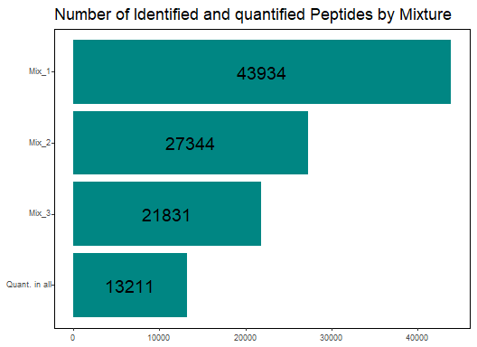

``` r
ggsave(plot = barplot_pept_cover, 
       filename = here::here("figures/barplot_coverage_pept_proteomics_gbm.tiff"), 
       device = "tiff",
       units = "mm",
       width = 38,
       height = 50)

ggsave(plot = barplot_pept_cover, 
       filename = here::here("figures/barplot_coverage_pept_proteomics_gbm.eps"), 
       device = "eps",
       units = "mm",
       width = 38,
       height = 50)
```

# Annotate peptides with cleavage information

In this section we annotate peptides by their specificity and cleavage
information.

``` r
if(!file.exists(here("data/semi_specific_search_fragpipe17/protein_combined.fas"))){
  source(here("scr/prepare_combined_fasta.R"))
}

fasta <- read.fasta(file = here("data/semi_specific_search_fragpipe17/protein_combined.fas"),
                    seqtype = "AA", 
                    as.string = TRUE)
```

``` r
if(!file.exists(here("results/semi_tryptic/cleavage_annoated_peptides_final.tsv"))){
  
  cleavage_annoated_peptides <- annotate_peptides(expr_mat = peptide_ids_filtered, 
                                                  fasta = fasta,
                                                  decoy_tag = "rev_")
  
  write_tsv(cleavage_annoated_peptides,
            here("results/semi_tryptic/cleavage_annoated_peptides_final.tsv"))
  
} else {
  
  cleavage_annoated_peptides <- read_tsv(here("results/semi_tryptic/cleavage_annoated_peptides_final.tsv"))
  
}

cleavage_annoated_peptides <- dplyr::mutate(cleavage_annoated_peptides,
                                            Genes = protein_id)

peptides_annotated <- left_join(peptide_ids_filtered, 
                                cleavage_annoated_peptides,
                                by = c("Peptide", 
                                       "protein_id"))
```

# Annotate N-terminal modifications of peptides

``` r
nterannot <- annotate_nterm(peptides_annotated,
                            tmtmass = 229.1629) %>%
  clean_names()
```

``` r
exp_nterannot <- nterannot %>%
  mutate(ntercount = str_count(string = assigned_modifications, 
                               pattern = "N-term"))
```

## Merge peptide annotation with TMT integrator quant report

``` r
# all quantified peptides
tmt_reprt_annot <- left_join(tmt_peptdata_frag, 
                             nterannot) 

check_na <- filter(tmt_reprt_annot, 
                   is.na(semi_type))

excluded_tmt_reprt_annot <- anti_join(nterannot, 
                                      tmt_reprt_annot) %>% 
                    clean_names()

#only those present in all mixtures
tmt_peptdata_fragnona <- tmt_peptdata_frag %>%
  filter(peptide %in% pept_nona$peptide)

tmt_reprt_annotnona <- left_join(tmt_peptdata_fragnona, 
                                 nterannot) 
```

``` r
source(here("scr/summarize_peptide_counts.R"))
```

``` r
summary_count <- summarize_peptide_counts(tmt_reprt_annot) 
```

## Barplot

These are the ones that would be used for inferential statistics.

``` r
to_count_info <- tmt_reprt_annot %>% 
   filter(index %in% pept_matrix_nona$index) %>%
                      dplyr::select(index, 
                                    specificity, 
                                    nterm, 
                                    semi_type, 
                                    tmt_tag,
                                    aa_after, 
                                    aa_before, 
                                    following_10_resid, 
                                    previous_10_resid, 
                                    start_position, 
                                    end_position) %>%
  mutate(specificity = if_else(str_detect(semi_type, 
                                          "unspecific"), 
                               true = "semi_specific",
                               false = specificity),
         duplicated = duplicated(index)) %>%
  distinct()
  
to_count_info_semi <- to_count_info %>%
                           dplyr::select(index,
                                         specificity) %>%
                           distinct() %>%
  mutate(duplicated = duplicated(index)) 

false_duplication <- to_count_info_semi %>%
  filter(duplicated) %>%
  pull(index)

to_count_info_semi <- to_count_info_semi %>%
  mutate(specificity = if_else(index %in% false_duplication, 
                               true = "semi_specific",
                               false = specificity)) %>%
  dplyr::select(-duplicated) %>%
  distinct()

  
  n_semi <- dplyr::count(to_count_info_semi, 
                         specificity) %>% 
                      dplyr::rename(feature_type = specificity) %>%
                      dplyr::mutate(category = "specificity")
  

  n_total <- tibble(feature_type = "Total",
                    n = length(unique(to_count_info$index)),
                    category = "Total")
  
  n_term <- dplyr::count(to_count_info, 
                         nterm) %>% 
                      dplyr::rename(feature_type = nterm) %>%
                      dplyr::mutate(category = "N-term")
  
  summary_count_pept_nona <- bind_rows(n_semi,
                                       n_term,
                                       n_total)


total_sumcount <- summary_count_pept_nona %>%
  filter(feature_type == "Total") %>%
  pull(n)

summary_countnona_no_tot <- summary_count_pept_nona %>%
  dplyr::filter(category != "Total") %>%
  dplyr::rename(`Feature category` = category)
```

``` r
print(summary_pept_annot)
```

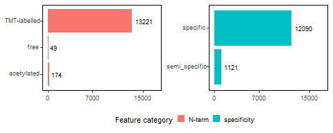

``` r
ggsave(plot = summary_pept_annot, 
       filename = here::here("figures/barplot_coverage_peptidesfeatures_gbm.tiff"), 
       device = "tiff",
       units = "mm",
       width = 76,
       height = 50)

ggsave(plot = summary_pept_annot, 
       filename = here::here("figures/barplot_coverage_peptidesfeatures_gbm.eps"), 
       device = "eps",
       units = "mm",
       width = 76,
       height = 50)
```

# Differential abundance analysis (DAA)

## Prep design matrix

``` r
paired_id <- sample_annotation2$paired_id
recurrence <- sample_annotation2$recurrence
patient <- sample_annotation2$patient
mixture <- sample_annotation2$mixture

paired_idwo6 <- sample_annotationwo6$paired_id
recurrencewo6 <- sample_annotationwo6$recurrence
patientwo6 <- sample_annotationwo6$patient
mixturewo6 <- sample_annotationwo6$mixture
```

``` r
design_limmawo6 <- model.matrix(~ patientwo6 + recurrencewo6)

sample_annotationwo6 <- sample_annotationwo6 %>%
  mutate(paired_id_semi = paste(patient, 
                                recurrence, 
                                sep = ""))

rownames(design_limmawo6) <- sample_annotationwo6$paired_id_semi
```

## Prep abundance matrices

``` r
pep_matwo6 <- dplyr::select(pept_matrix_nonawop6,
                             index, rownames(design_limmawo6))  %>%
  column_to_rownames("index") %>%
  as.matrix()
```

``` r
colnames(pep_matwo6)
```

     [1] "x1prim"  "x1rec"   "x2prim"  "x2rec"   "x3prim"  "x3rec"   "x4prim" 
     [8] "x4rec"   "x5prim"  "x5rec"   "x7prim"  "x7rec"   "x8prim"  "x8rec"  
    [15] "x9prim"  "x9rec"   "x10prim" "x10rec"  "x11prim" "x11rec" 

``` r
rownames(design_limmawo6)
```

     [1] "x1prim"  "x1rec"   "x2prim"  "x2rec"   "x3prim"  "x3rec"   "x4prim" 
     [8] "x4rec"   "x5prim"  "x5rec"   "x7prim"  "x7rec"   "x8prim"  "x8rec"  
    [15] "x9prim"  "x9rec"   "x10prim" "x10rec"  "x11prim" "x11rec" 

The column names in our peptide abundance matrix have the same order as
the row names in our design matrix.

## Fitting linear model

``` r
fit_mod_peptwo6 <- fit_limmapeptwo6(pep_matwo6, 
                         design_limmawo6, 
                         method = 'robust', 
                         Limma = "Robust - w Patient effect") 

compar_tab_peptwo6 <-  fit_mod_peptwo6 %>%
                    separate(Protein, 
                             into = c("protein", 
                                      "peptide"), 
                             remove = FALSE) %>%
  dplyr::rename(index = Protein)
```

## Extract coefficients

``` r
# load function for volcano plot
source(here("scr/plot_volcano.R"))
```

``` r
features1 <- tmt_reprt_annotnona %>%
                    dplyr::select(peptide, index, specificity, nterm, 
                                  semi_type, is_terminal)

compar_tab_peptwo6_annn <- left_join(compar_tab_peptwo6,
                                     features1)

increased_recwo6_pept_annn <- compar_tab_peptwo6_annn %>%
                    filter(logFC > 0,
                           adj.P.Val < 0.05,
                           specificity == "semi_specific",
                           is_terminal == "not_terminal") %>% 
  pull(peptide)

decreased_recwo6_pept_annn <- compar_tab_peptwo6_annn %>%
                    filter(logFC < 0,
                           adj.P.Val < 0.05,
                           specificity == "semi_specific",
                           is_terminal == "not_terminal") %>% 
  pull(peptide)
```

## Volcano plot

``` r
recwo6_pept22 <- compar_tab_peptwo6_annn %>%
  filter(adj.P.Val < 0.05,
         specificity == "semi_specific",
         is_terminal == "not_terminal")

recwo6_pept_no <- compar_tab_peptwo6_annn %>%
  filter(adj.P.Val < 0.05,
         specificity == "specific",
         is_terminal == "not_terminal")

compar_tab_peptwo6_annn2 <- compar_tab_peptwo6_annn %>%
  dplyr::rename(Protein = protein) %>%
 mutate(Feature = case_when(adj.P.Val < 0.05 & logFC > 0 & specificity == "semi_specific" & is_terminal == "not_terminal" ~ "Up-regulated Semi-tryptic",
                            adj.P.Val < 0.05 & logFC < 0 & specificity == "semi_specific" & is_terminal == "not_terminal" ~ "Down-regulated Semi-tryptic",
                            adj.P.Val < 0.05 & specificity == "specific" ~ "Tryptic",
                            TRUE ~ "No change")) %>%
 mutate(Feature = factor(Feature, 
                         levels = c("Up-regulated Semi-tryptic", 
                                    "Down-regulated Semi-tryptic",
                                    "No change",
                                    "Tryptic"))) %>%
  left_join(.,prot2gene)

gpnbm_pept_semi_lim <- compar_tab_peptwo6_annn2 %>%
  filter(Gene == "GPNMB")

diff_abund_semi <- compar_tab_peptwo6_annn2 %>% 
  filter(Feature %in% c("Up-regulated Semi-tryptic" , 
                        "Down-regulated Semi-tryptic"))

size <- 0.5

volcano_semi_gbm <- ggplot(data = compar_tab_peptwo6_annn2,
                      mapping = aes(x = logFC, 
                                    y = -log10(adj.P.Val),
                                    color = Feature)) + 
      geom_point(data = filter(compar_tab_peptwo6_annn2,
                               !Feature %in% c("Up-regulated Semi-tryptic" , 
                                               "Down-regulated Semi-tryptic")),
                 size = size) +
      geom_point(data = filter(compar_tab_peptwo6_annn2, 
                               Feature %in% c("Up-regulated Semi-tryptic" , 
                                              "Down-regulated Semi-tryptic")),
                 size = 1) + 
      scale_color_manual(values = c("Up-regulated Semi-tryptic" = "#ff6150",
                                    "Down-regulated Semi-tryptic" = "#54d2d2",
                                    "Tryptic" = "grey",
                                    "No change" = "darkgrey"
                                    )) +            
      geom_hline(yintercept = -log10(0.05),
                 color = "red", linetype = "dashed") +
     theme(strip.text = element_text(vjust = 1))
```

``` r
print(volcano_semi_gbm)
```

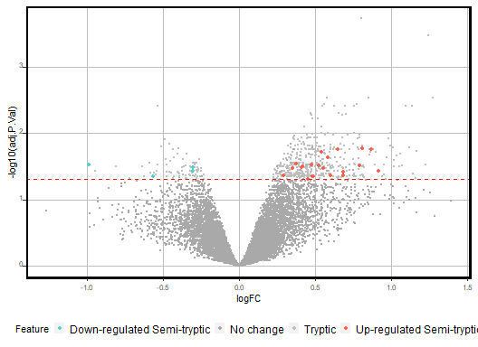

``` r
ggsave(plot = volcano_semi_gbm, 
       filename = here::here("figures/volcano_proteolysis_gbm_2.tiff"), 
       device = "tiff",
       units = "mm",
       width = 63,
       height = 63)

ggsave(plot = volcano_semi_gbm, 
       filename = here::here("figures/volcano_proteolysis_gbm_2.eps"), 
       device = "eps",
       units = "mm",
       width = 63,
       height = 63)
```

``` r
# supplementary results table for proteolysis results
summary_semi_limma <- compar_tab_peptwo6_annn2 %>% 
  filter(Feature %in% c("Up-regulated Semi-tryptic" , 
                        "Down-regulated Semi-tryptic",
                        "No change"))

write_tsv(x = summary_semi_limma,
          file = here::here("results/semi_tryptic/summary_proteolytic_processing_limma_results.tsv"))
```

# Checking specific hits

## GPNMB - distribution of abundances for semi-specific peptides

We identified a group of differentially abundant semi-specific peptides
from GPNMB.

``` r
pept_quant_annotated2 <- pept_quant_annotated %>%
  separate(col = index,
           into = c("Protein", 
                    "peptide"))

quant_anpeptwgene <- left_join(pept_quant_annotated2, 
                               prot2gene) 

tab_2_peptpaired_boxplot <-  quant_anpeptwgene %>%
  filter(Protein %in% "Q14956") 

gpmnb_pept_2annnot <- tab_2_peptpaired_boxplot %>%
  dplyr::select(Peptide = peptide,
                Genes = Protein) %>% 
  distinct()
  
# prep data
slim_datap <- pivot_longer(pept_matrix, 
                           cols = 2:length(names(pept_matrix)), 
                           names_to = c("patient","condition"),
                           values_to = "Intensity",
                           names_sep = "\\_") %>% 
  mutate(condition = case_when(str_detect(patient, "rec") ~ "rec",
                               str_detect(patient, "prim") ~ "prim"),
         patient = paste0("x",parse_number(patient))) %>%
  filter(str_detect(patient, "x6", negate = TRUE)) %>% 
  separate(col = index,
           into = c("Protein", "peptide"), 
           sep = "_") %>%
  left_join(.,sample_annotation2) %>%
    filter(Protein %in% "Q14956") 
  
slim_datap2 <- pivot_wider(slim_datap, 
                           values_from = Intensity, 
                            names_from = condition) 

slim_datap3 <- slim_datap2 %>% 
  mutate(Abs_diff = rec-prim) %>%
  mutate(rank = row_number(Abs_diff)) %>% 
  dplyr::rename(Initial = prim, Recurrent = rec) 
```

``` r
source(here("scr/annotate_peptides.R"))
```

``` r
annotated_gpnmb_peptides <- annotate_peptides(gpmnb_pept_2annnot,
                                              fasta = fasta) %>%
  dplyr::select(-previous_all_resid) %>% 
  filter(specificity == "semi_specific")
```

    [1] "1 AAAPGPCPPP out of 9"
    [1] "2 AAAPGPCPPPP out of 9"
    [1] "3 AAAPGPCPPPPP out of 9"
    [1] "4 AYVPIAQVK out of 9"
    [1] "5 DVYVVTDQIPVFVTM out of 9"
    [1] "6 DVYVVTDQIPVFVTMFQK out of 9"
    [1] "7 DVYVVTDQIPVFVTMFQKN out of 9"
    [1] "8 SSDETFLK out of 9"
    [1] "9 YGHFQATITIVEG out of 9"

``` r
slim_datap4 <- slim_datap3 %>%
  dplyr::filter(peptide %in% annotated_gpnmb_peptides$Peptide)
```

``` r
gpnmb_semis <- ggpaired(slim_datap4,
                        cond1 = "Initial",
                        cond2 = "Recurrent", 
                        fill = "condition",
                        ylab = "Normalized Abundance",
                        label = NULL,
                        repel = TRUE,
                        facet.by = "peptide",
                        point.size = 0.2, 
                        line.size = 0.1, 
                        line.color = "mixture") +
      theme(axis.text.x = element_text(hjust = 0.5, 
                                       vjust = 0, 
                                       size = 7, 
                                       angle = 360),
            axis.text.y = element_text(hjust = 0.95, 
                                       vjust = 0.2, 
                                       size = 7),
            panel.background = element_blank(),
            panel.grid.major = element_blank(),
            panel.border = element_rect(colour = "black", 
                                        fill = NA, 
                                        size = 0.5),
            axis.title = element_text(size = 7),
            legend.text = element_text(size = 7),
            legend.title = element_text(size = 7),
            legend.key.height= unit(6, 'mm'),
            legend.key.width= unit(6, 'mm'),
            legend.position="bottom",
            strip.text = element_text(hjust = 0.5, 
                                      vjust = 0, 
                                      size = 7, 
                                      angle = 360)) 
```

``` r
print(gpnmb_semis)
```

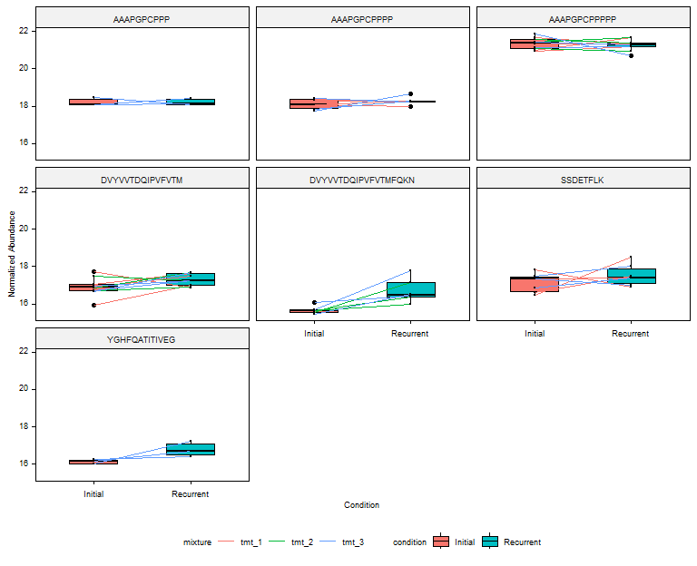

``` r
ggsave(plot = gpnmb_semis, 
       filename = here::here("figures/gpnmb_proteolysis_gbm_boxplots.tiff"), 
       device = "tiff",
       units = "mm",
       width = 190,
       height = 180)

ggsave(plot = gpnmb_semis, 
       filename = here::here("figures/gpnmb_proteolysis_gbm_boxplots.eps"), 
       device = "eps",
       units = "mm",
       width = 190,
       height = 180)
```

## Coverage of GBPNMB

``` r
source(here("scr/protein_peptide_coverage_plot.R"))
```

``` r
peptides_GPNMB <- cleavage_annoated_peptides %>% 
  filter(protein_id %in% "Q14956") %>%
  mutate(peptide_length = str_length(string = Peptide))
```

``` r
feat_gpnmb <- drawProteins::get_features("Q14956")
```

    [1] "Download has worked"

``` r
feat_gpnmbdf <- drawProteins::feature_to_dataframe(feat_gpnmb)
#Get peptides as coverage features for plotting

cov_feat_gpnmbdf <- get_coverage(annotated_peptides = peptides_GPNMB, 
                                 id = "Q14956")

# get fold-changes of peptides to plot for coverage
fcs_cov_gpnmbdf <- compar_tab_peptwo6_annn2 %>%
  filter(peptide %in% cov_feat_gpnmbdf$description) %>%
  dplyr::select(description = peptide, logFC) 

cov_feat_gpnmbdf2 <- left_join(cov_feat_gpnmbdf, 
                               fcs_cov_gpnmbdf)


#Merge coverage feature info with protein sequence features info:

fullfeat_gpnmb <- add_peptides(feat_gpnmbdf,
                               peptide_coverage_data = cov_feat_gpnmbdf)
# drawCanvas
canvas <- draw_canvas(fullfeat_gpnmb)

# draw the protein chain
wchain <- draw_chains(canvas, 
                      fullfeat_gpnmb)

# draw protein domains
wdomainsgpnmb <- draw_domains(wchain, 
                              data = fullfeat_gpnmb)
cov_feat_gpnmbdf$order <- 1.4

pepcov_gpnmbdf <- wchain + 
  ggplot2::geom_rect(data = cov_feat_gpnmbdf2,
                         mapping=ggplot2::aes(xmin=begin,
                                              xmax=end,
                                              ymin=order-0.05,
                                              ymax=order+0.05,
                                              fill = logFC)) +
  scale_fill_gradient(low = "#2C9C8E",
                      high = "#FC0000") +
    annotate("text", x = -50, y = 1.4, label = "Peptides") +
    theme_bw(base_size = 12) + # white background
    theme(panel.grid.minor=element_blank(),
          panel.grid.major=element_blank()) +
    theme(axis.ticks = element_blank(),
          axis.text.y = element_blank()) +
    theme(panel.border = element_blank(),
          legend.position = "bottom")
```

``` r
pepcov_gpnmbdf
```

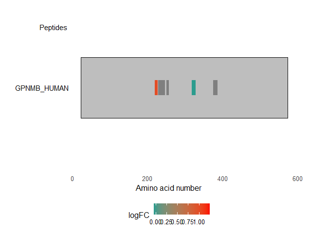

``` r
ggsave(plot = pepcov_gpnmbdf, 
       filename = here::here("figures/gpnmbdf_coverage_proteomics_gbm.tiff"), 
       device = "tiff",
       units = "mm",
       width = 150,
       height = 100)

ggsave(plot = pepcov_gpnmbdf, 
       filename = here::here("figures/gpnmbdf_coverage_proteomics_gbm.eps"), 
       device = "eps",
       units = "mm",
       width = 150,
       height = 100)
```

## GFAP - distribution of abundances for semi-specific peptides

We identified a group of differentially abundant semi-specific peptides
from GPNMB.

``` r
tab_2_peptpaired_gfap_boxplot <-  quant_anpeptwgene %>%
  filter(Gene %in% "GFAP") 

gfap_pept_2annnot <- tab_2_peptpaired_gfap_boxplot %>%
  dplyr::select(Peptide = peptide,
                Genes = Protein) %>% 
  distinct()
  
# prep data
slim_datap_gfap <- pivot_longer(pept_matrix, 
                           cols = 2:length(names(pept_matrix)), 
                           names_to = c("patient","condition"),
                           values_to = "Intensity",
                           names_sep = "\\_") %>% 
  mutate(condition = case_when(str_detect(patient, "rec") ~ "rec",
                               str_detect(patient, "prim") ~ "prim"),
         patient = paste0("x",parse_number(patient))) %>%
  filter(str_detect(patient, "x6", negate = TRUE)) %>% 
  separate(col = index,
           into = c("Protein", "peptide"), 
           sep = "_") %>%
  left_join(.,sample_annotation2) %>%
      filter(Protein %in% "P14136") 
  
slim_datap_gfap <- pivot_wider(slim_datap_gfap, 
                           values_from = Intensity, 
                            names_from = condition) 

slim_datap_gfap3 <- slim_datap_gfap %>% 
  mutate(Abs_diff = rec-prim) %>%
  mutate(rank = row_number(Abs_diff)) %>% 
  dplyr::rename(Initial = prim, Recurrent = rec) 
```

``` r
annotated_gfap_peptides <- annotate_peptides(gfap_pept_2annnot,
                                              fasta = fasta) %>%
  dplyr::select(-previous_all_resid) %>% 
  filter(specificity == "semi_specific")
```

    [1] "1 AASYQEALAR out of 198"
    [1] "2 AAYRQEADEATLAR out of 198"
    [1] "3 ADLTDAAAR out of 198"
    [1] "4 AEMMELN out of 198"
    [1] "5 AEMMELNDR out of 198"
    [1] "6 AEMMELNDRF out of 198"
    [1] "7 AEMMELNDRFASYIEK out of 198"
    [1] "8 AKEPTKLADVYQAELR out of 198"
    [1] "9 ALAAELN out of 198"
    [1] "10 ALAAELNQLR out of 198"
    [1] "11 ALAAELNQLRAK out of 198"
    [1] "12 ALAAELNQLRAKEPTK out of 198"
    [1] "13 ASERAEMMELNDR out of 198"
    [1] "14 ASERAEMMELNDRFASYIEK out of 198"
    [1] "15 ASSNMHEAEEWYR out of 198"
    [1] "16 ASYQEALAR out of 198"
    [1] "17 DFSLAGALNAGFK out of 198"
    [1] "18 DGEVIKESK out of 198"
    [1] "19 DNLAQDLATVR out of 198"
    [1] "20 DQLTANSAR out of 198"
    [1] "21 DVAKPDLTAALK out of 198"
    [1] "22 EAASYQEALA out of 198"
    [1] "23 EAASYQEALAR out of 198"
    [1] "24 EAASYQEALARLEEEGQSLKDEMAR out of 198"
    [1] "25 EAMASSNMHEAEEWYR out of 198"
    [1] "26 EIRTQYEAMASSNMHEAEEWYR out of 198"
    [1] "27 ELDVAKPDLTAALK out of 198"
    [1] "28 ELQEQLAR out of 198"
    [1] "29 ELQEQLARQQVHVELDVAKPDLTAALK out of 198"
    [1] "30 ERDNLAQDLATVR out of 198"
    [1] "31 ESKQEHK out of 198"
    [1] "32 ETSLDTK out of 198"
    [1] "33 ETSLDTKSVSEGHLK out of 198"
    [1] "34 EVERDNLAQDLATVR out of 198"
    [1] "35 FADLTDAAA out of 198"
    [1] "36 FADLTDAAAR out of 198"
    [1] "37 FADLTDAAARNAELLR out of 198"
    [1] "38 FADLTDAAARNAELLRQAK out of 198"
    [1] "39 FASYIEK out of 198"
    [1] "40 FLEQQNKALAAELNQLR out of 198"
    [1] "41 FSLAGALNAGFK out of 198"
    [1] "42 FSNLQIR out of 198"
    [1] "43 FSNLQIRETSLDTK out of 198"
    [1] "44 GALNAGFK out of 198"
    [1] "45 GEMMVGGLAPGR out of 198"
    [1] "46 GEMMVGGLAPGRR out of 198"
    [1] "47 HEAEEWYR out of 198"
    [1] "48 HEANDYRRQLQSLTCDLESLR out of 198"
    [1] "49 HLQEYQDLLN out of 198"
    [1] "50 HLQEYQDLLNVK out of 198"
    [1] "51 HVELDVAKPDLTAALK out of 198"
    [1] "52 HVREAASYQEALAR out of 198"
    [1] "53 IESLEEEIR out of 198"
    [1] "54 IHEEEVRELQEQLAR out of 198"
    [1] "55 IRETSLDTK out of 198"
    [1] "56 ITIPVQT out of 198"
    [1] "57 ITIPVQTF out of 198"
    [1] "58 ITIPVQTFS out of 198"
    [1] "59 ITIPVQTFSN out of 198"
    [1] "60 ITIPVQTFSNL out of 198"
    [1] "61 ITIPVQTFSNLQ out of 198"
    [1] "62 ITIPVQTFSNLQIR out of 198"
    [1] "63 ITIPVQTFSNLQIRETSLDTK out of 198"
    [1] "64 ITSAARRSYVSSGEMMVGGLAPGR out of 198"
    [1] "65 KIESLEEEIR out of 198"
    [1] "66 KIESLEEEIRFLR out of 198"
    [1] "67 KIHEEEVR out of 198"
    [1] "68 KIHEEEVRELQEQLAR out of 198"
    [1] "69 KLLEGEEN out of 198"
    [1] "70 KLLEGEENR out of 198"
    [1] "71 KLLEGEENRITIPVQ out of 198"
    [1] "72 KLLEGEENRITIPVQT out of 198"
    [1] "73 KLLEGEENRITIPVQTF out of 198"
    [1] "74 KLLEGEENRITIPVQTFSNL out of 198"
    [1] "75 KLLEGEENRITIPVQTFSNLQ out of 198"
    [1] "76 KLLEGEENRITIPVQTFSNLQIR out of 198"
    [1] "77 KLQDETNLR out of 198"
    [1] "78 KPDLTAALK out of 198"
    [1] "79 LADVYQAEL out of 198"
    [1] "80 LADVYQAELR out of 198"
    [1] "81 LADVYQAELRELR out of 198"
    [1] "82 LDQLTANSAR out of 198"
    [1] "83 LDVAKPDLTAALK out of 198"
    [1] "84 LEAENNLAAY out of 198"
    [1] "85 LEAENNLAAYR out of 198"
    [1] "86 LEAENNLAAYRQ out of 198"
    [1] "87 LEAENNLAAYRQEAD out of 198"
    [1] "88 LEAENNLAAYRQEADEAT out of 198"
    [1] "89 LEAENNLAAYRQEADEATLAR out of 198"
    [1] "90 LEAENNLAAYRQEADEATLARLD out of 198"
    [1] "91 LEAENNLAAYRQEADEATLARLDLER out of 198"
    [1] "92 LEEEGQSLK out of 198"
    [1] "93 LEEEGQSLKD out of 198"
    [1] "94 LEEEGQSLKDEM out of 198"
    [1] "95 LEEEGQSLKDEMA out of 198"
    [1] "96 LEEEGQSLKDEMAR out of 198"
    [1] "97 LEVERDNLAQDLAT out of 198"
    [1] "98 LEVERDNLAQDLATVR out of 198"
    [1] "99 LGPGTRLSLAR out of 198"
    [1] "100 LGPGTRLSLARMPPPLPTR out of 198"
    [1] "101 LLEGEENR out of 198"
    [1] "102 LLEGEENRITIPVQ out of 198"
    [1] "103 LLEGEENRITIPVQT out of 198"
    [1] "104 LLEGEENRITIPVQTF out of 198"
    [1] "105 LLEGEENRITIPVQTFSNL out of 198"
    [1] "106 LLEGEENRITIPVQTFSNLQIR out of 198"
    [1] "107 LQDETNLR out of 198"
    [1] "108 LQDETNLRLEAENNLAAYR out of 198"
    [1] "109 LQDETNLRLEAENNLAAYRQEADEATLAR out of 198"
    [1] "110 LQEYQDLLNVK out of 198"
    [1] "111 LQSLTCDLESLR out of 198"
    [1] "112 LRLDQLTAN out of 198"
    [1] "113 LRLDQLTANSAR out of 198"
    [1] "114 LSLARMPPPLPTR out of 198"
    [1] "115 LTCDLESLR out of 198"
    [1] "116 MPPPLPTR out of 198"
    [1] "117 MPPPLPTRVDF out of 198"
    [1] "118 MPPPLPTRVDFSLAGALN out of 198"
    [1] "119 MPPPLPTRVDFSLAGALNAGFK out of 198"
    [1] "120 MVGGLAPGR out of 198"
    [1] "121 MVGGLAPGRR out of 198"
    [1] "122 NAELLRQAK out of 198"
    [1] "123 NLAAYRQEADEATLAR out of 198"
    [1] "124 PDLTAALK out of 198"
    [1] "125 QAKHEANDYR out of 198"
    [1] "126 QAKHEANDYRR out of 198"
    [1] "127 QEHKDVM out of 198"
    [1] "128 QKLQDETN out of 198"
    [1] "129 QKLQDETNLR out of 198"
    [1] "130 QKLQDETNLRLEAENNLAAYR out of 198"
    [1] "131 QLARQQVHVELDVAKPDLTAALK out of 198"
    [1] "132 QLQSLTCDL out of 198"
    [1] "133 QLQSLTCDLES out of 198"
    [1] "134 QLQSLTCDLESLR out of 198"
    [1] "135 QLQSLTCDLESLRGTNESLER out of 198"
    [1] "136 QLQSLTCDLESLRGTNESLERQMR out of 198"
    [1] "137 QLTANSAR out of 198"
    [1] "138 QQVHVELDVAK out of 198"
    [1] "139 QQVHVELDVAKPD out of 198"
    [1] "140 QQVHVELDVAKPDLT out of 198"
    [1] "141 QQVHVELDVAKPDLTA out of 198"
    [1] "142 QQVHVELDVAKPDLTAA out of 198"
    [1] "143 QQVHVELDVAKPDLTAALK out of 198"
    [1] "144 QSLTCDLESLR out of 198"
    [1] "145 RDGEVIKESK out of 198"
    [1] "146 RELQEQLAR out of 198"
    [1] "147 RETSLDTK out of 198"
    [1] "148 RITSAAR out of 198"
    [1] "149 RKIESLEEEIR out of 198"
    [1] "150 RMPPPLPTR out of 198"
    [1] "151 RQLQSLTCDLESLR out of 198"
    [1] "152 RQLQSLTCDLESLRGTNESLER out of 198"
    [1] "153 RQQVHVELDVAKPDLTAALK out of 198"
    [1] "154 RRITSAAR out of 198"
    [1] "155 RSYVSSGEMMVGGLAPGR out of 198"
    [1] "156 RSYVSSGEMMVGGLAPGRR out of 198"
    [1] "157 SGEMMVGGLAPGR out of 198"
    [1] "158 SGEMMVGGLAPGRR out of 198"
    [1] "159 SKFADLTDAAAR out of 198"
    [1] "160 SKFADLTDAAARNAELLR out of 198"
    [1] "161 SLAGALNAGFK out of 198"
    [1] "162 SLKDEMAR out of 198"
    [1] "163 SLTCDLESLR out of 198"
    [1] "164 SSGEMMVGGLAPGR out of 198"
    [1] "165 SSGEMMVGGLAPGRR out of 198"
    [1] "166 SVSEGHL out of 198"
    [1] "167 SVSEGHLK out of 198"
    [1] "168 SVSEGHLKR out of 198"
    [1] "169 SYVSSGEMM out of 198"
    [1] "170 SYVSSGEMMVGGLAPG out of 198"
    [1] "171 SYVSSGEMMVGGLAPGR out of 198"
    [1] "172 SYVSSGEMMVGGLAPGRR out of 198"
    [1] "173 TKSVSEGHLKR out of 198"
    [1] "174 TQYEAMAS out of 198"
    [1] "175 TQYEAMASSN out of 198"
    [1] "176 TQYEAMASSNM out of 198"
    [1] "177 TQYEAMASSNMH out of 198"
    [1] "178 TQYEAMASSNMHEA out of 198"
    [1] "179 TQYEAMASSNMHEAEE out of 198"
    [1] "180 TQYEAMASSNMHEAEEWYR out of 198"
    [1] "181 TVEMRDGEVIK out of 198"
    [1] "182 TVEMRDGEVIKESK out of 198"
    [1] "183 VAKPDLTAALK out of 198"
    [1] "184 VDFSLAGAL out of 198"
    [1] "185 VDFSLAGALN out of 198"
    [1] "186 VDFSLAGALNA out of 198"
    [1] "187 VDFSLAGALNAGFK out of 198"
    [1] "188 VDFSLAGALNAGFKET out of 198"
    [1] "189 VDFSLAGALNAGFKETR out of 198"
    [1] "190 VELDVAKPDLTAALK out of 198"
    [1] "191 VERDNLAQDLATVR out of 198"
    [1] "192 VGGLAPGR out of 198"
    [1] "193 VGGLAPGRR out of 198"
    [1] "194 VRELQEQLAR out of 198"
    [1] "195 VSSGEMMVGGLAPGR out of 198"
    [1] "196 VSSGEMMVGGLAPGRR out of 198"
    [1] "197 YVSSGEMMVGGLAPGR out of 198"
    [1] "198 YVSSGEMMVGGLAPGRR out of 198"

``` r
slim_datap_gfap4 <- slim_datap_gfap3 %>%
  dplyr::filter(peptide %in% unique(annotated_gfap_peptides$Peptide))
```

``` r
gfap_semis <- ggpaired(slim_datap_gfap4,
                        cond1 = "Initial",
                        cond2 = "Recurrent", 
                        fill = "condition",
                        ylab = "Normalized Abundance",
                        label = NULL,
                        repel = TRUE,
                        facet.by = "peptide",
                        point.size = 0.2, 
                        line.size = 0.1, 
                        line.color = "mixture") +
      theme(axis.text.x = element_text(hjust = 0.5, 
                                       vjust = 0, 
                                       size = 7, 
                                       angle = 360),
            axis.text.y = element_text(hjust = 0.95, 
                                       vjust = 0.2, 
                                       size = 7),
            panel.background = element_blank(),
            panel.grid.major = element_blank(),
            panel.border = element_rect(colour = "black", 
                                        fill = NA, 
                                        size = 0.5),
            axis.title = element_text(size = 7),
            legend.text = element_text(size = 7),
            legend.title = element_text(size = 7),
            legend.key.height= unit(6, 'mm'),
            legend.key.width= unit(6, 'mm'),
            legend.position="bottom",
            strip.text = element_text(hjust = 0.5, 
                                      vjust = 0, 
                                      size = 7, 
                                      angle = 360)) 
```

``` r
print(gfap_semis)
```

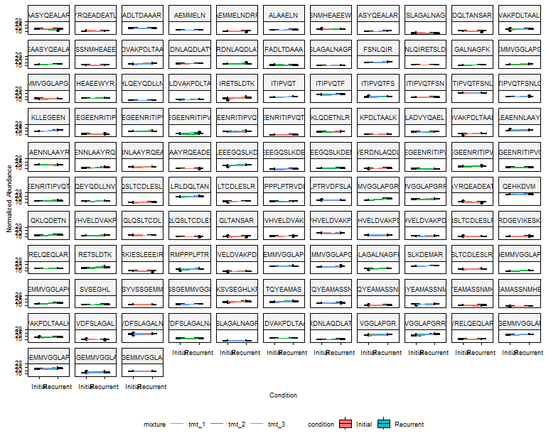

## Coverage of GFAP

``` r
source(here("scr/protein_peptide_coverage_plot.R"))
```

``` r
peptides_GFAP <- cleavage_annoated_peptides %>% 
  filter(protein_id %in% "P14136",
         specificity == "semi_specific") %>%
  mutate(peptide_length = str_length(string = Peptide))
```

``` r
feat_GFAP <- drawProteins::get_features("P14136")
```

    [1] "Download has worked"

``` r
feat_GFAPf <- drawProteins::feature_to_dataframe(feat_GFAP)
#Get peptides as coverage features for plotting

cov_feat_GFAPf <- get_coverage(annotated_peptides = peptides_GFAP, 
                                 id = "P14136")

# get fold-changes of peptides to plot for coverage
fcs_cov_GFAPf <- compar_tab_peptwo6_annn2 %>%
  filter(peptide %in% cov_feat_GFAPf$description) %>%
  dplyr::select(description = peptide, logFC) 

cov_feat_GFAP2 <- left_join(cov_feat_GFAPf, 
                            fcs_cov_GFAPf) 


#Merge coverage feature info with protein sequence features info:

fullfeat_GFAP <- add_peptides(feat_GFAPf,
                              peptide_coverage_data = cov_feat_GFAPf)
# drawCanvas
canvas <- draw_canvas(fullfeat_GFAP)

# draw the protein chain
wchain <- draw_chains(canvas, 
                      fullfeat_GFAP)

# draw protein domains
wdomainsgfap <- draw_domains(wchain, 
                             data = fullfeat_GFAP)

cov_feat_GFAP2$order <- 1.4

pepcov_GFAP <- wchain + 
  ggplot2::geom_rect(data = cov_feat_GFAP2,
                         mapping=ggplot2::aes(xmin=begin,
                                              xmax=end,
                                              ymin=order-0.05,
                                              ymax=order+0.05,
                                              fill = logFC)) +
  scale_fill_gradient(low = "#2C9C8E",
                      high = "#FC0000") +
    annotate("text", x = -50, y = 1.4, label = "Peptides") +
    theme_bw(base_size = 12) + # white background
    theme(panel.grid.minor=element_blank(),
          panel.grid.major=element_blank()) +
    theme(axis.ticks = element_blank(),
          axis.text.y = element_blank()) +
    theme(panel.border = element_blank(),
          legend.position = "bottom")
```

``` r
pepcov_GFAP
```

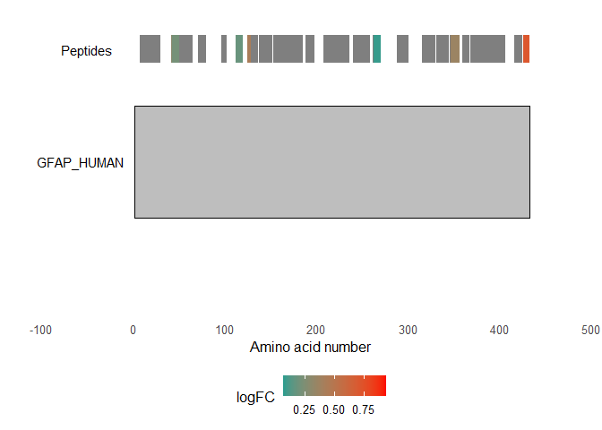

``` r
ggsave(plot = pepcov_GFAP, 
       filename = here::here("figures/gfap_coverage_proteomics_gbm.tiff"), 
       device = "tiff",
       units = "mm",
       width = 150,
       height = 100)

ggsave(plot = pepcov_GFAP, 
       filename = here::here("figures/gfap_coverage_proteomics_gbm.eps"), 
       device = "eps",
       units = "mm",
       width = 150,
       height = 100)
```

# Proportional abundance of proteolytic peptides

**Wrangle data**

``` r
pept_semi_annot <- peptides_annotated %>%
  dplyr::select(Peptide, 
                specificity, 
                is_terminal) 

pept_quant_to_summary <- pept_quant_annotated %>%
  separate(col = index, 
           into = c("Protein", "Peptide"), 
           sep = "\\_", 
           remove = FALSE) %>%
  left_join(.,pept_semi_annot)

pep_quant_presummary <- pept_quant_to_summary %>%
  dplyr::select(Protein, 
                Peptide, 
                recurrence, 
                paired_id, 
                Abundance, 
                specificity, 
                is_terminal) 
```

**Prepare data-frame with abudance percentage of semi-specific peptides
per sample**

``` r
pept_summary_int_all <- pep_quant_presummary %>%
  group_by(paired_id, 
           recurrence) %>%
  summarise(Sum_All = sum(Abundance, 
                          na.rm = TRUE))

pept_summary_int_semi <- pep_quant_presummary %>%
  filter(specificity == "semi_specific",
         is_terminal == "not_terminal") %>%
  group_by(paired_id, 
           recurrence) %>%
  summarise(Sum_Semi = sum(Abundance, 
                           na.rm = TRUE))

pept_sum_summary <- left_join(pept_summary_int_all, 
                              pept_summary_int_semi) %>%
  mutate(Percentage = Sum_Semi/Sum_All * 100,
         Stage = if_else(recurrence == "prim",
                         true = "Initial",
                         false = "Recurrence"))
```

## Plot of % of abundance of semi-specific peptides

``` r
plotSumEM <- ggplot(pept_sum_summary, 
                    aes(x = Stage, 
                        y = Percentage, 
                        fill = Stage, 
                        cex.axis = 1.5)) +
  geom_boxplot() +
  geom_dotplot(binaxis = "y", 
               stackdir = "center", 
               dotsize = 0.5) +
  # Box plot with jittered points
  # 0.2 : degree of jitter in x direction
  ylab("Proportional intensity of semi-tryptic peptides [%]") +
  geom_signif(comparisons = list(c("Initial",
                                   "Recurrence")),
              map_signif_level = TRUE) + 
  stat_compare_means(method = "t.test") +
  theme(axis.text.x = element_text(hjust = 0.5, 
                                   vjust = 0, 
                                   size = 6, 
                                   angle = 360),
        axis.text.y = element_text(hjust = 0.95, 
                                   vjust = 0.2, 
                                   size = 8),
        panel.background = element_blank(),
        panel.grid.major = element_blank(),
        panel.border = element_rect(colour = "black", 
                                    fill = NA, 
                                    size = 0.5),
        axis.title = element_text(size = 8),
        legend.text = element_text(size = 6),
        legend.title = element_text(size = 8),
        legend.key.height = unit(3, 'mm'),
        legend.key.width = unit(3, 'mm'),
        legend.position ="bottom") 
```

``` r
print(plotSumEM)
```

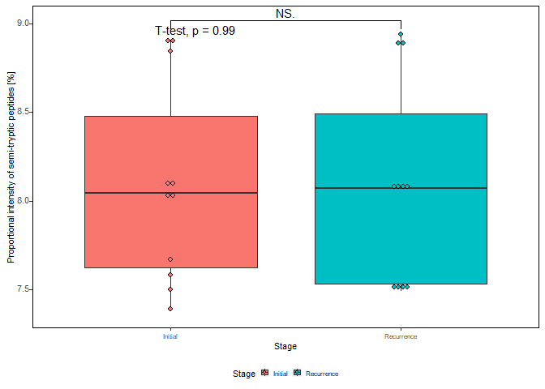

``` r
ggsave(plot = plotSumEM, 
       filename = here::here("figures/box_perc_semispec_pepts.tiff"), 
       device = "tiff",
       units = "mm",
       width = 40,
       height = 50)

ggsave(plot = plotSumEM, 
       filename = here::here("figures/box_perc_semispec_pepts.eps"), 
       device = "eps",
       units = "mm",
       width = 40,
       height = 50)
```

## Comparative analysis of semi-specific peptides vs protein abundance

### Get log2FC Summary of abundances of semi-specific peptides

``` r
#taking output from limma semi-specific
log2_semi_tryptic <- dplyr::select(compar_tab_peptwo6_annn2,
                                   logFC, 
                                   Protein, 
                                   peptide, 
                                   specificity, 
                                   is_terminal,
                                   Gene) %>%
  filter(specificity == "semi_specific",
         is_terminal == "not_terminal") %>%
  dplyr::rename(logFC_semi_peptide = logFC) %>%
  dplyr::select(-c(specificity, 
                   is_terminal))
```

### Get log2 Summary of protein abundances based only on fully-tryptic peptides

``` r
med_prot_quant_specific <- pep_quant_presummary %>%
  group_by(Protein, 
           paired_id) %>%
  summarise(`median(Abundance)` = median(Abundance, 
                                         na.rm = TRUE)) %>%
  ungroup()
```

``` r
proteins2exclude <- sel_proteins_missing(quant_annotated,
                                         threshold = 1)
```

``` r
# prep wide matrix for median proteins abundances (arousing only from fully-tryptic peptides)
wide_premat_prot_only_tryp <- med_prot_quant_specific %>%
  pivot_wider(id_cols = c("Protein"),
              values_from = `median(Abundance)`, 
              names_from = paired_id) %>%
  # keep only proteins present in 2 / 3 of the samples
  filter(!Protein %in% proteins2exclude) 

mat_prot_only_tryp <- wide_premat_prot_only_tryp %>%
  column_to_rownames("Protein") %>%
  as.matrix()
```

### Run limma on this new data to generate log2 FCs of proteins from only fully-tryptic peptides

**missForest-based imputation**

``` r
t_mat_prot_only_tryp <- t(mat_prot_only_tryp)

if(!file.exists(here("rds/missforest_imp_mat_prot_only_tryp.Rds"))){
  
 imp_prot_only_tryp <- missForest::missForest(t_mat_prot_only_tryp)
 t_mat_imp_prot_only_tryp <- imp_prot_only_tryp$ximp
 
 mat_prot_only_tryp <- t(t_mat_prot_only_tryp)
 
 saveRDS(imp_prot_only_tryp,
         file = here("rds/missforest_imp_mat_prot_only_tryp.Rds"))
 
} else {
  
 imp_prot_only_tryp <- readRDS(here("rds/missforest_imp_mat_prot_only_tryp.Rds"))
 t_mat_imp_prot_only_tryp <- imp_prot_only_tryp$ximp
 
 mat_imp_prot_only_tryp <- t(t_mat_imp_prot_only_tryp)
  
}
```

``` r
split <- str_split_fixed(colnames(mat_imp_prot_only_tryp), pattern = "\\_", n = 2)

patient_tryp <- split[,1]
recurrence <- split[,2]

design_tryp <- model.matrix(~patient_tryp+recurrence)

rownames(design_tryp) <- colnames(mat_imp_prot_only_tryp)
```

``` r
rownames(design_tryp) 
```

     [1] "x1_prim"  "x1_rec"   "x10_prim" "x10_rec"  "x11_prim" "x11_rec" 
     [7] "x2_prim"  "x2_rec"   "x3_prim"  "x3_rec"   "x4_prim"  "x4_rec"  
    [13] "x5_prim"  "x5_rec"   "x6_prim"  "x6_rec"   "x7_prim"  "x7_rec"  
    [19] "x8_prim"  "x8_rec"   "x9_prim"  "x9_rec"  

``` r
colnames(mat_prot_only_tryp)
```

     [1] "x1_prim"  "x1_rec"   "x10_prim" "x10_rec"  "x11_prim" "x11_rec" 
     [7] "x2_prim"  "x2_rec"   "x3_prim"  "x3_rec"   "x4_prim"  "x4_rec"  
    [13] "x5_prim"  "x5_rec"   "x6_prim"  "x6_rec"   "x7_prim"  "x7_rec"  
    [19] "x8_prim"  "x8_rec"   "x9_prim"  "x9_rec"  

``` r
limma_tab_wo6tryp <- fit_limmawo6_tryp(mat_imp_prot_only_tryp, 
                         design_tryp, 
                         method = 'robust', 
                         Limma = "Robust - Proteins w only tryptic peptides",
                         prot2gene = prot2gene)
```

``` r
log2_fully_tryptic <- dplyr::select(limma_tab_wo6tryp,
                                   logFC, 
                                   Protein, 
                                   Gene) %>%
  dplyr::rename(logFC_fully_tryp_protein = logFC) 
```

### Merge log2FCs of semi-tryptic peptides vs proteins with fully tryptic peptides

``` r
expr_matrix2 <- expr_matrix %>%
  dplyr::select(Protein, sample_annotation2$paired_id) 

expr_matrix_filt <- expr_matrix2 %>%
  filter(!Protein %in% proteins2exclude)

mat_filt <- expr_matrix_filt %>%
  column_to_rownames("Protein") %>%
  as.matrix()

t_mat_filt <- t(mat_filt)

if(!file.exists(here("rds/missforest_imp_mat_filt.Rds"))){
  
 t_imp_mat_filt <- missForest::missForest(t_mat_filt)
 t_imp_filt_mat <- t_imp_mat_filt$ximp
 
 mat_filt_imp <- t(t_imp_filt_mat)
 
 saveRDS(t_imp_mat_filt,
         file = here("rds/missforest_imp_mat_filt.Rds"))
 
} else {
  
 t_imp_mat_filt <- readRDS(here("rds/missforest_imp_mat_filt.Rds"))
 t_imp_filt_mat <- t_imp_mat_filt$ximp
 
 mat_filt_imp <- t(t_imp_filt_mat)
  
}

mat_filt_impwo6 <- as.data.frame(mat_filt_imp) %>%
  rownames_to_column("Protein") %>%
  dplyr::select(-starts_with("x6")) %>%
  column_to_rownames("Protein") %>%
  as.matrix()

source(here("scr/fit_limmawo6.R"))

# fit limma
limma_tab_wo6 <- fit_limmawo6(mat_filt_impwo6, 
                         design_limmawo6, 
                         method = 'robust', 
                         Limma = "Robust - w Patient effect",
                         prot2gene = prot2gene)

#get proteins increased in recurrence
increased_in_rec <- limma_tab_wo6 %>%
  filter(logFC > 0,
         adj.P.Val < 0.05) %>%
  pull(Protein)

#get proteins decreased in recurrence
decreased_in_rec <- limma_tab_wo6 %>%
  filter(logFC < 0,
         adj.P.Val < 0.05) %>%
  pull(Protein)

tab_sig_prots_tryptic <- bind_rows(tibble(protein = increased_in_rec,
                                   characteristic = "up-regulated"),
                           tibble(protein = decreased_in_rec,
                                  characteristic = "down-regulated"))
```

``` r
log2semipept2_log2protein_spec <- left_join(log2_fully_tryptic, 
                                            log2_semi_tryptic) %>%
  na.omit() %>%
  mutate(DA_Protein = if_else(Protein %in% tab_sig_prots_tryptic$protein,
                              true = TRUE,
                              false = FALSE),
         DA_peptide = if_else(peptide %in% recwo6_pept22$peptide,
                              true = TRUE,
                              false = FALSE))
```

### log2FC Proteins vs Semi-tryp peptides (scatter plot)

``` r
check_increased_pept <- cleavage_annoated_peptides %>%
  filter(Peptide %in% increased_recwo6_pept_annn)
```

``` r
inter_scater <- log2semipept2_log2protein_spec %>%
  filter(Protein %in% check_increased_pept$protein_id)

inter_scater$Gene[duplicated(inter_scater$Gene)] <- NA

scatter_proteolysis_plot <- ggplot(log2semipept2_log2protein_spec, 
                                   aes(x = logFC_fully_tryp_protein, 
                                       y = logFC_semi_peptide)) + 
  geom_smooth(method = lm, 
              se = FALSE, 
              linetype = "dashed", 
              size = 0.5, 
              color = "black") + 
  geom_point(aes(color = DA_Protein, 
                 shape = DA_peptide), 
             size = 0.6) +
  scale_color_manual(values = c("#2a9d8f", 
                                "red")) +
  xlab("log2(FC) - Protein abundances") + 
  ylab("log2(FC) - Semi-specific peptides") + 
  ggrepel::geom_text_repel(data = inter_scater,
                           aes(label = Gene), 
                           size = 1,
                           box.padding = 0.5,
                           max.overlaps = 25) +
  theme(axis.text.x = element_text(hjust = 0.5, 
                                   vjust = 0, 
                                   size = 8, 
                                   angle = 360),
        axis.text.y = element_text(hjust = 0.95, 
                                   vjust = 0.2, 
                                   size = 8),
        panel.background = element_blank(),
        panel.grid.major = element_blank(),
        panel.border = element_rect(colour = "black", 
                                    fill = NA, 
                                    size = 0.5),
        axis.title = element_text(size = 8),
        legend.text = element_text(size = 6),
        legend.title = element_text(size = 8),
        legend.key.height= unit(3, 'mm'),
        legend.key.width= unit(3, 'mm'),
        legend.position="bottom") 
```

``` r
cor.test(log2semipept2_log2protein_spec$logFC_fully_tryp_protein,
    log2semipept2_log2protein_spec$logFC_semi_peptide, 
    method = "pearson")
```


        Pearson's product-moment correlation

    data:  log2semipept2_log2protein_spec$logFC_fully_tryp_protein and log2semipept2_log2protein_spec$logFC_semi_peptide
    t = 16.098, df = 773, p-value < 2.2e-16
    alternative hypothesis: true correlation is not equal to 0
    95 percent confidence interval:
     0.4464034 0.5520192
    sample estimates:
          cor 
    0.5010747 

``` r
ggsave(plot = scatter_proteolysis_plot, 
       filename = here::here("figures/scatter_proteolysis_plot_gbm.tiff"), 
       device = "tiff",
       units = "mm",
       width = 63,
       height = 63)

ggsave(plot = scatter_proteolysis_plot, 
       filename = here::here("figures/scatter_proteolysis_plot_gbm.eps"), 
       device = "eps",
       units = "mm",
       width = 63,
       height = 63)
```

# Analysis of differential amino acid usage

``` r
source(here("scr/get_cleavage_area.R"))
```

``` r
cleave_areas <- get_cleave_area(cleavage_annoated_peptides)
```

``` r
library(dagLogo)
```

Used the identified protein sequences as background proteome.

``` r
proteome_ided <- prepareProteome(fasta = here("data/semi_specific_search_fragpipe17/protein_combined.fas"), 
                                 species = "Homo sapiens")
```

``` r
increased_Rec <- filter(cleave_areas$cleave_area20,
                            Peptide %in% increased_recwo6_pept_annn) 

decreased_Rec <- filter(cleave_areas$cleave_area20,
                            Peptide %in% decreased_recwo6_pept_annn)

increased_Rec_4ice <- filter(cleave_areas$cleave_area20,
                            Peptide %in% increased_recwo6_pept_annn) %>%
                    pull(cleave_area20)

decreased_Rec_4ice <- filter(cleave_areas$cleave_area20,
                            Peptide %in% decreased_recwo6_pept_annn) %>%
                    pull(cleave_area20)
```

``` r
write_tsv(x = increased_Rec,
          file = here("results/semi_tryptic/proteolytic_products_increased_in_Recurrent.tsv"))

write_tsv(x = decreased_Rec,
          file = here("results/semi_tryptic/proteolytic_products_increased_in_Recurrent.tsv"))
```

**Format peptide sequences**

``` r
if(!file.exists(here("results/semi_tryptic/formated_pept_daglogo_increasedREC.rds"))){
  
  form_peptidesincreased_4ice <- formatSequence(increased_Rec_4ice, 
                                  proteome = proteome_ided)

  write_rds(form_peptidesincreased_4ice, file = here("results/semi_tryptic/formated_pept_daglogo_increasedREC.rds"))
  
} else {
  
  form_peptidesincreased_4ice <- read_rds(here("results/semi_tryptic/formated_pept_daglogo_increasedREC.rds"))
  
}
```

``` r
if(!file.exists(here("results/semi_tryptic/formated_pept_daglogo_decreasedREC.rds"))){
  
  form_peptidesdecreased_4ice <- formatSequence(decreased_Rec_4ice, 
                                  proteome = proteome_ided)

  write_rds(form_peptidesdecreased_4ice, file = here("results/semi_tryptic/formated_pept_daglogo_decreasedREC.rds"))
  
} else {
  
  form_peptidesdecreased_4ice <- read_rds(here("results/semi_tryptic/formated_pept_daglogo_decreasedREC.rds"))
  
}
```

## DAU increased

``` r
bg_mod_ztest_increased <- buildBackgroundModel(form_peptidesincreased_4ice,
                                           proteome = proteome_ided,
                           background = "wholeProteome",
                           testType = "ztest")
```

``` r
dau_nogroup_increased <- testDAU(form_peptidesincreased_4ice, 
                           dagBackground = bg_mod_ztest_increased)
```

``` r
dagHeatmap(dau_nogroup_increased) 
```

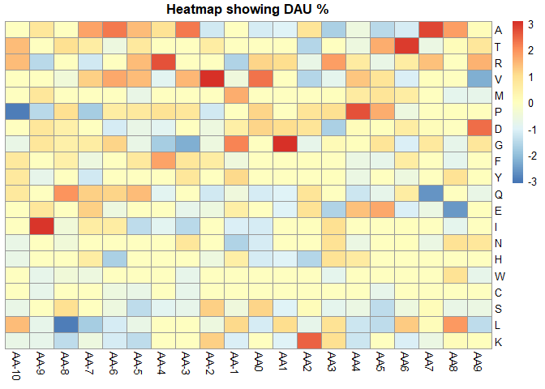

## DAU decreased

``` r
bg_mod_ztest_decreased <- buildBackgroundModel(form_peptidesdecreased_4ice,
                                           proteome = proteome_ided,
                           background = "wholeProteome",
                           testType = "ztest")
```

``` r
dau_nogroup_decreased <- testDAU(form_peptidesdecreased_4ice, 
                           dagBackground = bg_mod_ztest_decreased)
```

``` r
dagHeatmap(dau_nogroup_decreased) 
```

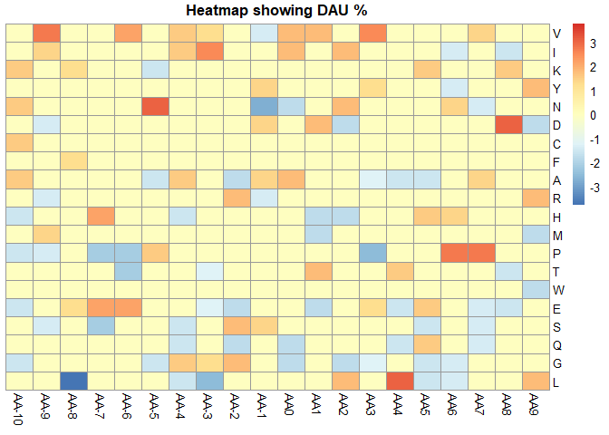

# Heatmaps of positional abundance of amino acids of proteolytic products

``` r
cleavage_area_list <- get_cleave_area(cleavage_annoated_peptides)
```

``` r
increased <- compar_tab_peptwo6_annn %>%
                filter(logFC > 0,
                       adj.P.Val < 0.05,
                       specificity == "semi_specific",
                       is_terminal == "not_terminal") %>% 
                    pull(peptide)

decreased <- compar_tab_peptwo6_annn %>%
                filter(logFC < 0,
                       adj.P.Val < 0.05,
                       specificity == "semi_specific",
                       is_terminal == "not_terminal") %>% 
                    pull(peptide)

list_result <- list(output_limma = compar_tab_peptwo6_annn,
                    increased = increased,
                    decreased = decreased)
```

``` r
prelogo <- prep_peptides(cleavage_area_list$cleave_area20)
```

## Increased Semi-specific peptides (TMT-labelled) (simple counts-no stats)

``` r
order_of_aas <- read_csv(file = here::here("data/ordered_amino_acids.csv"))
```

``` r
increased_pept_mat <- prelogo$form_peptidesincreased_4ice@peptides
```

``` r
positions <- c(paste0("P",10:1),paste0("P",1:10,"'"))
```

``` r
colnames(increased_pept_mat) <- positions
```

``` r
increased_pept_mat_df <- increased_pept_mat %>%
                    as_tibble() 
```

``` r
long_incr_ <- pivot_longer(increased_pept_mat_df,
                           cols = everything(),
                           names_to = "position",
                           values_to = "AA")
```

``` r
count_incr <- long_incr_ %>%
                    dplyr::count(position, AA)
```

``` r
wide_count_incr <- count_incr %>%
                    pivot_wider(id_cols = AA,
                                names_from = position,
                                values_from = n) %>%
                    dplyr::select(AA, all_of(positions)) %>%
                    dplyr::arrange(factor(AA, 
                                          levels = order_of_aas$...1))
```

``` r
wide_count_incr_mat <- wide_count_incr %>%
                    dplyr::select(AA, paste0("P",5:1),paste0("P",1:5,"'")) %>%
                    column_to_rownames("AA") %>%
                    as.matrix()
```

``` r
pheatmap::pheatmap(wide_count_incr_mat, 
                   cluster_rows = FALSE,
                   cluster_cols = FALSE,
                   main = "AA Counts - Increased Semi-specific pept in Recurrence")
```

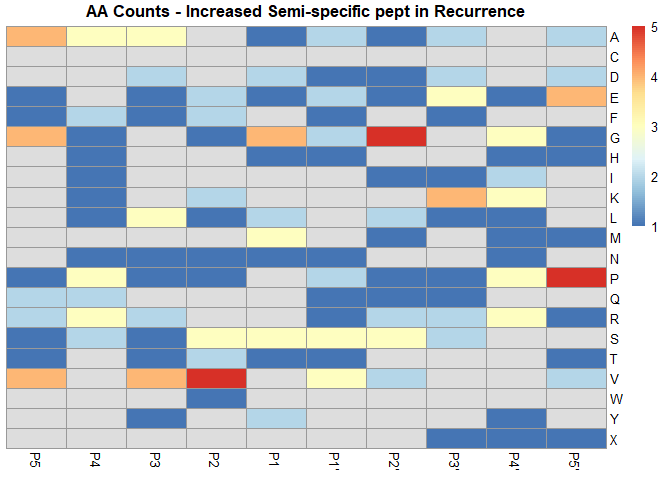

``` r
pheatmap::pheatmap(wide_count_incr_mat, 
                   cluster_rows = FALSE,
                   cluster_cols = FALSE)
```

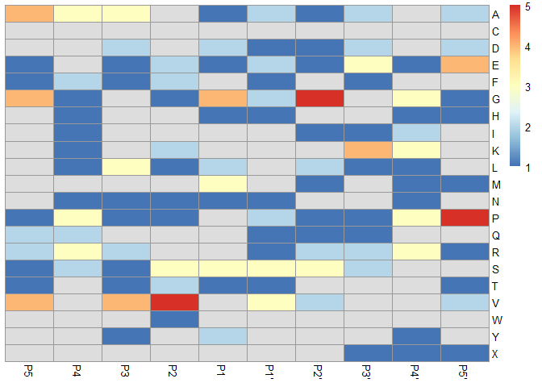

# Heatmaps of positional abundance of amino acids of proteolytic products from GPNBM

``` r
cleavage_annoated_peptides_gpnbm <- cleavage_annoated_peptides %>%
  filter(Peptide %in% gpmnb_pept_2annnot$Peptide)

cleavage_area_list_gpnbm <- get_cleave_area(cleavage_annoated_peptides_gpnbm)
```

``` r
prelogo_gpnbm <- prep_peptides_min(cleavage_area_list_gpnbm$cleave_area20$cleave_area20, 
                                   proteome_ided = proteome_ided)
```

## Heatmap

``` r
gpnbm_pept_mat <- prelogo_gpnbm$form_peptides_4ice@peptides
```

``` r
positions <- c(paste0("P",10:1),
               paste0("P",1:10,"'"))
```

``` r
colnames(gpnbm_pept_mat) <- positions
```

``` r
gpnbm_pept_mat_df <- gpnbm_pept_mat %>%
                    as_tibble() 
```

``` r
long_gpnbm_pept <- pivot_longer(gpnbm_pept_mat_df,
                           cols = everything(),
                           names_to = "position",
                           values_to = "AA")
```

``` r
count_gpnbm_pept <- long_gpnbm_pept %>%
                    dplyr::count(position, AA)
```

``` r
amino_acids_order <- data.frame(AA = order_of_aas$...1)

vect_aa_order <- amino_acids_order$AA
```

``` r
wide_count_gpnbm <- count_gpnbm_pept %>%
                    pivot_wider(id_cols = AA,
                                names_from = position,
                                values_from = n) %>%
                    dplyr::select(AA, all_of(positions)) %>%
                    full_join(., amino_acids_order) %>%
                    dplyr::arrange(factor(AA, 
                                          levels = vect_aa_order))
```

``` r
wide_count_mat <- wide_count_gpnbm %>%
                    dplyr::select(AA, paste0("P",5:1),paste0("P",1:5,"'")) %>%
                    column_to_rownames("AA") %>%
                    as.matrix()
```

``` r
pheatmap::pheatmap(wide_count_mat, 
                   cluster_rows = FALSE,
                   cluster_cols = FALSE,
                   main = "AA Counts - Semi-specific peptides GPNBM")
```

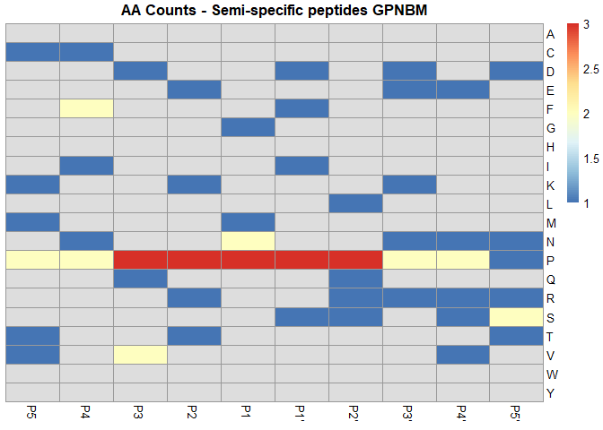

``` r
pheatmap::pheatmap(wide_count_incr_mat, 
                   cluster_rows = FALSE,
                   cluster_cols = FALSE)
```


# Heatmaps of positional abundance of amino acids of proteolytic products from GFAP

``` r
gfap_semi_pepts <- diff_abund_semi %>% 
  filter(Gene == "GFAP") %>% 
  pull(peptide)

gfap_semi <- diff_abund_semi %>% 
  filter(Gene == "GFAP") 
```

``` r
cleavage_annoated_peptides_gfap <- cleavage_annoated_peptides %>%
  filter(Peptide %in% gfap_semi_pepts)

cleavage_area_list_gfap <- get_cleave_area(cleavage_annoated_peptides_gfap)
```

``` r
prelogo_gfap <- prep_peptides_min(cleavage_area_list_gfap$cleave_area20$cleave_area20, 
                                   proteome_ided = proteome_ided)
```

``` r
gfap_semis_fcs_annt <- left_join(gfap_semi %>% dplyr::rename(Peptide = peptide),
                                 cleavage_area_list_gfap$cleave_area20)
```

## Heatmap

``` r
gfap_pept_mat <- prelogo_gfap$form_peptides_4ice@peptides
```

``` r
positions <- c(paste0("P",10:1),paste0("P",1:10,"'"))
```

``` r
colnames(gfap_pept_mat) <- positions
```

``` r
gfap_pept_mat_df <- gfap_pept_mat %>%
                    as_tibble() 
```

``` r
long_gfap_pept <- pivot_longer(gfap_pept_mat_df,
                           cols = everything(),
                           names_to = "position",
                           values_to = "AA")
```

``` r
count_gfap_pept <- long_gfap_pept %>%
                    dplyr::count(position, AA)
```

``` r
wide_count_gfap <- count_gfap_pept %>%
                    pivot_wider(id_cols = AA,
                                names_from = position,
                                values_from = n) %>%
                    dplyr::select(AA, all_of(positions)) %>%
                    full_join(., amino_acids_order) %>%
                    dplyr::arrange(factor(AA, 
                                          levels = order_of_aas$...1))
```

``` r
wide_count_mat <- wide_count_gfap %>%
                    dplyr::select(AA, paste0("P",5:1),paste0("P",1:5,"'")) %>%
                    column_to_rownames("AA") %>%
                    as.matrix()
```

``` r
pheatmap::pheatmap(wide_count_mat, 
                   cluster_rows = FALSE,
                   cluster_cols = FALSE,
                   main = "AA Counts - Semi-specific peptides GFAP")
```

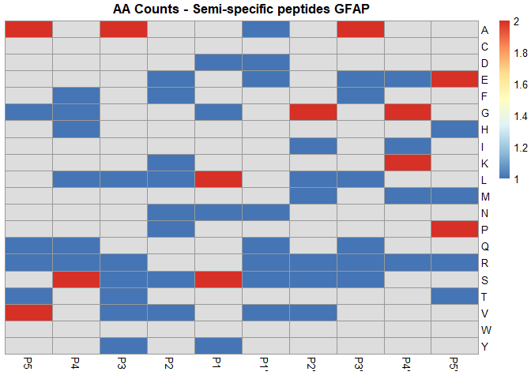

# Genearate Supplementary Table of Annotated Semi-specific peptides

This table would contain the list of differentially abundant
semi-specific peptides with their respective annotation of extended
cleavage sites. A different table will be added for the GPMBN peptides.

It will also contain the peptides identified as associated to GPMBN.

``` r
cleavage_annoated_peptides_diffabund <- cleavage_annoated_peptides %>%
  filter(Peptide %in% diff_abund_semi$peptide)

cleavage_area_list_diffabund <- get_cleave_area(cleavage_annoated_peptides_diffabund)
```

``` r
diffabund_semis_fcs_annt <- left_join(diff_abund_semi %>% dplyr::rename(Peptide = peptide),
                                 cleavage_area_list_diffabund$cleave_area20) %>%
  left_join(., cleavage_area_list_gpnbm$cleave_area20) %>%
  dplyr::select(-c(prev_10_pad,
                   following_10_pad,
                   len_20,
                   len_clearea,
                   len_follow,
                   len_prev,
                   len_followpad,
                   len_prevpad))
```

``` r
write_tsv(x = diffabund_semis_fcs_annt,
          file = here("suppl_tables/Supplementary_Table_3_differential_abundant_semispepecific_peptides.tsv"))
```

``` r
gpnbm_supp_table <- cleavage_area_list_gpnbm$cleave_area20 %>%
  dplyr::select(-c(prev_10_pad,
                   following_10_pad,
                   len_20,
                   len_clearea,
                   len_follow,
                   len_prev,
                   len_followpad,
                   len_prevpad))
```

``` r
write_tsv(x = gpnbm_supp_table,
          file = here("suppl_tables/Supplementary_Table_4_gpnbm_semispepecific_peptides.tsv"))
```
