GBM recurrence - Lipidomics analysis
================
Miguel Cosenza-Contreras

- <a href="#initial-data-loading-and-wrangling"
  id="toc-initial-data-loading-and-wrangling"><span
  class="toc-section-number">1</span> Initial data loading and
  wrangling</a>
  - <a href="#boxplots-after-normalization"
    id="toc-boxplots-after-normalization"><span
    class="toc-section-number">1.1</span> Boxplots after normalization</a>
  - <a href="#visualize-missing-values"
    id="toc-visualize-missing-values"><span
    class="toc-section-number">1.2</span> Visualize missing values</a>
- <a href="#data-preparation-for-pca-and-limma"
  id="toc-data-preparation-for-pca-and-limma"><span
  class="toc-section-number">2</span> Data preparation for PCA and
  limma</a>
  - <a href="#sparcity-reduction-for-lipidomics-data"
    id="toc-sparcity-reduction-for-lipidomics-data"><span
    class="toc-section-number">2.1</span> Sparcity reduction for lipidomics
    data</a>
  - <a href="#missforest-imputation" id="toc-missforest-imputation"><span
    class="toc-section-number">2.2</span> <code>missForest</code>
    imputation</a>
  - <a href="#save-wide-matrix" id="toc-save-wide-matrix"><span
    class="toc-section-number">2.3</span> Save wide matrix</a>
- <a href="#exploratory-pca" id="toc-exploratory-pca"><span
  class="toc-section-number">3</span> Exploratory PCA</a>
- <a href="#limma" id="toc-limma"><span
  class="toc-section-number">4</span> <code>limma</code></a>
  - <a href="#get-tabular-results-of-increaseddecreased-lipids"
    id="toc-get-tabular-results-of-increaseddecreased-lipids"><span
    class="toc-section-number">4.1</span> Get tabular results of
    increased/decreased lipids</a>
  - <a href="#volcano-lipidomics" id="toc-volcano-lipidomics"><span
    class="toc-section-number">4.2</span> Volcano lipidomics</a>
  - <a href="#volcano-ceramides" id="toc-volcano-ceramides"><span
    class="toc-section-number">4.3</span> Volcano Ceramides</a>
  - <a href="#volcano-all-identities" id="toc-volcano-all-identities"><span
    class="toc-section-number">4.4</span> Volcano all identities</a>
  - <a href="#boxplots-per-type-of-lipid"
    id="toc-boxplots-per-type-of-lipid"><span
    class="toc-section-number">4.5</span> Boxplots per type of lipid</a>
- <a href="#mixomics-pls" id="toc-mixomics-pls"><span
  class="toc-section-number">5</span> mixOmics PLS</a>
  - <a href="#required-data" id="toc-required-data"><span
    class="toc-section-number">5.1</span> Required data</a>
- <a href="#mixomics-pls-based-on-fcs-between-proteomics-and-lipidomics"
  id="toc-mixomics-pls-based-on-fcs-between-proteomics-and-lipidomics"><span
  class="toc-section-number">6</span> mixOmics PLS based on FCs between
  Proteomics and Lipidomics</a>
  - <a href="#create-matrix-of-fcs-per-protein-and-patient"
    id="toc-create-matrix-of-fcs-per-protein-and-patient"><span
    class="toc-section-number">6.1</span> Create matrix of FCs per
    <strong>protein</strong> and patient</a>
    - <a href="#create-matrix-of-fcs-per-lipid-feature-and-patient"
      id="toc-create-matrix-of-fcs-per-lipid-feature-and-patient"><span
      class="toc-section-number">6.1.1</span> Create matrix of FCs per
      <strong>lipid feature</strong> and patient</a>
    - <a href="#executing-pls-with-tunning-fc"
      id="toc-executing-pls-with-tunning-fc"><span
      class="toc-section-number">6.1.2</span> Executing PLS with tunning
      (FC)</a>
      - <a href="#circle-plot" id="toc-circle-plot"><span
        class="toc-section-number">6.1.2.1</span> Circle plot</a>
      - <a href="#enrichment-analysis-of-proteomics-signatures"
        id="toc-enrichment-analysis-of-proteomics-signatures"><span
        class="toc-section-number">6.1.2.2</span> Enrichment analysis of
        proteomics signatures</a>
      - <a href="#enrichment-analysis-of-lipidomics-signatures-after-pls"
        id="toc-enrichment-analysis-of-lipidomics-signatures-after-pls"><span
        class="toc-section-number">6.1.2.3</span> Enrichment analysis of
        lipidomics signatures after PLS</a>

``` r
knitr::opts_chunk$set(echo = TRUE, 
                      message = FALSE, 
                      warning = FALSE)

source(here::here("scr/helper_functions.R"))
```

``` r
## Required packages ----
library(tidyverse)
library(mixOmics)
library(fs)
library(kableExtra)
library(sva)
library(limma)
library(naniar)
library(missForest)
library(DT)
library(here)
library(janitor)
library(ggpubr)
library(ggrepel)
library(readxl)
library(extrafont)
library(clusterProfiler)
```

``` r
theme_set(theme(axis.text.x = element_text(hjust = 0.5, 
                                           vjust = 0, 
                                           size = 6, 
                                           angle = 360),
                axis.text.y = element_text(hjust = 0.5, 
                                           vjust = 0, 
                                           size = 6),
                panel.background = element_blank(),
                panel.grid.major = element_line(color = "grey"),
                panel.border = element_rect(colour = "black", 
                                            fill = NA, 
                                            size = 1.5),
                axis.title=element_text(size = 8),
                legend.title = element_text(size = 8),
                legend.key.height = unit(3, 
                                         'mm'),
                legend.key.width = unit(3, 
                                        'mm'),
                legend.position = "bottom"))
```

# Initial data loading and wrangling

``` r
# load raw data
lipidomics_raw <- readxl::read_excel(path = here("data/lipidomics/2022-07-26lipids_merged_foell_laloti.xlsx")) %>%
  clean_names()

sample_annotation <- read_csv(here("data/sample_annotation.csv"))

# correct annotation

sample_annotation2 <- sample_annotation %>%
  mutate(patient = paste("x",
                         patient,
                         sep = ""),
         recurrence = case_when(recurrence == "initial" ~ "prim",
                                recurrence == "recurrent" ~ "rec",
                                TRUE ~ recurrence)) %>%
  mutate(paired_id = paste(patient, 
                           recurrence, 
                           sep = "_")) %>%
  filter(recurrence %in% c("prim", 
                           "rec"))
```

``` r
lipidomics_sample_prep <- readxl::read_excel(path = here("data/lipidomics/Lipidomics_sample_preparation_reformatted.xlsx")) %>%
  clean_names() %>%
  dplyr::rename(sample_name = patient) %>%
  mutate(patient = str_trim(str_remove(sample_name,
                              "(1°)|(R)")),
         condition = if_else(condition = str_detect(string = sample_name,
                                                    pattern = "R"), 
                             true = "recurrence",
                             false = "primary")) %>%
  mutate(name = paste0(condition, patient))
```

Selecting interesting columns from lipidomics data and prepare abundance
matrix.

``` r
lipid_1 <- lipidomics_raw %>%
  dplyr::select(m_meas, name, rt_min, 
                matches("primary"),
                matches("recurrence"))

lipid_pre_mat <- lipid_1 %>% 
  mutate(name = str_replace_all(string = name, 
                               pattern = "\\_",
                               replacement = " ")) %>%
   mutate(feature = paste(name, m_meas, rt_min,sep = "_")) %>%
   dplyr::select(-c(name, m_meas, rt_min)) %>%
   relocate(feature) 

column_names <- colnames(lipid_pre_mat) %>%
  str_remove(., pattern = "_.*") %>% 
  str_extract(., pattern = "feature|primary.*|recurrence.*")

colnames(lipid_pre_mat) <- column_names
```

Create matrix

``` r
# create matrix 
lipid_mat <- lipid_pre_mat %>%
  column_to_rownames("feature") %>%
  as.matrix()
```

Substitute zero values for `NA`s

``` r
lipid_mat[lipid_mat == 0] <- NA
```

Log2-transformation and scaling

``` r
lipid_log2_mat <- mutate_all(as.data.frame(lipid_mat), 
                             log2)

lipid_scaled_mat <- scale(lipid_log2_mat,
                     scale = F,
                     center = apply(lipid_log2_mat, 2, median, 
                                    na.rm = TRUE) - median(as.matrix(lipid_log2_mat), 
                                                           na.rm = TRUE))
```

Prep long matrix for visualizations

``` r
lipid_long <- lipid_scaled_mat %>%
  as.data.frame() %>%
  rownames_to_column("feature") %>%
  pivot_longer(cols = where(is.numeric), 
               names_to = "patient",
               values_to = "Abundance") %>%
  separate(col = feature, 
           into = c("name", "m_z", "rt"),
           remove = FALSE,
           sep = "_")
```

``` r
lipid_long_annt <- lipid_long %>%
  dplyr::select(-c(patient, Abundance)) %>%
  distinct() %>%
  separate(col = name,
           into = c("identity", "definition"),
           sep = "\\;",
           remove = FALSE) %>%
  mutate(definition = case_when(str_detect(string = identity,
                                           pattern = "\\:") ~ definition,
                                TRUE ~ identity)) %>%
  mutate(identity = ifelse(str_detect(string = identity,
                                        pattern = "\\:",
                                        negate = TRUE),
                            yes = NA,
                            no = identity))

lipid_annotation <- lipid_long_annt %>%
  separate(col = identity,
           into = c("abbreviation", "composition"),
           sep = " ", 
           remove = FALSE,
           extra = "merge") %>%
  separate(col = composition,
           into = c("pre_fatty_acid_length", "n_doub_bonds"),
           sep = "\\:",
           remove = FALSE) %>%
  mutate(pre_fatty_acid_length = str_remove_all(string = pre_fatty_acid_length,
                                                pattern = "O-")) %>%
  mutate(main_fat_acd_length_num = parse_integer(pre_fatty_acid_length)) %>%
  mutate(main_fat_acd_length_fct = as.factor(main_fat_acd_length_num)) %>%
  mutate(definition = ifelse(test = is.na(identity),
                             yes = name,
                             no = abbreviation),
         definition2 = ifelse(test = is.na(identity),
                              yes = name,
                              no = identity))
```

``` r
lipid_annotation2 <- lipid_annotation %>%
  mutate(name_lipid1 = case_when(str_detect(string = name,
                                            pattern = "; Dodeca") ~ str_remove_all(name, "; Dodecanoylcarnitine"),
                                 str_detect(string = name,
                                            pattern = "; Myra") ~ str_remove_all(name, "; Myristoylcarnitine"),
                                 str_detect(string = name,
                                            pattern = "; Palmit") ~ str_remove_all(name, "; Palmitoyl-L-carnitine"),
                                 str_detect(string = name,
                                            pattern = ";O2") ~ str_replace_all(name, ";O2", ""),
                                 str_detect(string = name,
                                            pattern = ";2O/") ~ str_replace_all(name, ";2O/", " "),
                                 str_detect(string = name,
                                            pattern = ";2O$") ~ str_remove_all(name, ";2O.*"),
                                 str_detect(string = name,
                                            pattern = ";O2$") ~ str_remove_all(name, ";O2.*"),
                                 str_detect(string = name,
                                            pattern = ";3O$") ~ str_remove_all(name, ";3O.*"),
                                 str_detect(string = name,
                                            pattern = "/N-") ~ str_replace_all(name, "/N-", " "),
                                 str_detect(string = name,
                                            pattern = "-SN1") ~ str_replace_all(name, "-SN1", ""),
                                 str_detect(string = name,
                                            pattern = "LPC O-") ~ str_replace_all(name, "O-", ""),
                                 str_detect(string = name,
                                            pattern = "PC O-") ~ str_replace_all(name, "O-", ""),
                                 str_detect(string = name,
                                            pattern = "LPE O-") ~ str_replace_all(name, "O-", ""),
                                 str_detect(string = name,
                                            pattern = "PE O-") ~ str_replace_all(name, "O-", ""),
                                 str_detect(string = name,
                                            pattern = "; PC") ~ str_remove_all(name, ";.*"),
                                 str_detect(string = name,
                                            pattern = "; PE") ~ str_remove_all(name, ";.*"),
                                 str_detect(string = name,
                                            pattern = "; PG") ~ str_remove_all(name, ";.*"),
                                 str_detect(string = name,
                                            pattern = "; PI") ~ str_remove_all(name, ";.*"),
                                 str_detect(string = name,
                                            pattern = "; PS") ~ str_remove_all(name, ";.*"),
                                 str_detect(string = name,
                                            pattern = "; TG") ~ str_remove_all(name, ";.*"),
                                 str_detect(string = name,
                                            pattern = ";O;S") ~ str_remove_all(name, ";.*"),
                                 str_detect(string = name,
                                            pattern = ";O$") ~ str_remove_all(name, ";O$"),
                                 TRUE ~ name)) %>%
  mutate(name_lipid3 = if_else(condition = str_detect(string = name_lipid1,
                                            pattern = "2OH"),
                               true = str_remove_all(name_lipid1, ";\\(.*"),
                               false = name_lipid1)) %>%
  dplyr::relocate(name_lipid1, name_lipid3, .before = identity)
```

``` r
lipid_annotation3 <- lipid_annotation2 %>%
                    mutate(lipid = name)

lipid_long_annt2 <- left_join(lipid_long, lipid_annotation3)
```

## Boxplots after normalization

``` r
boxplot(lipid_mat, 
        main = "Before scaling")
```

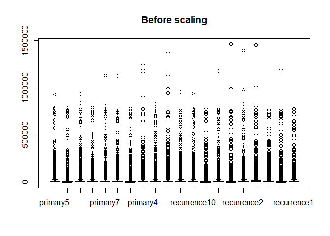

``` r
boxplot(lipid_scaled_mat,
        main = "After scaling")
```

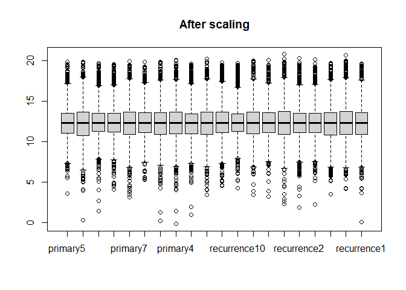

## Visualize missing values

``` r
naniar::vis_miss(as.data.frame(lipid_scaled_mat),
                 cluster = TRUE, 
                 sort_miss = TRUE)
```

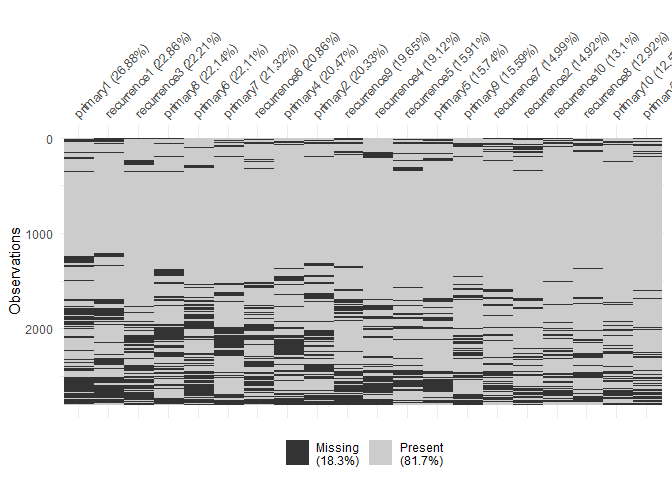

It doesn’t seem to be an increased accumulation of missing values
associated to a particular condition/stage.

# Data preparation for PCA and limma

I will run PCA for unsupervised analysis and `limma` for the
differential abundance analysis.

**Prepare sample annotation table**

``` r
sample_annotation <- tibble(name = colnames(lipid_mat),
                            condition = str_remove_all(string = colnames(lipid_mat),
                                                       pattern = "[:digit:]"),
                            patient = parse_number(colnames(lipid_mat)) %>%
                              as.factor())

sample_annotationlip <- sample_annotation %>%
  dplyr::rename(Sample = name)
```

**Define design matrix**

``` r
patient_lip <- sample_annotation$patient

recurrence_lip <- sample_annotation$condition

design_lip <- model.matrix(~patient_lip+recurrence_lip)

rownames(design_lip) <- sample_annotation$name
```

`limma` does not allow for missing values… We need to apply sparsity
reduction.

## Sparcity reduction for lipidomics data

``` r
na_count <- group_by(lipid_long_annt2,
                     feature) %>%
    summarise(na_count = sum(is.na(Abundance)),
              total = n()) %>% 
    ungroup() %>% 
    mutate(NA_fraction = na_count/total)
```

Keep only features missing in less than 20% of the samples.

``` r
# keep only features that are present in 80% of the samples
feature2include <- na_count %>%
  filter(NA_fraction < 0.2) 

reduced_pre_mat_lip <- lipid_scaled_mat %>%
  as.data.frame() %>%
  rownames_to_column("feature") %>%
  filter(feature %in% feature2include$feature)

reduced_mat_lip <- reduced_pre_mat_lip %>%
  column_to_rownames("feature") %>%
  as.matrix()
```

## `missForest` imputation

``` r
t_reduced_mat_lip <- t(reduced_mat_lip)


if(!file.exists( here("rds/missforest_imp_lipids.Rds"))){
 
  t_imp_lip <- missForest::missForest(t_reduced_mat_lip)

 
  write_rds(x = t_imp_lip,
           file = here("rds/missforest_imp_lipids.Rds"))
  
  imp_mat_lip <- t_imp_lip$ximp %>% t()
  
} else {
  
  t_imp_lip <- read_rds(file = here("rds/missforest_imp_lipids.Rds"))
  
  imp_mat_lip <- t_imp_lip$ximp %>% t()
  
}
```

## Save wide matrix

``` r
imp_mat_lip[1:5, 1:5]
```

                                                                 primary5  primary1
    (Z)-2-tetracos-15-enamidoethanesulfonic acid_473.35313_5.54  7.149982  7.481971
    2-tetracosanamidoethanesulfonic acid_475.36876_6.27          9.958798  9.903171
    Canthaxanthin_564.39691_6.39                                 9.945596  9.966085
    CAR 12:0; Dodecanoylcarnitine_343.27213_2.05                16.530528 14.999125
    CAR 14:0; Myristoylcarnitine_371.30322_2.64                 16.761910 14.727042
                                                                 primary3 primary10
    (Z)-2-tetracos-15-enamidoethanesulfonic acid_473.35313_5.54  9.655343  9.692654
    2-tetracosanamidoethanesulfonic acid_475.36876_6.27         12.460319 11.695249
    Canthaxanthin_564.39691_6.39                                10.972270 10.567910
    CAR 12:0; Dodecanoylcarnitine_343.27213_2.05                17.852324 14.681625
    CAR 14:0; Myristoylcarnitine_371.30322_2.64                 18.352022 15.164353
                                                                primary7
    (Z)-2-tetracos-15-enamidoethanesulfonic acid_473.35313_5.54 13.14313
    2-tetracosanamidoethanesulfonic acid_475.36876_6.27         14.67719
    Canthaxanthin_564.39691_6.39                                13.63252
    CAR 12:0; Dodecanoylcarnitine_343.27213_2.05                15.65312
    CAR 14:0; Myristoylcarnitine_371.30322_2.64                 15.29711

Prepare matrix for enrichment purposes

``` r
df_imp_mat_lip <- imp_mat_lip %>% 
            as.data.frame() %>%
            rownames_to_column("feature") %>% 
  left_join(., lipid_annotation2) %>% 
  dplyr::select(name_lipid3, starts_with("prima"), starts_with("recurr"))
```

# Exploratory PCA

``` r
pca_lips <- pca(t_imp_lip$ximp, 
                ncomp = 10, 
                center = TRUE, 
                scale = TRUE)
```

``` r
plot(pca_lips)
```

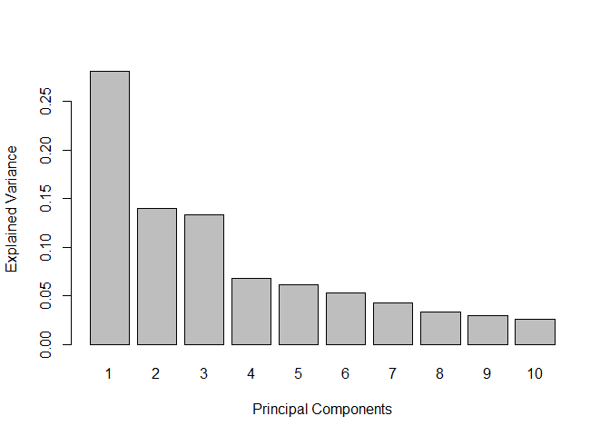

``` r
# preprocess pca results 
pca_vari_lips <- pca_lips$variates$X %>% 
  as.data.frame() %>%
  rownames_to_column("name") %>%
  left_join(., 
            lipidomics_sample_prep,
            by = "name")
```

``` r
ggplot(data = pca_vari_lips,
       aes(x = PC1, y = PC2)) +
  geom_point(size = 4, aes(shape = batch, 
                           color = condition)) +  
  geom_text(aes(label = patient), 
            position = position_nudge(x = 4)) +
  labs(title = "PCA plot of samples\nBased on the abundance values of lipids") +
  xlab(paste("PC1", round(pca_vari_lips$prop_expl_var$X[1]*100), "% var explained")) + 
  ylab(paste("PC2", round(pca_vari_lips$prop_expl_var$X[2]*100), "% var explained")) 
```

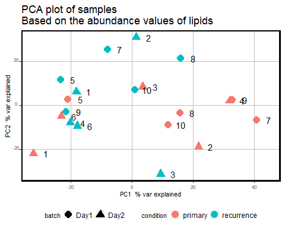

``` r
ggplot(data = pca_vari_lips,
       aes(x = PC1, y = PC2)) +
  geom_point(size = 4, aes(shape = condition, 
                           color = batch)) +  
  geom_text(aes(label = patient), 
            position = position_nudge(x = 4)) +
  labs(title = "PCA plot of samples\nBased on the abundance values of lipids") +
  xlab(paste("PC1", round(pca_vari_lips$prop_expl_var$X[1]*100), "% var explained")) + 
  ylab(paste("PC2", round(pca_vari_lips$prop_expl_var$X[2]*100), "% var explained")) 
```

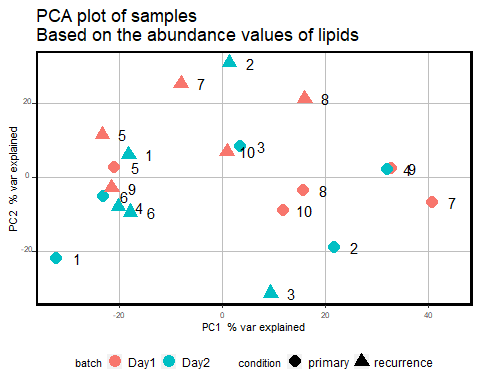

There is no batch effect associated to the sample prep day.

# `limma`

``` r
limma_lip <- lmFit(object = imp_mat_lip, 
                  design = design_lip, 
                  method = "robust")

limma_lip <- eBayes(limma_lip)

limma_tab_lip <- topTable(limma_lip, 
                          coef = "recurrence_liprecurrence", 
                          number = Inf, 
                          adjust.method = "BH") 

limma_tab_annotated <- limma_tab_lip %>%
  rownames_to_column("feature") %>%
  left_join(., lipid_annotation2)

ceramides_limma <- limma_tab_annotated %>%
  filter(str_detect(definition, "Cer"))


da_limma_lipids <- limma_tab_annotated %>% 
  filter(adj.P.Val < 0.05) %>%
  filter(!is.na(definition)) %>%
  filter(str_detect(definition, "NA", negate = TRUE))

defined_lipids <- lipid_annotation %>%
  filter(str_detect(definition, "NA", negate = TRUE),
         str_detect(feature, "zzz+",negate = TRUE)) 

def_imp_mat_lip <- imp_mat_lip %>%
  as.data.frame() %>%
  rownames_to_column("feature") %>%
  filter(feature %in% defined_lipids$feature) %>%
  column_to_rownames("feature") %>%
  as.matrix()
```

## Get tabular results of increased/decreased lipids

``` r
increased_lipids <- limma_tab_annotated %>%
  filter(logFC > 0,
         adj.P.Val < 0.05) %>%
  filter(str_detect(name_lipid3, "NA", negate = TRUE))

decreased_lipids <- limma_tab_annotated %>%
  filter(logFC < 0,
         adj.P.Val < 0.05)  %>%
  filter(str_detect(name_lipid3, "NA", negate = TRUE))

background_lipids <- limma_tab_annotated %>%
  filter(str_detect(name_lipid3, "NA", negate = TRUE))
```

``` r
write_csv(x = increased_lipids,
          file = here("data/lipidomics/increased_lipids.csv")) 

write_csv(x = decreased_lipids,
          file = here("data/lipidomics/decreased_lipids.csv"))

write_csv(x = background_lipids,
          file = here("data/lipidomics/background_lipids.csv"))
```

## Volcano lipidomics

``` r
size <- 1.3

volcano_lipids <- ggplot(data = limma_tab_annotated,
                      mapping = aes(x = logFC, y = -log10(adj.P.Val))) +
      geom_point(data = limma_tab_annotated %>% filter(adj.P.Val < 0.05),
                 mapping = aes(x = logFC, y = -log10(adj.P.Val)), 
                 color = "#D9C5B2",
                 size = size) +
      geom_point(data = limma_tab_annotated %>% filter(logFC > 0,
                                           adj.P.Val > 0.05),
                 mapping = aes(x = logFC, y = -log10(adj.P.Val)), color = "#2a9d8f",
                 size = size) +
      geom_point(data = limma_tab_annotated %>% filter(logFC < -0,
                                           adj.P.Val > 0.05),
                 mapping = aes(x = logFC, y = -log10(adj.P.Val)), color = "#2a9d8f",
                 size = size) +
      geom_point(data = ceramides_limma,
                 mapping = aes(x = logFC, y = -log10(adj.P.Val)), 
                 color = "red",
                 size = size) +
      geom_hline(yintercept = -log10(0.05),
                 color = "red", linetype = "dashed") +
      xlab("logFC - Recurrent / Initial")+
      theme(axis.text.x = element_text(hjust = 0.5, vjust = 0, size = 6, angle = 360),
        axis.text.y = element_text(hjust = 0.95, vjust = 0.2, size = 8),
        panel.background = element_blank(),
        panel.grid.major = element_blank(),
        panel.border = element_rect(colour = "black", fill=NA, size=0.5),
        axis.title = element_text(size = 8),
        legend.text = element_text(size = 6),
        legend.title = element_text(size = 8),
        legend.key.height= unit(3, 'mm'),
        legend.key.width= unit(3, 'mm'),
        legend.position="bottom") 
```

``` r
volcano_lipids
```

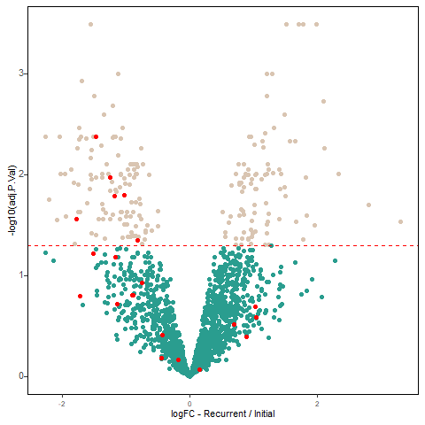

``` r
inter_lip <- limma_tab_annotated %>%
  filter(name != "NA", 
         adj.P.Val < 0.05) 
```

## Volcano Ceramides

``` r
volcano_lipids
```

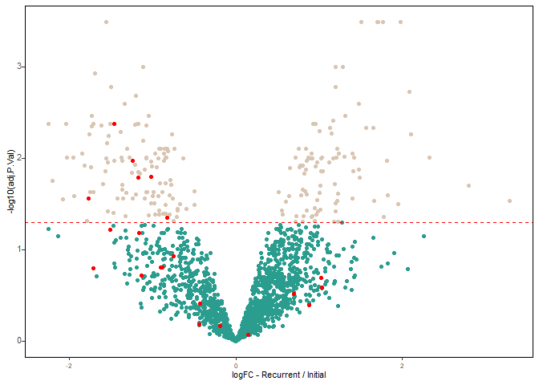

## Volcano all identities

``` r
      ggplot(data = limma_tab_annotated,
                      mapping = aes(x = logFC, y = -log10(adj.P.Val))) + 
      geom_point(data = limma_tab_annotated %>% filter(adj.P.Val < 0.05),
                     mapping = aes(x = logFC, y = -log10(adj.P.Val)), 
                     color = "#D9C5B2",
                     size = size) +
      geom_point(data = limma_tab_annotated %>% filter(logFC > 0,
                                           adj.P.Val > 0.05),
                 mapping = aes(x = logFC, y = -log10(adj.P.Val)), 
                 color = "#2a9d8f",
                 size = size) +
      geom_point(data = limma_tab_annotated %>% filter(logFC < -0,
                                           adj.P.Val > 0.05),
                 mapping = aes(x = logFC, y = -log10(adj.P.Val)), 
                 color = "#2a9d8f",
                 size = size) +
      geom_point(data = da_limma_lipids,
                 mapping = aes(x = logFC, y = -log10(adj.P.Val),
                               color = definition), 
                 size = size) +
      geom_hline(yintercept = -log10(0.05),
                 color = "red", linetype = "dashed") +
      xlab("logFC - Recurrent / Primary") +
      theme(axis.text.x = element_text(hjust = 0.5, vjust = 0, size = 6, angle = 360),
        axis.text.y = element_text(hjust = 0.95, vjust = 0.2, size = 8),
        panel.background = element_blank(),
        panel.grid.major = element_blank(),
        panel.border = element_rect(colour = "black", fill=NA, size=0.5),
        axis.title = element_text(size = 8),
        legend.text = element_text(size = 6),
        legend.title = element_text(size = 8),
        legend.key.height= unit(3, 'mm'),
        legend.key.width= unit(3, 'mm'),
        legend.position="bottom")
```

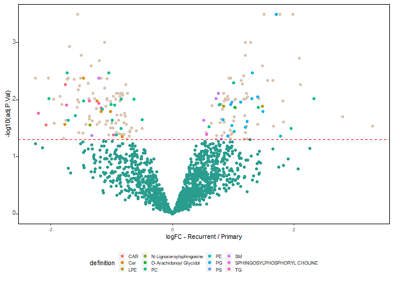

## Boxplots per type of lipid

``` r
lipid_long_annt3 <- lipid_long_annt2 %>% 
  filter(!is.na(definition)) %>%
  filter(str_detect(definition, "NA", negate = TRUE)) %>%
  mutate(stage = str_remove_all(string = patient,
                                pattern = "[:digit:]"),
         patient = parse_number(patient)) %>%
  mutate(stage = if_else(stage == "primary",
                         true = "primary",
                         false = "recurrence")) %>%
  pivot_wider(names_from = stage,
              values_from = Abundance)
```

``` r
summarized_lipids <- lipid_long_annt3 %>%
  dplyr::select(feature, definition, primary, recurrence, patient) %>%
  filter(feature %in% feature2include$feature) %>%
  mutate(definition = str_remove(definition, "(.*);")) %>%
  mutate(definition = if_else(definition == "SPHINGOSYLPHOSPHORYL CHOLINE",
                              true = str_to_sentence(definition),
                              false = definition)) %>%
  group_by(definition, patient) %>%
  summarise(Initial = median(primary, 
                             na.rm = TRUE),
            Recurrent = median(recurrence, 
                                na.rm = TRUE)) %>%
  filter(str_detect(definition, "zzz", negate = TRUE)) 
```

``` r
ggpaired(summarized_lipids,
         cond1 = "Initial",
         cond2 = "Recurrent", 
         fill = "condition",
         ylab = "Scaled Abundance",
         label = NULL,
         repel = TRUE,
         facet.by = "definition", point.size = 0.2, line.size = 0.1) + 
  coord_cartesian(ylim = c(6,20)) +
      stat_compare_means(method = "t.test", 
                         paired = TRUE, 
                         label.y = 6.5, 
                         size = 3) 
```

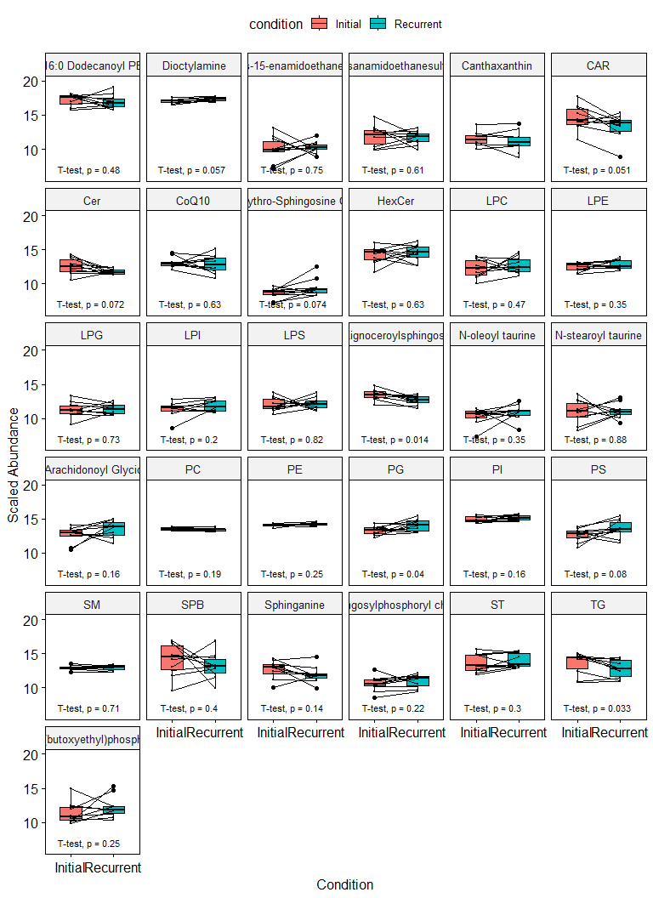

# mixOmics PLS

We want to explore correlations between proteomics expression data and
lipidomics, using projection of latent structure (PLS) as implemented in
the mixOmics R package.

## Required data

**Proteomics data**

We’ll use the proteomics data after filtering for proteins found in 2/3
mixtures, `missForest` imputation and exclusion of ‘patient 6
(proteomics)’.

``` r
identified_proteins <- read_tsv(here("data/specific_search_fragpipe17/specific_no_ptms_2/combined_protein.tsv")) %>% 
  janitor::clean_names()

prot2gene <- identified_proteins %>%
  dplyr::select(Protein = protein_id, Gene = gene,
                Description = description)
```

``` r
## tmt-integrator output loading 
tmt_protdata_frag <- read_tsv(here("data/specific_search_fragpipe17/specific_no_ptms_2/tmt-report/abundance_protein_MD.tsv")) %>% 
  janitor::clean_names()


expr_matrix <- dplyr::select(tmt_protdata_frag,
                             Protein = index, starts_with("x"))

## Get predictors for mixtures
expr_matrix2 <- expr_matrix %>%
  dplyr::select(Protein, sample_annotation2$paired_id) 

long_mat <- pivot_longer(expr_matrix,
                         cols = starts_with("x"),
                         names_sep = "_",
                         names_to = c("patient", 
                                      "recurrence"),
                         values_to = "Abundance")

long_mat_2 <- long_mat %>%
  mutate(paired_id = paste(patient, 
                           recurrence, 
                           sep = "_"))

## Annotated abundance data in long format ----

quant_annotated <- left_join(long_mat_2,
                             sample_annotation2, 
                             by = c("paired_id", 
                                    "patient",
                                    "recurrence")) %>%
  mutate(Channel_mix = paste(mixture, 
                             channel,  
                             sep = "_"))

proteins2exclude <- sel_proteins_missing(quant_annotated,
                                         threshold = 1)

expr_matrix_filt <- expr_matrix2 %>%
  filter(!Protein %in% proteins2exclude)
```

``` r
mat_filt <- expr_matrix_filt %>%
  column_to_rownames("Protein") %>%
  as.matrix()

t_mat_filt <- t(mat_filt)

if(!file.exists(here("rds/missforest_imp_mat_filt.Rds"))){
  
 t_imp_mat_filt <- missForest::missForest(t_mat_filt)
 t_imp_filt_mat <- t_imp_mat_filt$ximp
 
 mat_filt_imp <- t(t_imp_filt_mat)
 
 saveRDS(t_imp_mat_filt,
         file = here("rds/missforest_imp_mat_filt.Rds"))
 
} else {
  
 t_imp_mat_filt <- readRDS(here("rds/missforest_imp_mat_filt.Rds"))
 t_imp_filt_mat <- t_imp_mat_filt$ximp
 
 mat_filt_imp <- t(t_imp_filt_mat)
  
}
```

``` r
mat_filt_impwo6 <- as.data.frame(mat_filt_imp) %>%
  rownames_to_column("Protein") %>%
  dplyr::select(-starts_with("x6")) %>%
  column_to_rownames("Protein") %>%
  as.matrix()

sample_annotationwo6 <- sample_annotation2 %>%
  filter(patient != "x6")

df_mat_filt_impwo6 <- mat_filt_impwo6 %>%
  as.data.frame() %>%
  rownames_to_column("Protein") %>%
  left_join(.,prot2gene) %>%
  relocate(Gene)

mat_filt_imp_gene <- df_mat_filt_impwo6 %>%
  dplyr::select(-c(Gene, Description)) %>%
  dplyr::relocate(ends_with("prim")) %>%
  column_to_rownames("Protein") %>%
  as.matrix()

t_mat_filt_imp_gene_prot <- t(mat_filt_imp_gene)
```

``` r
t_mat_filt_imp_gene_prot[1:5,1:5]
```

            A0A075B6H9 A0A0A0MS15 A0A0B4J1U7 A0A0B4J1V0 A0A0C4DH33
    x1_prim   19.94963   18.53463   22.16874   18.23207   15.29189
    x2_prim   18.24085   17.84463   20.55509   16.90492   15.03891
    x3_prim   19.40524   19.35137   22.41883   17.97603   14.75205
    x4_prim   18.01550   17.79523   21.02839   16.96568   14.18093
    x5_prim   19.19619   18.58008   22.84955   17.67893   14.66929

``` r
dim(t_mat_filt_imp_gene_prot)
```

    [1]   20 4464

**Lipidomics data**

Only lipidomics features with an associated definition were used for the
sPLS analysis.

``` r
t_def_imp_mat_lip <- t(def_imp_mat_lip)
```

``` r
t_def_imp_mat_lip[1:3,25:28]
```

             Cer 18:1;2O/24:2_645.60598_10.49 Cer 18:1;2O/26:2_673.6372_11.97
    primary5                         15.11605                        12.72918
    primary1                         15.59603                        13.21733
    primary3                         14.24833                        11.26451
             Cer 18:1;2O/36:3_811.77787_23.15 Cer 18:2;2O/18:0_563.52686_8.86
    primary5                         9.432496                        13.65620
    primary1                         9.177843                        14.31971
    primary3                        11.261777                        14.60696

``` r
dim(def_imp_mat_lip)
```

    [1] 437  20

# mixOmics PLS based on FCs between Proteomics and Lipidomics

## Create matrix of FCs per **protein** and patient

``` r
# uniprot column names
pre_manual_fcs_prots <- df_mat_filt_impwo6 %>%
  dplyr::select(-Gene) %>% 
  pivot_longer(cols = where(is.numeric),
               names_to = "sample_id",
               values_to = "Abundance") %>%
  separate(col = sample_id,
           sep = "\\_", 
           into = c("patient_n", "stage"))

manual_fcs_prots <- pre_manual_fcs_prots %>%
  pivot_wider(names_from = stage,
              values_from = Abundance) %>%
  mutate(prot_pat_fc = rec - prim)

df_mat_fcs_prots <- manual_fcs_prots %>% 
  dplyr::select(Protein, patient_n,  prot_pat_fc) %>%
  pivot_wider(names_from = patient_n,
              values_from = prot_pat_fc)

mat_fcs_prots <- df_mat_fcs_prots %>%
  column_to_rownames("Protein") %>%
  as.matrix()

# gene symbol names
pre_manual_fcs_symb <- df_mat_filt_impwo6 %>%
  dplyr::select(-Protein) %>% 
  pivot_longer(cols = where(is.numeric),
               names_to = "sample_id",
               values_to = "Abundance") %>%
  separate(col = sample_id,
           sep = "\\_", 
           into = c("patient_n", "stage"))

manual_fcs_symb <- pre_manual_fcs_symb %>%
  pivot_wider(names_from = stage,
              values_from = Abundance) %>%
  mutate(prot_pat_fc = rec - prim)

df_mat_fcs_symb <- manual_fcs_symb %>% 
  dplyr::select(Gene, patient_n,  prot_pat_fc) %>%
  pivot_wider(names_from = patient_n,
              values_from = prot_pat_fc)

mat_fcs_symb <- df_mat_fcs_symb %>%
  column_to_rownames("Gene") %>%
  as.matrix()
```

``` r
mat_fcs_prots[1:5, 1:5]
```

                        x1         x2          x3        x4         x5
    A0A075B6H9 -1.88294455  0.3634895 -0.59432502 0.4603575 -0.2965648
    A0A0A0MS15  0.05617255  0.2187756 -0.18326227 0.4190694 -1.2058616
    A0A0B4J1U7 -1.24289490  0.8586511 -0.60649441 0.4594989 -2.1041902
    A0A0B4J1V0 -0.81142507  0.4369969 -0.07634805 0.1742001 -0.2212918
    A0A0C4DH33 -0.23325684 -0.4907531 -0.13913646 0.2886994  0.1413894

### Create matrix of FCs per **lipid feature** and patient

``` r
pre_manual_fcs_lip <- def_imp_mat_lip %>%
  as.data.frame() %>%
  rownames_to_column("lipid_feature") %>%
  pivot_longer(cols = where(is.numeric),
               names_to = "sample_id",
               values_to = "Abundance") %>%
  mutate(patient_n = paste0("x",parse_number(sample_id)),
         stage = if_else(condition = str_detect(string = sample_id, 
                                                pattern = "primary"),
                         true = "prim",
                         false = "rec"))

manual_fcs_lip <- pre_manual_fcs_lip %>%
  dplyr::select(-sample_id) %>%
  pivot_wider(names_from = stage,
              values_from = Abundance) %>%
  mutate(lip_pat_fc = rec - prim)

df_mat_fcs_lip <- manual_fcs_lip %>% 
  dplyr::select(lipid_feature, patient_n,  lip_pat_fc) %>%
  pivot_wider(names_from = patient_n,
              values_from = lip_pat_fc)

mat_fcs_lip <- df_mat_fcs_lip %>%
  column_to_rownames("lipid_feature") %>%
  as.matrix()
```

``` r
mat_fcs_lip[1:5, 1:3]
```

                                                                        x5
    (Z)-2-tetracos-15-enamidoethanesulfonic acid_473.35313_5.54 3.03676866
    2-tetracosanamidoethanesulfonic acid_475.36876_6.27         1.35013744
    Canthaxanthin_564.39691_6.39                                0.59972865
    CAR 12:0; Dodecanoylcarnitine_343.27213_2.05                0.02070841
    CAR 14:0; Myristoylcarnitine_371.30322_2.64                 0.17809831
                                                                        x1
    (Z)-2-tetracos-15-enamidoethanesulfonic acid_473.35313_5.54  2.5249495
    2-tetracosanamidoethanesulfonic acid_475.36876_6.27          0.6369342
    Canthaxanthin_564.39691_6.39                                -0.6105942
    CAR 12:0; Dodecanoylcarnitine_343.27213_2.05                 0.2728701
    CAR 14:0; Myristoylcarnitine_371.30322_2.64                  0.5036132
                                                                        x3
    (Z)-2-tetracos-15-enamidoethanesulfonic acid_473.35313_5.54  1.3404060
    2-tetracosanamidoethanesulfonic acid_475.36876_6.27          0.2022406
    Canthaxanthin_564.39691_6.39                                 0.4327397
    CAR 12:0; Dodecanoylcarnitine_343.27213_2.05                -3.6056220
    CAR 14:0; Myristoylcarnitine_371.30322_2.64                 -3.6696302

### Executing PLS with tunning (FC)

``` r
t_mat_fcs_lip <- t(mat_fcs_lip)
t_mat_fcs_prots <- t(mat_fcs_symb)
```

``` r
pls_res_fcs <- pls(X = t_mat_fcs_lip, 
                   Y = t_mat_fcs_prots, 
                   mode = "regression", 
                   ncomp = 5)
```

Performance measure:

``` r
if(!file.exists(here("rds/performance_pls_mixomics_fcs_lip_prot.Rds"))){
  
   perf_fcs_pls <- perf(pls_res_fcs, 
                    folds = 5,
                    progressBar = TRUE, 
                    nrepeat = 10)  
   
   write_rds(x = perf_fcs_pls,
             file = here("rds/performance_pls_mixomics_fcs_lip_prot.Rds"))
   
} else {
  
  perf_fcs_pls <- read_rds(here("rds/performance_pls_mixomics_fcs_lip_prot.Rds"))
  
}
```

``` r
plot(perf_fcs_pls, criterion = 'Q2.total')
```

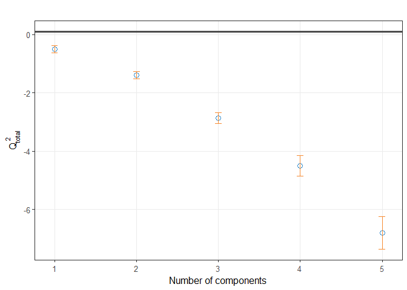

The Q2 criterion indicates that a component should be included in the
model if the Q2 total \<= 0.0975… In this case, all components are
smaller than this. This could be related to over-fitting or due to the
inclusion of too many variables in the model (see [discussion in
mixOmics
forum](https://mixomics-users.discourse.group/t/q2-total-negative-in-perf-pls/138)).

We would work with 3 components, and keep 25 top proteins per 10 top
lipids per component. This selection is arbitrary but was rationalized
based on model interpretability.

``` r
pls_res_fcs_tuned <- spls(X = t_mat_fcs_prots, 
                          Y = t_mat_fcs_lip, 
                          mode = "regression", 
                          ncomp = 4,
                          keepX = c(25, 25, 25, 25),
                          keepY = c(15, 15, 15, 15))
```

#### Circle plot

``` r
plotVar(pls_res_fcs_tuned,
        cex = c(4,4),
        legend = TRUE)
```

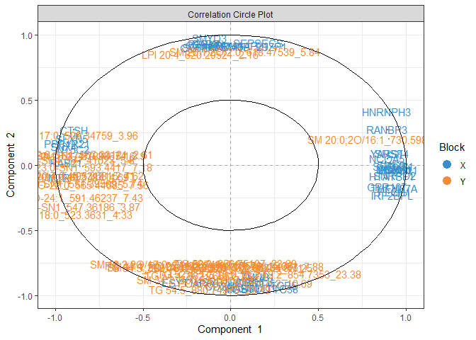

``` r
coordinatesfcs <- plotVar(pls_res_fcs_tuned, plot = FALSE)

coord2_fcs_circlgg <- coordinatesfcs %>% 
  mutate(`Component 1` = x,
         `Component 2` = y,
         Source = if_else(condition = Block == "X",
                          true = "Proteomics",
                          false = "Lipidomics")) %>% 
  as_tibble() %>% 
  dplyr::select(`Component 1`, 
                `Component 2`,
                Source,
                names)  %>%
  mutate(association = case_when(`Component 1` > 0.5 & Source == "Proteomics" ~ "Negative_association_LPCs",
                                 `Component 1` < -0.5 & Source == "Proteomics" ~ "Positive_association_LPCs",
                                 `Component 1` < -0.5 & Source == "Lipidomics" ~ "Positive_association_Proteins1", 
                                 `Component 2` < -0.5 & Source == "Lipidomics" ~ "Positive_association_Proteins2"),
         groups = case_when(`Component 1` < -0.5 & Source == "Proteomics" ~ "prot_g1",
                            `Component 2` < -0.5 & Source == "Proteomics" ~ "prot_g2",
                            `Component 2` > 0.5 & Source == "Proteomics" ~ "prot_g3",
                             `Component 1` > 0.5 & Source == "Proteomics" ~ "prot_g4",
                            `Component 1` < -0.5 & Source == "Lipidomics" ~ "lip_g1",
                            `Component 2` < -0.5 & Source == "Lipidomics" ~ "lip_g2"),
         names = str_remove(string = names, pattern = "_.*"))

proteomics_pls <- coord2_fcs_circlgg %>%
  filter(Source == "Proteomics")
```

``` r
elipsize <- 0.3

circle_fcs_lipids <- ggplot(data = coord2_fcs_circlgg,
                  aes(x = `Component 1`, 
                      y = `Component 2`,
                      color = Source)) +
             geom_point(size = 0.8) +  
             geom_text_repel(aes(label = names), 
                             size = 0.8, 
                             max.overlaps = 30,
                             segment.size = 0.08) + 
             stat_ellipse(data = coord2_fcs_circlgg %>% 
                            filter(groups == "prot_g1"),
                          color = "#425F57",
                          linetype = "dashed",
                          size = elipsize) +
             stat_ellipse(data = coord2_fcs_circlgg %>% 
                                 filter(groups == "prot_g2"),
                          color = "#367E18",
                          linetype = "dashed",
                          size = elipsize) + 
             stat_ellipse(data = coord2_fcs_circlgg %>% 
                                 filter(groups == "prot_g4"),
                          color = "#749F82",
                          linetype = "dashed",
                          size = elipsize) + 
             stat_ellipse(data = coord2_fcs_circlgg %>% 
                                 filter(groups == "lip_g1"),
                          color = "#FF6D28",
                          size = elipsize) +
             stat_ellipse(data = coord2_fcs_circlgg %>% 
                                 filter(groups == "lip_g2"),
                          color = "#FF884B",
                          size = elipsize) + 
             scale_color_manual(values = c("Proteomics" = "#1A4D2E",
                                           "Lipidomics" = "#FF9F29")) + 
             theme(axis.text.x = element_text(hjust = 0.5, vjust = 0, size = 10, angle = 360),
                   axis.text.y = element_text(hjust = 0.95, vjust = 0.2, size = 10),
                   panel.background = element_blank(),
                   panel.border = element_rect(colour = "black", fill=NA, size=0.5),
                   axis.title = element_text(size = 10),
                   legend.text = element_text(size = 7),
                   legend.title = element_text(size = 8),
                   legend.key.height = unit(3, 'mm'),
                   legend.key.width = unit(3, 'mm'),
                   legend.position = "bottom")
```

``` r
circle_fcs_lipids2 <- ggplot(data = coord2_fcs_circlgg,
                  aes(x = `Component 1`, 
                      y = `Component 2`,
                      color = Source)) +
             geom_point(size = 1.2) +  
             geom_text_repel(aes(label = names), 
                             size = 2.5, 
                             max.overlaps = 30, 
                             segment.size = 0.05) + 
             stat_ellipse(data = coord2_fcs_circlgg %>% 
                            filter(groups == "prot_g1"),
                          color = "#425F57",
                          linetype = "dashed",
                          size = 0.3) +
             stat_ellipse(data = coord2_fcs_circlgg %>% 
                                 filter(groups == "prot_g3"),
                          color = "#367E18",
                          linetype = "dashed",
                          size = 0.3) + 
             stat_ellipse(data = coord2_fcs_circlgg %>% 
                                 filter(groups == "prot_g4"),
                          color = "#749F82",
                          linetype = "dashed",
                          size = 0.3) + 
             stat_ellipse(data = coord2_fcs_circlgg %>% 
                                 filter(groups == "lip_g1"),
                          color = "#FF6D28",
                          size = 0.3) +
             stat_ellipse(data = coord2_fcs_circlgg %>% 
                                 filter(groups == "lip_g2"),
                          color = "#FF884B",
                          size = 0.3) + 
             scale_color_manual(values = c("Proteomics" = "#1A4D2E",
                                           "Lipidomics" = "#FF9F29")) + 
             theme(axis.text.x = element_text(hjust = 0.5, vjust = 0, size = 10, angle = 360),
                   axis.text.y = element_text(hjust = 0.95, vjust = 0.2, size = 10),
                   panel.background = element_blank(),
                   panel.border = element_rect(colour = "black", fill=NA, size=0.5),
                   axis.title = element_text(size = 10),
                   legend.text = element_text(size = 7),
                   legend.title = element_text(size = 8),
                   legend.key.height = unit(3, 'mm'),
                   legend.key.width = unit(3, 'mm'),
                   legend.position = "bottom")
```

``` r
circle_fcs_lipids2
```

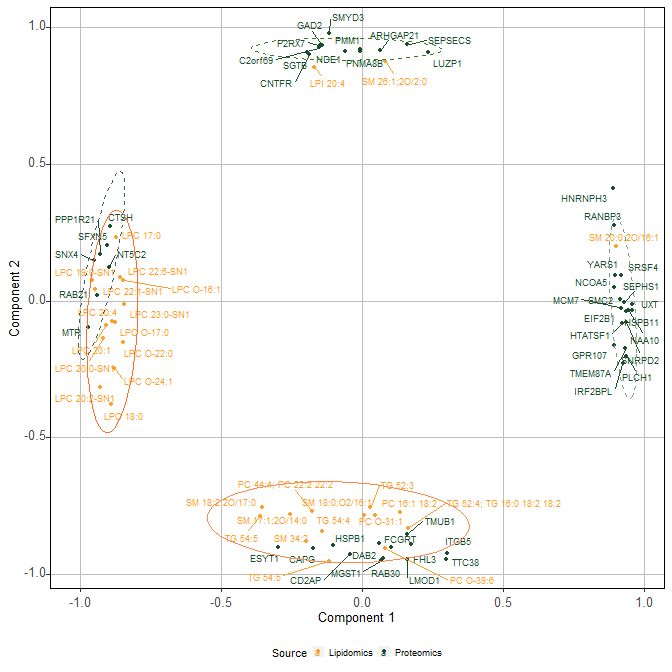

``` r
ggsave(plot = circle_fcs_lipids, 
       filename = here::here("figures/spls_prot_fcslip_gbm2.tiff"), 
       device = "tiff",
       units = "mm",
       width = 63,
       height = 63)

ggsave(plot = circle_fcs_lipids, 
       filename = here::here("figures/spls_prot_fcslip_gbm2.eps"), 
       device = "eps",
       units = "mm",
       width = 63,
       height = 63)

write_tsv(x = coord2_fcs_circlgg,
          file = here::here("suppl_tables/proteomics_lipidomics_summary_spls_results.tsv"))
```

#### Enrichment analysis of proteomics signatures

``` r
bitr_entrez_pls_fcs <- bitr(geneID = proteomics_pls$names, 
                            fromType = "SYMBOL", 
                            toType = "ENTREZID", 
                            OrgDb = "org.Hs.eg.db") %>% 
  dplyr::rename(names = SYMBOL)

proteomics_pls <- left_join(proteomics_pls, bitr_entrez_pls_fcs)

entrez_universe <- bitr(geneID = identified_proteins$gene %>% 
                                unique(), 
                            fromType = "SYMBOL", 
                            toType = "ENTREZID", 
                            OrgDb = "org.Hs.eg.db") 
```

``` r
formula_pls_fcs_res <- compareCluster(names ~ groups, 
                              data = proteomics_pls, 
                              fun = "enrichGO",
                              OrgDb = "org.Hs.eg.db",
                              keyType = "SYMBOL",
                              ont = "MF",
                              pvalueCutoff = 0.05,
                              pAdjustMethod = "BH",
                              universe = identified_proteins$gene %>% 
                                unique(),
                              qvalueCutoff = 0.2,
                              minGSSize = 1,
                              maxGSSize = 500,
                              readable = TRUE,
                              pool = FALSE)

res_enrich_pls_fcs <- simplify(formula_pls_fcs_res)
```

``` r
enrichplot::dotplot(res_enrich_pls_fcs)
```

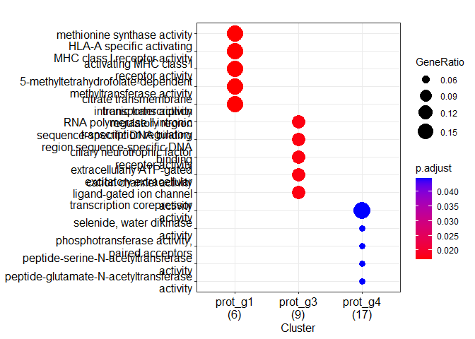

``` r
lipid_pls_enrich <- enrichplot::dotplot(res_enrich_pls_fcs) +
                    scale_color_continuous(low = "red", 
                                           high = "blue",
                                           guide = guide_colorbar(reverse=TRUE),
                                           breaks = c(0.02, 0.04)) +
                    scale_size_continuous(breaks = c(0.06, 0.15)) +
                    theme(axis.text.x = element_text(hjust = 0.5, vjust = 0, size = 8, angle = 360),
                          axis.text.y = element_text(hjust = 0.95, vjust = 0.2, size = 7),
                          panel.background = element_blank(),
                          panel.border = element_rect(colour = "black", fill=NA, size=0.5),
                          axis.title.x = element_blank(),
                          axis.title.y = element_blank(),
                          legend.text = element_text(size = 7),
                          legend.title = element_text(size = 8),
                          legend.key.height = unit(3, 'mm'),
                          legend.key.width = unit(3, 'mm'),
                          legend.position = "bottom",
                          text = element_text(family = "sans"))
```

``` r
lipid_pls_enrich
```

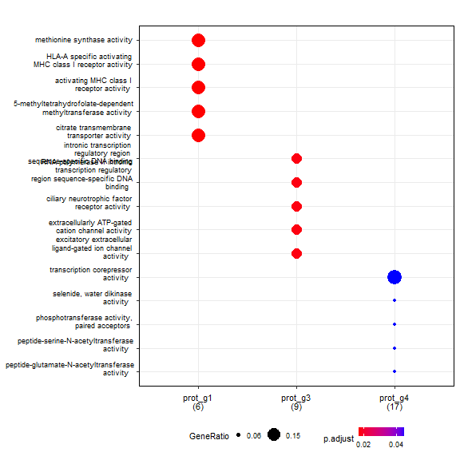

##### Visualize enrichment analysis of proteomics signatures

``` r
pls_proteomics_feat_gomf_enrichment <- res_enrich_pls_fcs@compareClusterResult %>%
  mutate(`Group` = factor(Cluster,
                          levels = c("prot_g1", "prot_g2",
                                     "prot_g3", "prot_g4"))) %>%
    mutate(
      Description = if_else(
        condition = str_count(Description, '\\S+') > 3,
        true = str_c(word(Description,1,3), word(Description,4,str_count(Description,'\\S+')), sep = '\n'),
        false = Description
      )
    ) %>% 
  mutate(Description = factor(Description,
                              levels = rev(.$Description))) %>% 
  group_by(`Group`) %>%
  slice_min(order_by = p.adjust, 
            n = 5)
```

``` r
ggplot(data = pls_proteomics_feat_gomf_enrichment,
       mapping = aes(y = -log10(p.adjust),
                     x = Description, 
                     fill = `Group`)) + 
  geom_col() + 
  geom_hline(yintercept = -log10(0.05),
             linetype = "dashed",
             color = "red") + 
  coord_flip() +  
  xlab(label = "-log10(Adjusted p-value") +
  ylab(label = "Enriched GO Cellular Compotent terms") +
   theme(axis.text.x = element_text(hjust = 0.5, vjust = 0, size = 8, angle = 360),
         axis.text.y = element_text(hjust = 0.95, vjust = 0.2, size = 7),
         panel.background = element_blank(),
         panel.border = element_rect(colour = "black", fill=NA, size=0.5),
         axis.title.x = element_blank(),
         axis.title.y = element_blank(),
         legend.text = element_text(size = 7),
         legend.title = element_text(size = 8),
         legend.key.height= unit(3, 'mm'),
         legend.key.width= unit(3, 'mm'),
         legend.position="right",
         text = element_text(family = "sans"))
```

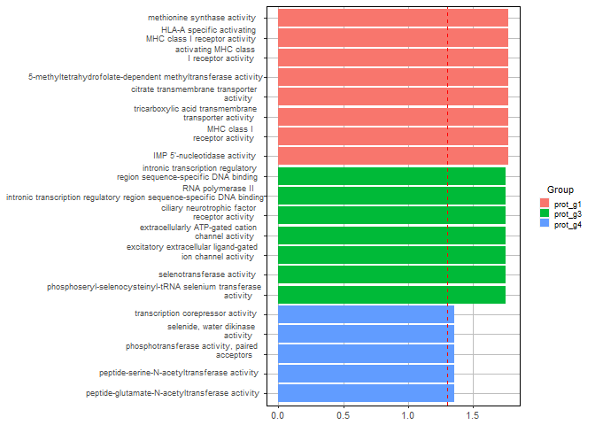

``` r
barplot_enrich_prot_pls <- ggplot(data = pls_proteomics_feat_gomf_enrichment,
                                  mapping = aes(y = -log10(p.adjust),
                                                x = Description, 
                                                fill = `Group`)) + 
                           geom_col() + 
                           geom_hline(yintercept = -log10(0.05),
                                      linetype = "dashed",
                                      color = "red",
                                      size = 0.25) + 
                           coord_flip() +  
                           ylab(label = "-log10(Adjusted p-value)") +
                           xlab(label = "Enriched GO Cellular Compotent terms") +
                           theme(axis.text.x = element_text(hjust = 0.5, 
                                                            vjust = 0, 
                                                            size = 3, 
                                                            angle = 360),
                                  axis.text.y = element_text(hjust = 0.95, 
                                                             vjust = 0.2, 
                                                             size = 3),
                                  panel.background = element_blank(),
                                  panel.border = element_rect(colour = "black", 
                                                              fill=NA, 
                                                              size=0.5),
                                  axis.title.y = element_blank(),
                                  axis.title.x = element_text(size = 4),
                                  legend.text = element_text(size = 3),
                                  legend.title = element_text(size = 3),
                                  legend.key.height = unit(3, 'mm'),
                                  legend.key.width = unit(3, 'mm'),
                                  legend.position = "right")
```

``` r
ggsave(plot = barplot_enrich_prot_pls, 
       filename = here::here("figures/barplot_gomf_pls_prot_lip_gbm2.tiff"), 
       device = "tiff",
       units = "mm",
       width = 100,
       height = 50)

ggsave(plot = barplot_enrich_prot_pls, 
       filename = here::here("figures/barplot_gomf_pls_prot_lip_gbm2.eps"), 
       device = "eps",
       units = "mm",
       width = 100,
       height = 50)
```

#### Enrichment analysis of lipidomics signatures after PLS

``` r
lipids_g1 <- coord2_fcs_circlgg %>%
  filter(groups == "lip_g1") %>%
  dplyr::rename(feature = names) %>%
  left_join(., lipid_annotation3)

lipids_g2 <- coord2_fcs_circlgg %>%
  filter(groups == "lip_g2") %>%
  dplyr::rename(feature = names) %>%
  left_join(., lipid_annotation3)
```

**Save tables of features**

``` r
write_csv(x = lipids_g1,
          file = here("data/lipidomics/lipids_g1_pls_fcs_left_group.csv")) 

write_csv(x = lipids_g2,
          file = here("data/lipidomics/lipids_g2_pls_fcs_bottom_group.csv"))
```

##### Visualization of LION enrichment results

###### LION enrichment after limma

**Loading and preprocessing LION enrichment tabular results**

``` r
lion_increased_volcano <- read_csv(file = here::here("data/lipidomics/LION-enrichment-increased_lipids.csv"))
```

``` r
lion_decreased_volcano <- read_csv(file = here::here("data/lipidomics/LION-enrichment-decreased_lipids.csv"))
```

**Preprocessing**

``` r
lion_increased_volcano <- lion_increased_volcano %>%
  mutate(`Association with Recurrence` = "Increased")

lion_decreased_volcano <- lion_decreased_volcano %>%
  mutate(`Association with Recurrence` = "Decreased")

lion_lipidom_limma <- bind_rows(lion_increased_volcano,
                                 lion_decreased_volcano) %>% 
  group_by(`Association with Recurrence`) %>% 
  slice_min(order_by = `FDR q-value`,
            n = 4) %>%
  dplyr::rename(Description = Discription) %>%
  ungroup()
```

``` r
lion_lipidom_limma_2 <- lion_lipidom_limma %>%
  mutate(`Association with Protein FCs` = factor(`Association with Recurrence`,
                          levels = c("Increased", "Decreased"))) %>%
  dplyr::arrange(`Association with Recurrence`) %>% 
    mutate(
      Description = if_else(
        condition = str_count(Description, '\\S+') > 3,
        true = str_c(word(Description,1,3), word(Description,4,str_count(Description,'\\S+')), sep = '\n'),
        false = Description
      )
    ) %>% 
  mutate(Description = factor(Description,
                              levels = rev(.$Description))) 
```

**Visualize**

``` r
ggplot(data = lion_lipidom_limma_2,
       mapping = aes(y = -log10(`FDR q-value`),
                     x = Description, 
                     fill = `Association with Protein FCs`)) + 
  geom_bar(stat = "identity") + 
  geom_hline(yintercept = -log10(0.05),
             linetype = "dashed",
             color = "red") + 
  coord_flip() +  
  xlab(label = "-log10(Adjusted p-value") +
  ylab(label = "Enriched Lipid Ontology terms") +
   theme(axis.text.x = element_text(hjust = 0.5, vjust = 0, size = 8, angle = 360),
         axis.text.y = element_text(hjust = 0.95, vjust = 0.2, size = 7),
         panel.background = element_blank(),
         panel.border = element_rect(colour = "black", fill=NA, size=0.5),
         axis.title.x = element_blank(),
         axis.title.y = element_blank(),
         legend.text = element_text(size = 7),
         legend.title = element_text(size = 8),
         legend.key.height= unit(3, 'mm'),
         legend.key.width= unit(3, 'mm'),
         legend.position="right")
```

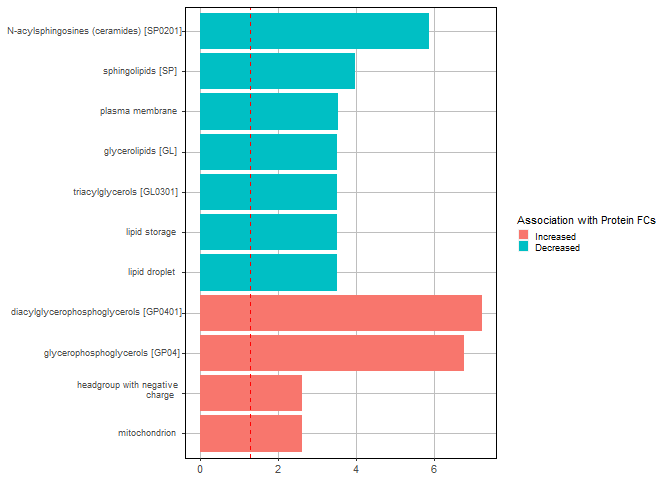

``` r
barplot_enr_lion_limma <- ggplot(data = lion_lipidom_limma_2,
                                     mapping = aes(y = -log10(`FDR q-value`),
                                                   x = Description, 
                                                   fill = `Association with Protein FCs`)) + 
  geom_bar(stat = "identity") + 
  geom_hline(yintercept = -log10(0.05),
             linetype = "dashed",
             color = "red") + 
  coord_flip() +  
  ylab(label = "-log10(Adjusted p-value") +
  xlab(label = "Enriched Lipid Ontology terms") +
  theme(axis.text.x = element_text(hjust = 0.5, 
                                   vjust = 0, 
                                   size = 3, 
                                   angle = 360),
         axis.text.y = element_text(hjust = 0.95, 
                                    vjust = 0.2, 
                                    size = 3),
         panel.background = element_blank(),
         panel.border = element_rect(colour = "black", 
                                     fill=NA, 
                                     size=0.5),
         axis.title.y = element_blank(),
         axis.title.x = element_text(size = 4),
         legend.text = element_text(size = 3),
         legend.title = element_text(size = 3),
         legend.key.height = unit(3, 'mm'),
         legend.key.width = unit(3, 'mm'),
         legend.position = "right",
        text = element_text("sans"))

barplot_enr_lion_limma_helv <- barplot_enr_lion_limma + 
  theme(text = element_text("Helvetica"))
```

``` r
ggsave(plot = barplot_enr_lion_limma, 
       filename = here::here("figures/barplot_lion_enrich_limma_lip_gbm2.tiff"), 
       device = "tiff",
       units = "mm",
       width = 80,
       height = 36)

ggsave(plot = barplot_enr_lion_limma_helv, 
       filename = here::here("figures/barplot_lion_enrich_limma_lip_gbm2.eps"), 
       device = "eps",
       units = "mm",
       width = 80,
       height = 36)
```

###### LION enrichment after FCs-based PLS

**Loading and preprocessing LION enrichment tabular results**

``` r
lion_g1_pls <- read_csv(file = here::here("data/lipidomics/LION-enrichment-g1_lipids_fcsbased_pls.csv"))
```

``` r
lion_g2_pls <- read_csv(file = here::here("data/lipidomics/LION-enrichment-g2_lipids_fcsbased_pls.csv"))
```

**Preprocessing**

``` r
lion_g1_pls <- lion_g1_pls %>%
  mutate(`PLS group` = "G1")

lion_g2_pls <- lion_g2_pls %>%
  mutate(`PLS group` = "G2")

lion_lipidom_pls <- bind_rows(lion_g1_pls,
                                 lion_g2_pls) %>% 
  group_by(`PLS group`) %>% 
  slice_min(order_by = `FDR q-value`,
            n = 4) %>%
  dplyr::rename(Description = Discription) %>%
  ungroup()
```

``` r
lion_lipidom_pls_2 <- lion_lipidom_pls %>%
  mutate(`PLS group` = factor(`PLS group`,
                          levels = c("G1", "G2"))) %>%
  dplyr::arrange(`PLS group`) %>% 
    mutate(
      Description = if_else(
        condition = str_count(Description, '\\S+') > 3,
        true = str_c(word(Description,1,3), word(Description,4,str_count(Description,'\\S+')), sep = '\n'),
        false = Description
      )
    ) %>% 
  mutate(Description = factor(Description,
                              levels = rev(.$Description))) 
```

**Visualize**

``` r
ggplot(data = lion_lipidom_pls_2,
       mapping = aes(y = -log10(`FDR q-value`),
                     x = Description, 
                     fill = `PLS group`)) + 
  geom_bar(stat = "identity") + 
  geom_hline(yintercept = -log10(0.05),
             linetype = "dashed",
             color = "red") + 
  coord_flip() +  
  xlab(label = "-log10(Adjusted p-value") +
  ylab(label = "Enriched Lipid Ontology terms") +
   theme(axis.text.x = element_text(hjust = 0.5, vjust = 0, size = 8, angle = 360),
         axis.text.y = element_text(hjust = 0.95, vjust = 0.2, size = 7),
         panel.background = element_blank(),
         panel.border = element_rect(colour = "black", fill=NA, size=0.5),
         axis.title.x = element_blank(),
         axis.title.y = element_blank(),
         legend.text = element_text(size = 7),
         legend.title = element_text(size = 8),
         legend.key.height= unit(3, 'mm'),
         legend.key.width= unit(3, 'mm'),
         legend.position="right")
```

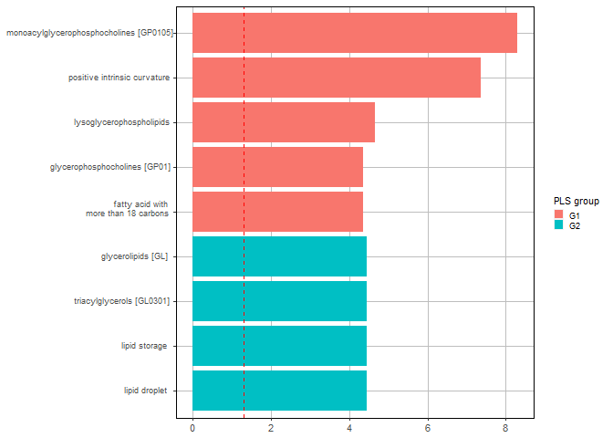

``` r
barplot_enr_lion_pls <- ggplot(data = lion_lipidom_pls_2,
                                     mapping = aes(y = -log10(`FDR q-value`),
                                                   x = Description, 
                                                   fill = `PLS group`)) + 
  geom_bar(stat = "identity") + 
  geom_hline(yintercept = -log10(0.05),
             linetype = "dashed",
             color = "red") + 
  coord_flip() +  
  xlab(label = "-log10(Adjusted p-value") +
  ylab(label = "Enriched Lipid Ontology terms") +
     theme(axis.text.x = element_text(hjust = 0.5, 
                                   vjust = 0, 
                                   size = 3, 
                                   angle = 360),
         axis.text.y = element_text(hjust = 0.95, 
                                    vjust = 0.2, 
                                    size = 3),
         panel.background = element_blank(),
         panel.border = element_rect(colour = "black", 
                                     fill=NA, 
                                     size=0.5),
         axis.title.y = element_blank(),
         axis.title.x = element_text(size = 4),
         legend.text = element_text(size = 3),
         legend.title = element_text(size = 3),
         legend.key.height = unit(3, 'mm'),
         legend.key.width = unit(3, 'mm'),
         legend.position = "right",
        text = element_text("sans"))

barplot_enr_lion_pls_helv <- barplot_enr_lion_pls + 
  theme(text = element_text("Helvetica"))
```

``` r
ggsave(plot = barplot_enr_lion_pls, 
       filename = here::here("figures/barplot_lion_enrich_fcs_pls_lip_gbm2.tiff"), 
       device = "tiff",
       units = "mm",
       width = 80,
       height = 36)

ggsave(plot = barplot_enr_lion_pls_helv, 
       filename = here::here("figures/barplot_lion_enrich_fcs_pls_lip_gbm2.eps"), 
       device = "eps",
       units = "mm",
       width = 80,
       height = 36)
```
