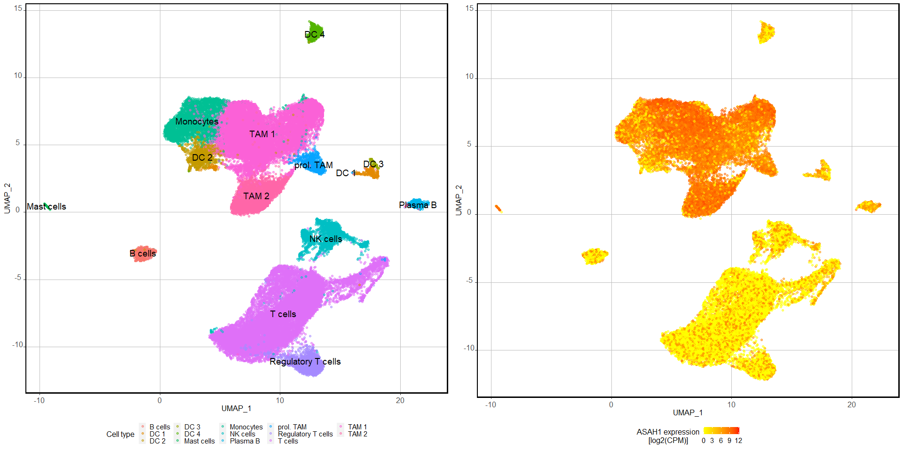

GBM Recurrence - Mine Single Cell data
================
Miguel Cosenza-Contreras

- <a href="#initial-data-loading-and-wrangling"
  id="toc-initial-data-loading-and-wrangling"><span
  class="toc-section-number">1</span> Initial data loading and
  wrangling</a>
- <a href="#generate-scatter-plot" id="toc-generate-scatter-plot"><span
  class="toc-section-number">2</span> Generate scatter plot</a>

``` r
knitr::opts_chunk$set(echo = TRUE, 
                      message = FALSE, 
                      warning = FALSE)

## Required packages ----
library(tidyverse)
```

    Warning: package 'ggplot2' was built under R version 4.3.1

    Warning: package 'purrr' was built under R version 4.3.1

    ── Attaching core tidyverse packages ──────────────────────── tidyverse 2.0.0 ──
    ✔ dplyr     1.1.2     ✔ readr     2.1.4
    ✔ forcats   1.0.0     ✔ stringr   1.5.0
    ✔ ggplot2   3.4.3     ✔ tibble    3.2.1
    ✔ lubridate 1.9.2     ✔ tidyr     1.3.0
    ✔ purrr     1.0.2     
    ── Conflicts ────────────────────────────────────────── tidyverse_conflicts() ──
    ✖ dplyr::filter() masks stats::filter()
    ✖ dplyr::lag()    masks stats::lag()
    ℹ Use the conflicted package (<http://conflicted.r-lib.org/>) to force all conflicts to become errors

``` r
library(ggpubr)
library(ggrepel)
library(cowplot)
```


    Attaching package: 'cowplot'

    The following object is masked from 'package:ggpubr':

        get_legend

    The following object is masked from 'package:lubridate':

        stamp

``` r
theme_set(theme(axis.text.x = element_text(hjust = 0.5, 
                                           vjust = 0, 
                                           size = 12, 
                                           angle = 360),
                axis.text.y = element_text(hjust = 0.5, 
                                           vjust = 0, 
                                           size = 12),
                panel.background = element_blank(),
                panel.grid.major = element_line(color = "grey"),
                panel.border = element_rect(colour = "black", 
                                            fill = NA, 
                                            linewidth = 1.5),
                axis.title=element_text(size = 12),
                legend.title = element_text(size = 12),
                legend.text = element_text(size = 11),
                legend.key.height = unit(4, 
                                         'mm'),
                legend.key.width = unit(4, 
                                        'mm'),
                legend.key.size = unit(10,
                                        'mm'),
                legend.position = "bottom"))
```

# Initial data loading and wrangling

Load the annotation with ASAH1 expression data

``` r
annotated_with_asah1 <- readRDS(here::here("rds/long_cpm_scrnaseq_asah1_annot.rds"))
```

# Generate scatter plot

``` r
umap_asah1_expr <- ggplot(annotated_with_asah1, 
       aes(x = x, 
           y = y, 
           color = asah1_expression)) +
  geom_point(alpha = 0.5) +
  scale_color_gradient(low = "yellow", high = "red") +
  labs(x = "UMAP_1", 
       y = "UMAP_2", 
       color = "ASAH1 expression\n[log2(CPM)]") +
  theme(legend.position = "bottom")
```

``` r
cell_type_centroid <- annotated_with_asah1 %>%
  group_by(cluster) %>%
  summarise(x = mean(x), 
            y = mean(y)) %>%
  ungroup()
```

``` r
umap_cell_type <- ggplot(annotated_with_asah1, 
       aes(x = x, 
           y = y, 
           color = cluster)) +
  geom_point(alpha = 0.5) +
  geom_text(data = cell_type_centroid, 
            aes(x = x, 
                y = y, 
                label = cluster), 
            size = 5,
            color = "black") +
  #scale_color_gradient(low = "yellow", high = "red") +
  labs(x = "UMAP_1", 
       y = "UMAP_2", 
       color = "Cell type") +
  theme(legend.position = "bottom") 
```

``` r
umap_grid <- plot_grid(umap_cell_type, 
                       umap_asah1_expr, 
                       ncol = 2)
```

``` r
umap_grid
```



``` r
ggsave(here::here("figures/umap_grid_asah1_expression_scRNAseq.pdf"), 
       umap_grid, 
       width = 34, 
       height = 34/2,
       units = "cm")
```

``` r
ggsave(here::here("figures/umap_grid_asah1_expression_scRNAseq.png"), 
       umap_grid, 
       width = 34, 
       height = 34/2,
       units = "cm")
```

``` r
dev.off()
```

    null device 
              1 
