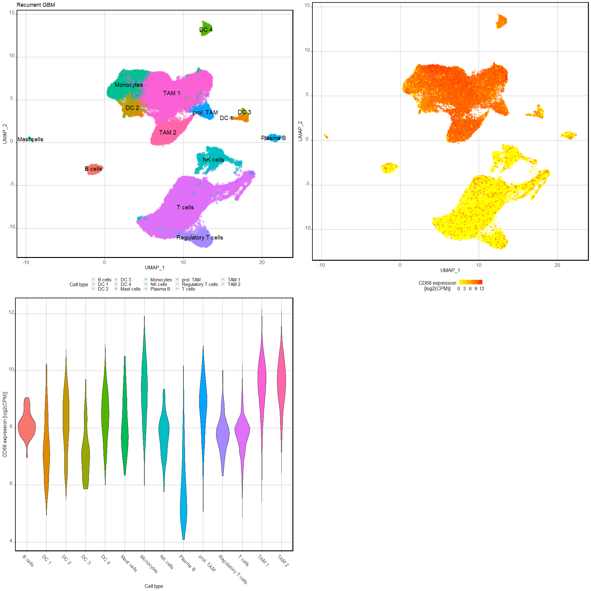

GBM Recurrence - Mine Single Cell data
================
Miguel Cosenza-Contreras

- <a href="#initial-data-loading-and-wrangling"
  id="toc-initial-data-loading-and-wrangling"><span
  class="toc-section-number">1</span> Initial data loading and
  wrangling</a>
- <a href="#generate-scatter-plot-for-asah1-expression"
  id="toc-generate-scatter-plot-for-asah1-expression"><span
  class="toc-section-number">2</span> Generate scatter plot for ASAH1
  expression</a>
  - <a href="#rgbm" id="toc-rgbm"><span
    class="toc-section-number">2.1</span> rGBM</a>
  - <a href="#violin-plot" id="toc-violin-plot"><span
    class="toc-section-number">2.2</span> Violin plot</a>
  - <a href="#igbm" id="toc-igbm"><span
    class="toc-section-number">2.3</span> iGBM</a>
- <a href="#generate-scatter-plot-mpo-expression"
  id="toc-generate-scatter-plot-mpo-expression"><span
  class="toc-section-number">3</span> Generate scatter plot MPO
  expression</a>
  - <a href="#violin-plot-1" id="toc-violin-plot-1"><span
    class="toc-section-number">3.1</span> Violin plot</a>
- <a href="#generate-scatter-plot-for-cd14-expression"
  id="toc-generate-scatter-plot-for-cd14-expression"><span
  class="toc-section-number">4</span> Generate scatter plot for CD14
  expression</a>
  - <a href="#rgbm-1" id="toc-rgbm-1"><span
    class="toc-section-number">4.1</span> rGBM</a>
    - <a href="#violin-plot-2" id="toc-violin-plot-2"><span
      class="toc-section-number">4.1.1</span> Violin plot</a>
  - <a href="#igbm-1" id="toc-igbm-1"><span
    class="toc-section-number">4.2</span> iGBM</a>
    - <a href="#violin-plot-3" id="toc-violin-plot-3"><span
      class="toc-section-number">4.2.1</span> Violin plot</a>
- <a href="#generate-scatter-plot-for-iba1-expression"
  id="toc-generate-scatter-plot-for-iba1-expression"><span
  class="toc-section-number">5</span> Generate scatter plot for IBA1
  expression</a>
  - <a href="#rgbm-2" id="toc-rgbm-2"><span
    class="toc-section-number">5.1</span> rGBM</a>
    - <a href="#violin-plot-4" id="toc-violin-plot-4"><span
      class="toc-section-number">5.1.1</span> Violin plot</a>
  - <a href="#igbm-2" id="toc-igbm-2"><span
    class="toc-section-number">5.2</span> iGBM</a>
- <a href="#generate-scatter-plot-for-elane-expression"
  id="toc-generate-scatter-plot-for-elane-expression"><span
  class="toc-section-number">6</span> Generate scatter plot for ELANE
  expression</a>
  - <a href="#rgbm-3" id="toc-rgbm-3"><span
    class="toc-section-number">6.1</span> rGBM</a>
  - <a href="#violin-plot-5" id="toc-violin-plot-5"><span
    class="toc-section-number">6.2</span> Violin plot</a>
  - <a href="#igbm-3" id="toc-igbm-3"><span
    class="toc-section-number">6.3</span> iGBM</a>
- <a href="#genearate-scatter-plot-for-lipocalin-2-lcn2-expression"
  id="toc-genearate-scatter-plot-for-lipocalin-2-lcn2-expression"><span
  class="toc-section-number">7</span> Genearate scatter plot for
  lipocalin-2 (LCN2) expression</a>
- <a href="#overlay-elane-with-asah1-mpo-and-cd14-expression"
  id="toc-overlay-elane-with-asah1-mpo-and-cd14-expression"><span
  class="toc-section-number">8</span> Overlay ELANE with ASAH1, MPO and
  CD14 expression</a>
  - <a href="#rgbm-4" id="toc-rgbm-4"><span
    class="toc-section-number">8.1</span> rGBM</a>
    - <a href="#violin-of-overlay" id="toc-violin-of-overlay"><span
      class="toc-section-number">8.1.1</span> Violin of overlay</a>
  - <a href="#igbm-4" id="toc-igbm-4"><span
    class="toc-section-number">8.2</span> iGBM</a>
  - <a href="#umap-overlay-of-rgbm-and-igbm"
    id="toc-umap-overlay-of-rgbm-and-igbm"><span
    class="toc-section-number">8.3</span> UMAP overlay of rGBM and iGBM</a>
- <a href="#generate-scatter-plot-for-cd68-expression"
  id="toc-generate-scatter-plot-for-cd68-expression"><span
  class="toc-section-number">9</span> Generate scatter plot for CD68
  expression</a>
  - <a href="#rgbm-5" id="toc-rgbm-5"><span
    class="toc-section-number">9.1</span> rGBM</a>
  - <a href="#violin-plot-6" id="toc-violin-plot-6"><span
    class="toc-section-number">9.2</span> Violin plot</a>
  - <a href="#igbm-5" id="toc-igbm-5"><span
    class="toc-section-number">9.3</span> iGBM</a>
    - <a href="#violin-plot-7" id="toc-violin-plot-7"><span
      class="toc-section-number">9.3.1</span> Violin plot</a>
- <a href="#overlay-iba1-and-cd68-expression"
  id="toc-overlay-iba1-and-cd68-expression"><span
  class="toc-section-number">10</span> Overlay IBA1 and CD68
  expression</a>
  - <a href="#rgbm-6" id="toc-rgbm-6"><span
    class="toc-section-number">10.1</span> rGBM</a>
    - <a href="#violin-of-overlay-1" id="toc-violin-of-overlay-1"><span
      class="toc-section-number">10.1.1</span> Violin of overlay</a>
  - <a href="#igbm-6" id="toc-igbm-6"><span
    class="toc-section-number">10.2</span> iGBM</a>
  - <a href="#violin-plot-of-the-overlay"
    id="toc-violin-plot-of-the-overlay"><span
    class="toc-section-number">10.3</span> Violin plot of the overlay</a>
- <a href="#rgbm-vs-igbm-comparisons"
  id="toc-rgbm-vs-igbm-comparisons"><span
  class="toc-section-number">11</span> rGBM vs iGBM comparisons</a>
  - <a href="#asah1-expression" id="toc-asah1-expression"><span
    class="toc-section-number">11.1</span> ASAH1 expression</a>
    - <a href="#umap-of-cell-type-based-on-igbm-nd-newly-diagnosed"
      id="toc-umap-of-cell-type-based-on-igbm-nd-newly-diagnosed"><span
      class="toc-section-number">11.1.1</span> UMAP of cell type based on iGBM
      (ND = newly diagnosed)</a>
- <a href="#umaps-of-cell-type-between-igbm-and-rgbm"
  id="toc-umaps-of-cell-type-between-igbm-and-rgbm"><span
  class="toc-section-number">12</span> UMAPs of cell type between iGBM and
  rGBM</a>
  - <a href="#umaps-with-asah1-expression-between-igbm-and-rgbm"
    id="toc-umaps-with-asah1-expression-between-igbm-and-rgbm"><span
    class="toc-section-number">12.1</span> UMAPs with ASAH1 expression
    between iGBM and rGBM</a>
  - <a href="#violin-plots-of-asah1-expression-between-igbm-and-rgbm"
    id="toc-violin-plots-of-asah1-expression-between-igbm-and-rgbm"><span
    class="toc-section-number">12.2</span> Violin plots of ASAH1 expression
    between iGBM and rGBM</a>
  - <a
    href="#violin-plots-for-asah1-elane-and-mpo-expression-between-igbm-and-rgbm"
    id="toc-violin-plots-for-asah1-elane-and-mpo-expression-between-igbm-and-rgbm"><span
    class="toc-section-number">12.3</span> Violin plots for ASAH1, ELANE and
    MPO expression between iGBM and rGBM</a>
  - <a href="#asah1-expression-in-cd14-cells"
    id="toc-asah1-expression-in-cd14-cells"><span
    class="toc-section-number">12.4</span> ASAH1 expression in CD14+
    cells</a>
    - <a href="#rgbm-7" id="toc-rgbm-7"><span
      class="toc-section-number">12.4.1</span> rGBM</a>
    - <a href="#igbm-7" id="toc-igbm-7"><span
      class="toc-section-number">12.4.2</span> iGBM</a>
    - <a href="#violin-plot-of-asah1-expression-in-cd14-cells"
      id="toc-violin-plot-of-asah1-expression-in-cd14-cells"><span
      class="toc-section-number">12.4.3</span> Violin plot of ASAH1 expression
      in CD14+ cells</a>

``` r
knitr::opts_chunk$set(echo = FALSE, 
                      message = FALSE, 
                      warning = FALSE)

## Required packages ----
library(tidyverse)
```

    Warning: package 'ggplot2' was built under R version 4.3.1

    Warning: package 'purrr' was built under R version 4.3.1

    ── Attaching core tidyverse packages ──────────────────────── tidyverse 2.0.0 ──
    ✔ dplyr     1.1.2     ✔ readr     2.1.4
    ✔ forcats   1.0.0     ✔ stringr   1.5.0
    ✔ ggplot2   3.4.3     ✔ tibble    3.2.1
    ✔ lubridate 1.9.2     ✔ tidyr     1.3.0
    ✔ purrr     1.0.2     
    ── Conflicts ────────────────────────────────────────── tidyverse_conflicts() ──
    ✖ dplyr::filter() masks stats::filter()
    ✖ dplyr::lag()    masks stats::lag()
    ℹ Use the conflicted package (<http://conflicted.r-lib.org/>) to force all conflicts to become errors

``` r
library(ggpubr)
library(ggrepel)
library(cowplot)
```


    Attaching package: 'cowplot'

    The following object is masked from 'package:ggpubr':

        get_legend

    The following object is masked from 'package:lubridate':

        stamp

``` r
library(scales)    # Install ggnewscale package
```

    Warning: package 'scales' was built under R version 4.3.1


    Attaching package: 'scales'

    The following object is masked from 'package:purrr':

        discard

    The following object is masked from 'package:readr':

        col_factor

``` r
library(ggnewscale)    
```

    Warning: package 'ggnewscale' was built under R version 4.3.1

``` r
library(ggrastr)
```

    Warning: package 'ggrastr' was built under R version 4.3.1

``` r
theme_set(theme(axis.text.x = element_text(hjust = 0.5, 
                                           vjust = 0, 
                                           size = 12, 
                                           angle = 360),
                axis.text.y = element_text(hjust = 0.5, 
                                           vjust = 0, 
                                           size = 12),
                panel.background = element_blank(),
                panel.grid.major = element_line(color = "grey"),
                panel.border = element_rect(colour = "black", 
                                            fill = NA, 
                                            linewidth = 1.5),
                axis.title=element_text(size = 12),
                legend.title = element_text(size = 12),
                legend.text = element_text(size = 11),
                legend.key.height = unit(4, 
                                         'mm'),
                legend.key.width = unit(4, 
                                        'mm'),
                legend.key.size = unit(10,
                                        'mm'),
                legend.position = "bottom"))
```

# Initial data loading and wrangling

Load the annotation with ASAH1 expression data

# Generate scatter plot for ASAH1 expression

## rGBM

## Violin plot


    null device 
              1 

## iGBM

# Generate scatter plot MPO expression

## Violin plot


# Generate scatter plot for CD14 expression

## rGBM


### Violin plot


## iGBM


### Violin plot


# Generate scatter plot for IBA1 expression

## rGBM

### Violin plot

    # A tibble: 6 × 8
      gene  cell               iba1_expression     x      y ident cluster sample
      <chr> <chr>                        <dbl> <dbl>  <dbl> <dbl> <chr>   <chr> 
    1 AIF1  AAACCTGCAGCTTAAC-1            7.71  6.61 -10.1      5 T cells R1    
    2 AIF1  AACTCTTTCCTCAATT-1            7.88  6.56  -9.38     5 T cells R1    
    3 AIF1  AACTGGTCAGGTGCCT-1            9.25 11.0   -7.16     3 T cells R1    
    4 AIF1  AACTTTCGTGTGCGTC-1            8.15  7.64  -9.11     5 T cells R1    
    5 AIF1  AAGGCAGTCACTCTTA-1            7.89  6.51  -9.86     5 T cells R1    
    6 AIF1  AATCCAGGTCATACTG-1            7.39  6.35 -10.5      5 T cells R1    


## iGBM


# Generate scatter plot for ELANE expression

## rGBM

## Violin plot


## iGBM


# Genearate scatter plot for lipocalin-2 (LCN2) expression

The single-cell dataset does not seem to contain LCN2 expression data.

# Overlay ELANE with ASAH1, MPO and CD14 expression

## rGBM


### Violin of overlay


    null device 
              1 

## iGBM

    # A tibble: 0 × 8
    # ℹ 8 variables: gene <chr>, cell <chr>, mpo_expression <dbl>, x <dbl>,
    #   y <dbl>, ident <dbl>, cluster <chr>, sample <chr>


## UMAP overlay of rGBM and iGBM


# Generate scatter plot for CD68 expression

## rGBM

## Violin plot



## iGBM


### Violin plot


# Overlay IBA1 and CD68 expression

## rGBM


### Violin of overlay

## iGBM


## Violin plot of the overlay

    [1] "T cells"   "NK cells"  "Monocytes" "TAM 1"     "DC"        "B cells"  
    [7] "TAM 2"     "prol. TAM"


    null device 
              1 

# rGBM vs iGBM comparisons

## ASAH1 expression

Load the data

### UMAP of cell type based on iGBM (ND = newly diagnosed)

# UMAPs of cell type between iGBM and rGBM


## UMAPs with ASAH1 expression between iGBM and rGBM


## Violin plots of ASAH1 expression between iGBM and rGBM

    tibble [42,870 × 8] (S3: tbl_df/tbl/data.frame)
     $ gene            : chr [1:42870] "ASAH1" "ASAH1" "ASAH1" "ASAH1" ...
     $ cell            : chr [1:42870] "AAACCTGAGAAGGTTT-1" "AAACCTGAGCCAGGAT-1" "AAACCTGCAGCTTAAC-1" "AAACCTGTCATTCACT-1" ...
     $ asah1_expression: num [1:42870] 0 0 0 0 0 ...
     $ x               : num [1:42870] 9.86 8.58 6.61 9.74 5.96 ...
     $ y               : num [1:42870] -9.88 -9.68 -10.11 -8.57 -10.13 ...
     $ ident           : num [1:42870] 3 3 5 3 5 3 5 5 5 3 ...
     $ cluster         : chr [1:42870] "T cells" "T cells" "T cells" "T cells" ...
     $ sample          : chr [1:42870] "R1" "R1" "R1" "R1" ...

    tibble [21,303 × 8] (S3: tbl_df/tbl/data.frame)
     $ gene            : chr [1:21303] "ASAH1" "ASAH1" "ASAH1" "ASAH1" ...
     $ cell            : chr [1:21303] "AAACCTGAGAGCCTAG-1" "AAACCTGAGTATCGAA-1" "AAACCTGAGTGATCGG-1" "AAACCTGCAGCGTAAG-1" ...
     $ asah1_expression: num [1:21303] 0 10.09 7.65 7.82 7.7 ...
     $ x               : num [1:21303] -1.93 -2.085 -1.458 -0.405 -1.218 ...
     $ y               : num [1:21303] -4.87 -6.32 -5.01 -5.3 -6.31 ...
     $ ident           : num [1:21303] 1 1 1 1 1 1 1 1 1 1 ...
     $ cluster         : chr [1:21303] "TAM 2" "TAM 2" "TAM 2" "TAM 2" ...
     $ sample          : chr [1:21303] "ND7" "ND7" "ND7" "ND7" ...


## Violin plots for ASAH1, ELANE and MPO expression between iGBM and rGBM

    [1] "T cells"   "NK cells"  "TAM 2"     "Monocytes" "TAM 1"     "DC"       
    [7] "B cells"   "prol. TAM"


## ASAH1 expression in CD14+ cells

### rGBM

Filter CD14+ cells:

    [1] 14.63351

### iGBM

Filter CD14+ cells:

    [1] 14.26552

### Violin plot of ASAH1 expression in CD14+ cells

    # A tibble: 33,069 × 9
       gene  cell         asah1_expression     x     y ident cluster sample gbm_type
       <chr> <chr>                   <dbl> <dbl> <dbl> <dbl> <chr>   <chr>  <chr>   
     1 ASAH1 AAAGCAAAGAA…             8.26  1.09  6.61     4 Monocy… R1     rGBM    
     2 ASAH1 AAAGTAGGTTA…            10.4   1.22  5.67     4 Monocy… R1     rGBM    
     3 ASAH1 AACACGTTCCC…             7.80  4.83  5.38     4 Monocy… R1     rGBM    
     4 ASAH1 ACACCCTCAGA…             9.30  1.75  6.11     4 Monocy… R1     rGBM    
     5 ASAH1 ACATCAGAGCC…             8.33  1.11  5.78     4 Monocy… R1     rGBM    
     6 ASAH1 ACATCAGAGTG…             9.30  8.54  7.05     4 Monocy… R1     rGBM    
     7 ASAH1 ACATGGTCAGA…             8.80  2.00  6.26     4 Monocy… R1     rGBM    
     8 ASAH1 ACATGGTGTCA…             8.14  2.45  6.40     4 Monocy… R1     rGBM    
     9 ASAH1 ACCAGTATCGT…             8.95  1.50  5.36     4 Monocy… R1     rGBM    
    10 ASAH1 ACGAGGAAGAA…             7.85  3.14  8.29     4 Monocy… R1     rGBM    
    # ℹ 33,059 more rows

    null device 
              1 


