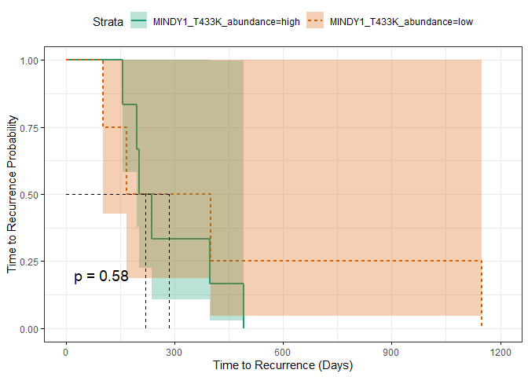
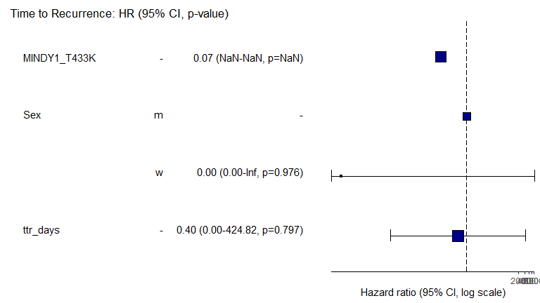
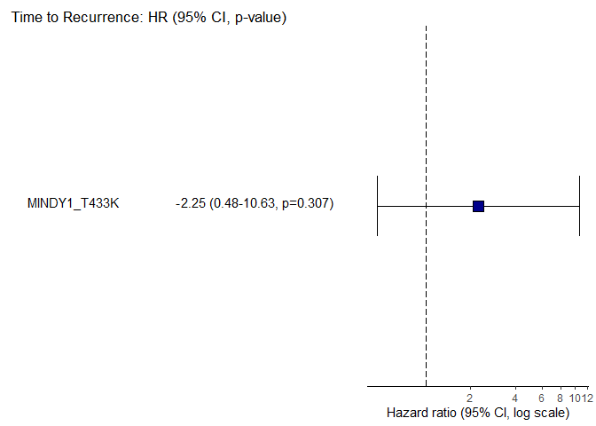
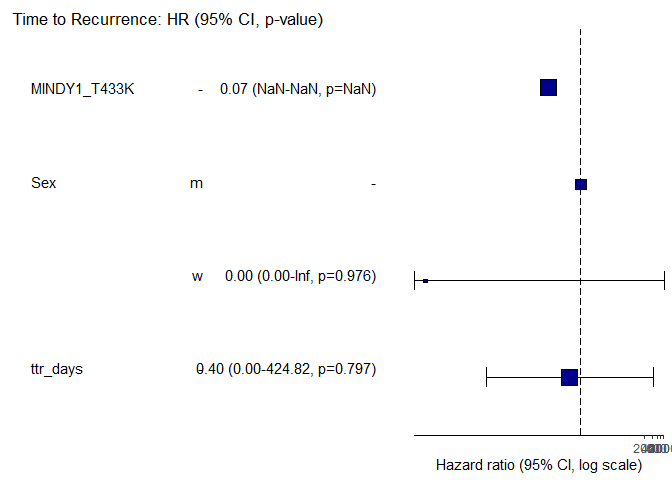

GBM Recurrence Proteogenomics - MINDY assoc. with TTR
================
Miguel Cosenza-Contreras

- <a href="#get-mindy-expression-data"
  id="toc-get-mindy-expression-data"><span
  class="toc-section-number">1</span> Get MINDY expression data</a>
- <a href="#associate-myndy-expression-with-time-to-recurrence"
  id="toc-associate-myndy-expression-with-time-to-recurrence"><span
  class="toc-section-number">2</span> Associate MYNDY expression with Time
  to Recurrence</a>
  - <a href="#load-and-prepare-patient-data"
    id="toc-load-and-prepare-patient-data"><span
    class="toc-section-number">2.1</span> Load and prepare patient data</a>
  - <a href="#sample-annotation" id="toc-sample-annotation"><span
    class="toc-section-number">2.2</span> Sample annotation</a>
  - <a
    href="#whats-the-association-of-mindy1_t433k-at-initial-stage-with-time-to-recurrence"
    id="toc-whats-the-association-of-mindy1_t433k-at-initial-stage-with-time-to-recurrence"><span
    class="toc-section-number">2.3</span> What’s the association of
    MINDY1_T433K at Initial stage with time to recurrence?</a>
- <a
  href="#cox-proportional-hazards-model-on-protein-expression-vs-time-to-recurrence"
  id="toc-cox-proportional-hazards-model-on-protein-expression-vs-time-to-recurrence"><span
  class="toc-section-number">3</span> Cox proportional hazards model on
  protein expression vs Time to Recurrence</a>
  - <a href="#checking-assumptions" id="toc-checking-assumptions"><span
    class="toc-section-number">3.1</span> Checking Assumptions</a>
  - <a href="#model-results" id="toc-model-results"><span
    class="toc-section-number">3.2</span> Model results</a>

``` r
knitr::opts_chunk$set(echo = TRUE, 
                      message = FALSE, 
                      warning = FALSE)

source(here::here("scr/helper_functions.R"))

## Required packages ----
library(tidyverse)
```

    Warning: package 'ggplot2' was built under R version 4.3.1

    Warning: package 'purrr' was built under R version 4.3.1

    ── Attaching core tidyverse packages ──────────────────────── tidyverse 2.0.0 ──
    ✔ dplyr     1.1.2     ✔ readr     2.1.4
    ✔ forcats   1.0.0     ✔ stringr   1.5.0
    ✔ ggplot2   3.4.3     ✔ tibble    3.2.1
    ✔ lubridate 1.9.2     ✔ tidyr     1.3.0
    ✔ purrr     1.0.2     
    ── Conflicts ────────────────────────────────────────── tidyverse_conflicts() ──
    ✖ dplyr::filter() masks stats::filter()
    ✖ dplyr::lag()    masks stats::lag()
    ℹ Use the conflicted package (<http://conflicted.r-lib.org/>) to force all conflicts to become errors

``` r
library(mixOmics)
```

    Loading required package: MASS

    Attaching package: 'MASS'

    The following object is masked from 'package:dplyr':

        select

    Loading required package: lattice

    Loaded mixOmics 6.24.0
    Thank you for using mixOmics!
    Tutorials: http://mixomics.org
    Bookdown vignette: https://mixomicsteam.github.io/Bookdown
    Questions, issues: Follow the prompts at http://mixomics.org/contact-us
    Cite us:  citation('mixOmics')


    Attaching package: 'mixOmics'

    The following object is masked from 'package:purrr':

        map

``` r
library(fs)
```

    Warning: package 'fs' was built under R version 4.3.1

``` r
library(kableExtra)
```


    Attaching package: 'kableExtra'

    The following object is masked from 'package:dplyr':

        group_rows

``` r
library(sva)
```

    Loading required package: mgcv
    Loading required package: nlme

    Warning: package 'nlme' was built under R version 4.3.1


    Attaching package: 'nlme'

    The following object is masked from 'package:dplyr':

        collapse

    This is mgcv 1.8-42. For overview type 'help("mgcv-package")'.
    Loading required package: genefilter

    Attaching package: 'genefilter'

    The following object is masked from 'package:MASS':

        area

    The following object is masked from 'package:readr':

        spec

    Loading required package: BiocParallel

``` r
library(limma)
library(naniar)
library(missForest)
library(clusterProfiler)
```

    Warning: package 'clusterProfiler' was built under R version 4.3.1


    Registered S3 methods overwritten by 'treeio':
      method              from    
      MRCA.phylo          tidytree
      MRCA.treedata       tidytree
      Nnode.treedata      tidytree
      Ntip.treedata       tidytree
      ancestor.phylo      tidytree
      ancestor.treedata   tidytree
      child.phylo         tidytree
      child.treedata      tidytree
      full_join.phylo     tidytree
      full_join.treedata  tidytree
      groupClade.phylo    tidytree
      groupClade.treedata tidytree
      groupOTU.phylo      tidytree
      groupOTU.treedata   tidytree
      inner_join.phylo    tidytree
      inner_join.treedata tidytree
      is.rooted.treedata  tidytree
      nodeid.phylo        tidytree
      nodeid.treedata     tidytree
      nodelab.phylo       tidytree
      nodelab.treedata    tidytree
      offspring.phylo     tidytree
      offspring.treedata  tidytree
      parent.phylo        tidytree
      parent.treedata     tidytree
      root.treedata       tidytree
      rootnode.phylo      tidytree
      sibling.phylo       tidytree
    clusterProfiler v4.8.2  For help: https://yulab-smu.top/biomedical-knowledge-mining-book/

    If you use clusterProfiler in published research, please cite:
    T Wu, E Hu, S Xu, M Chen, P Guo, Z Dai, T Feng, L Zhou, W Tang, L Zhan, X Fu, S Liu, X Bo, and G Yu. clusterProfiler 4.0: A universal enrichment tool for interpreting omics data. The Innovation. 2021, 2(3):100141

    Attaching package: 'clusterProfiler'

    The following object is masked from 'package:lattice':

        dotplot

    The following object is masked from 'package:MASS':

        select

    The following object is masked from 'package:purrr':

        simplify

    The following object is masked from 'package:stats':

        filter

``` r
library(ReactomePA)
```

    ReactomePA v1.44.0  For help: https://yulab-smu.top/biomedical-knowledge-mining-book/

    If you use ReactomePA in published research, please cite:
    Guangchuang Yu, Qing-Yu He. ReactomePA: an R/Bioconductor package for reactome pathway analysis and visualization. Molecular BioSystems 2016, 12(2):477-479

    Attaching package: 'ReactomePA'

    The following object is masked from 'package:lattice':

        dotplot

``` r
library(org.Hs.eg.db)
```

    Loading required package: AnnotationDbi

    Warning: package 'AnnotationDbi' was built under R version 4.3.1

    Loading required package: stats4
    Loading required package: BiocGenerics

    Attaching package: 'BiocGenerics'

    The following object is masked from 'package:limma':

        plotMA

    The following object is masked from 'package:fs':

        path

    The following objects are masked from 'package:lubridate':

        intersect, setdiff, union

    The following objects are masked from 'package:dplyr':

        combine, intersect, setdiff, union

    The following objects are masked from 'package:stats':

        IQR, mad, sd, var, xtabs

    The following objects are masked from 'package:base':

        anyDuplicated, aperm, append, as.data.frame, basename, cbind,
        colnames, dirname, do.call, duplicated, eval, evalq, Filter, Find,
        get, grep, grepl, intersect, is.unsorted, lapply, Map, mapply,
        match, mget, order, paste, pmax, pmax.int, pmin, pmin.int,
        Position, rank, rbind, Reduce, rownames, sapply, setdiff, sort,
        table, tapply, union, unique, unsplit, which.max, which.min

    Loading required package: Biobase
    Welcome to Bioconductor

        Vignettes contain introductory material; view with
        'browseVignettes()'. To cite Bioconductor, see
        'citation("Biobase")', and for packages 'citation("pkgname")'.

    Loading required package: IRanges

    Warning: package 'IRanges' was built under R version 4.3.1

    Loading required package: S4Vectors

    Attaching package: 'S4Vectors'

    The following object is masked from 'package:clusterProfiler':

        rename

    The following objects are masked from 'package:lubridate':

        second, second<-

    The following objects are masked from 'package:dplyr':

        first, rename

    The following object is masked from 'package:tidyr':

        expand

    The following object is masked from 'package:utils':

        findMatches

    The following objects are masked from 'package:base':

        expand.grid, I, unname


    Attaching package: 'IRanges'

    The following object is masked from 'package:clusterProfiler':

        slice

    The following object is masked from 'package:nlme':

        collapse

    The following object is masked from 'package:lubridate':

        %within%

    The following objects are masked from 'package:dplyr':

        collapse, desc, slice

    The following object is masked from 'package:purrr':

        reduce

    The following object is masked from 'package:grDevices':

        windows


    Attaching package: 'AnnotationDbi'

    The following object is masked from 'package:clusterProfiler':

        select

    The following object is masked from 'package:MASS':

        select

    The following object is masked from 'package:dplyr':

        select

``` r
library(DT)
library(here)
```

    here() starts at C:/Users/migue/OneDrive/Documentos/R_Projects/5_projects/gbm/gbm_manuscript_data_analysis

``` r
library(janitor)
```


    Attaching package: 'janitor'

    The following objects are masked from 'package:stats':

        chisq.test, fisher.test

``` r
library(drawProteins)
```


    Attaching package: 'drawProteins'

    The following object is masked from 'package:clusterProfiler':

        parse_gff

``` r
library(seqinr)
```


    Attaching package: 'seqinr'

    The following object is masked from 'package:limma':

        zscore

    The following object is masked from 'package:nlme':

        gls

    The following object is masked from 'package:dplyr':

        count

``` r
library(ggpubr)
library(ggrepel)
library(extrafont)
```

    Registering fonts with R

``` r
extrafont::loadfonts(device = "win")
```

    Agency FB already registered with windowsFonts().
    Algerian already registered with windowsFonts().
    Arial Black already registered with windowsFonts().
    Arial already registered with windowsFonts().
    Arial Narrow already registered with windowsFonts().
    Arial Rounded MT Bold already registered with windowsFonts().
    Bahnschrift already registered with windowsFonts().
    Baskerville Old Face already registered with windowsFonts().
    Bauhaus 93 already registered with windowsFonts().
    Bell MT already registered with windowsFonts().
    Berlin Sans FB already registered with windowsFonts().
    Berlin Sans FB Demi already registered with windowsFonts().
    Bernard MT Condensed already registered with windowsFonts().
    Blackadder ITC already registered with windowsFonts().
    Bodoni MT already registered with windowsFonts().
    Bodoni MT Black already registered with windowsFonts().
    Bodoni MT Condensed already registered with windowsFonts().
    Bodoni MT Poster Compressed already registered with windowsFonts().
    Book Antiqua already registered with windowsFonts().
    Bookman Old Style already registered with windowsFonts().
    Bookshelf Symbol 7 already registered with windowsFonts().
    Bradley Hand ITC already registered with windowsFonts().
    Britannic Bold already registered with windowsFonts().
    Broadway already registered with windowsFonts().
    Brush Script MT already registered with windowsFonts().
    Calibri already registered with windowsFonts().
    Calibri Light already registered with windowsFonts().
    Californian FB already registered with windowsFonts().
    Calisto MT already registered with windowsFonts().
    Cambria already registered with windowsFonts().
    Candara already registered with windowsFonts().
    Candara Light already registered with windowsFonts().
    Castellar already registered with windowsFonts().
    Centaur already registered with windowsFonts().
    Century already registered with windowsFonts().
    Century Gothic already registered with windowsFonts().
    Century Schoolbook already registered with windowsFonts().
    Chiller already registered with windowsFonts().
    Colonna MT already registered with windowsFonts().
    Comic Sans MS already registered with windowsFonts().
    Consolas already registered with windowsFonts().
    Constantia already registered with windowsFonts().
    Cooper Black already registered with windowsFonts().
    Copperplate Gothic Bold already registered with windowsFonts().
    Copperplate Gothic Light already registered with windowsFonts().
    Corbel already registered with windowsFonts().
    Corbel Light already registered with windowsFonts().
    Courier New already registered with windowsFonts().
    Curlz MT already registered with windowsFonts().
    Dubai already registered with windowsFonts().
    Dubai Light already registered with windowsFonts().
    Dubai Medium already registered with windowsFonts().
    Ebrima already registered with windowsFonts().
    Edwardian Script ITC already registered with windowsFonts().
    Elephant already registered with windowsFonts().
    Engravers MT already registered with windowsFonts().
    Eras Bold ITC already registered with windowsFonts().
    Eras Demi ITC already registered with windowsFonts().
    Eras Light ITC already registered with windowsFonts().
    Eras Medium ITC already registered with windowsFonts().
    Felix Titling already registered with windowsFonts().
    Footlight MT Light already registered with windowsFonts().
    Forte already registered with windowsFonts().
    Franklin Gothic Book already registered with windowsFonts().
    Franklin Gothic Demi already registered with windowsFonts().
    Franklin Gothic Demi Cond already registered with windowsFonts().
    Franklin Gothic Heavy already registered with windowsFonts().
    Franklin Gothic Medium already registered with windowsFonts().
    Franklin Gothic Medium Cond already registered with windowsFonts().
    Freestyle Script already registered with windowsFonts().
    French Script MT already registered with windowsFonts().
    Gabriola already registered with windowsFonts().
    Gadugi already registered with windowsFonts().
    Garamond already registered with windowsFonts().
    Georgia already registered with windowsFonts().
    Gigi already registered with windowsFonts().
    Gill Sans Ultra Bold already registered with windowsFonts().
    Gill Sans Ultra Bold Condensed already registered with windowsFonts().
    Gill Sans MT already registered with windowsFonts().
    Gill Sans MT Condensed already registered with windowsFonts().
    Gill Sans MT Ext Condensed Bold already registered with windowsFonts().
    Gloucester MT Extra Condensed already registered with windowsFonts().
    Goudy Old Style already registered with windowsFonts().
    Goudy Stout already registered with windowsFonts().
    Haettenschweiler already registered with windowsFonts().
    Harlow Solid Italic already registered with windowsFonts().
    Harrington already registered with windowsFonts().
    High Tower Text already registered with windowsFonts().
    HoloLens MDL2 Assets already registered with windowsFonts().
    Impact already registered with windowsFonts().
    Imprint MT Shadow already registered with windowsFonts().
    Informal Roman already registered with windowsFonts().
    Ink Free already registered with windowsFonts().
    Javanese Text already registered with windowsFonts().
    Jokerman already registered with windowsFonts().
    Juice ITC already registered with windowsFonts().
    Kristen ITC already registered with windowsFonts().
    Kunstler Script already registered with windowsFonts().
    Wide Latin already registered with windowsFonts().
    Lato already registered with windowsFonts().
    Lato Light already registered with windowsFonts().
    Lato Semibold already registered with windowsFonts().
    Leelawadee UI already registered with windowsFonts().
    Leelawadee UI Semilight already registered with windowsFonts().
    Lucida Bright already registered with windowsFonts().
    Lucida Calligraphy already registered with windowsFonts().
    Lucida Console already registered with windowsFonts().
    Lucida Fax already registered with windowsFonts().
    Lucida Handwriting already registered with windowsFonts().
    Lucida Sans already registered with windowsFonts().
    Lucida Sans Typewriter already registered with windowsFonts().
    Lucida Sans Unicode already registered with windowsFonts().
    Magneto already registered with windowsFonts().
    Maiandra GD already registered with windowsFonts().
    Malgun Gothic already registered with windowsFonts().
    Malgun Gothic Semilight already registered with windowsFonts().
    Marlett already registered with windowsFonts().
    Matura MT Script Capitals already registered with windowsFonts().
    Microsoft Himalaya already registered with windowsFonts().
    Microsoft Yi Baiti already registered with windowsFonts().
    Microsoft New Tai Lue already registered with windowsFonts().
    Microsoft PhagsPa already registered with windowsFonts().
    Microsoft Sans Serif already registered with windowsFonts().
    Microsoft Tai Le already registered with windowsFonts().
    Mistral already registered with windowsFonts().
    Modern No. 20 already registered with windowsFonts().
    Mongolian Baiti already registered with windowsFonts().
    Monotype Corsiva already registered with windowsFonts().
    MS Outlook already registered with windowsFonts().
    MS Reference Sans Serif already registered with windowsFonts().
    MS Reference Specialty already registered with windowsFonts().
    MT Extra already registered with windowsFonts().
    MV Boli already registered with windowsFonts().
    Myanmar Text already registered with windowsFonts().
    Niagara Engraved already registered with windowsFonts().
    Niagara Solid already registered with windowsFonts().
    Nirmala UI already registered with windowsFonts().
    Nirmala UI Semilight already registered with windowsFonts().
    OCR A Extended already registered with windowsFonts().
    Old English Text MT already registered with windowsFonts().
    Onyx already registered with windowsFonts().
    Palace Script MT already registered with windowsFonts().
    Palatino Linotype already registered with windowsFonts().
    Papyrus already registered with windowsFonts().
    Parchment already registered with windowsFonts().
    Perpetua already registered with windowsFonts().
    Perpetua Titling MT already registered with windowsFonts().
    Playbill already registered with windowsFonts().
    Poor Richard already registered with windowsFonts().
    Pristina already registered with windowsFonts().
    Rage Italic already registered with windowsFonts().
    Ravie already registered with windowsFonts().
    Roboto Black already registered with windowsFonts().
    Roboto already registered with windowsFonts().
    Roboto Light already registered with windowsFonts().
    Roboto Medium already registered with windowsFonts().
    Roboto Thin already registered with windowsFonts().
    Rockwell already registered with windowsFonts().
    Rockwell Condensed already registered with windowsFonts().
    Rockwell Extra Bold already registered with windowsFonts().
    Script MT Bold already registered with windowsFonts().
    Segoe Fluent Icons already registered with windowsFonts().
    Segoe MDL2 Assets already registered with windowsFonts().
    Segoe Print already registered with windowsFonts().
    Segoe Script already registered with windowsFonts().
    Segoe UI already registered with windowsFonts().
    Segoe UI Light already registered with windowsFonts().
    Segoe UI Semibold already registered with windowsFonts().
    Segoe UI Semilight already registered with windowsFonts().
    Segoe UI Black already registered with windowsFonts().
    Segoe UI Historic already registered with windowsFonts().
    Segoe UI Symbol already registered with windowsFonts().
    Segoe UI Variable already registered with windowsFonts().
    Showcard Gothic already registered with windowsFonts().
    SimSun-ExtB already registered with windowsFonts().
    Sitka Text already registered with windowsFonts().
    Snap ITC already registered with windowsFonts().
    Stencil already registered with windowsFonts().
    Sylfaen already registered with windowsFonts().
    Symbol already registered with windowsFonts().
    Tahoma already registered with windowsFonts().
    Tempus Sans ITC already registered with windowsFonts().
    Times New Roman already registered with windowsFonts().
    Trebuchet MS already registered with windowsFonts().
    Tw Cen MT already registered with windowsFonts().
    Tw Cen MT Condensed already registered with windowsFonts().
    Tw Cen MT Condensed Extra Bold already registered with windowsFonts().
    Verdana already registered with windowsFonts().
    Viner Hand ITC already registered with windowsFonts().
    Vivaldi already registered with windowsFonts().
    Vladimir Script already registered with windowsFonts().
    Webdings already registered with windowsFonts().
    Wingdings already registered with windowsFonts().
    Wingdings 2 already registered with windowsFonts().
    Wingdings 3 already registered with windowsFonts().

``` r
theme_set(theme(axis.text.x = element_text(hjust = 0.5, 
                                           vjust = 0, 
                                           size = 6, 
                                           angle = 360),
                axis.text.y = element_text(hjust = 0.5, 
                                           vjust = 0, 
                                           size = 6),
                panel.background = element_blank(),
                panel.grid.major = element_line(color = "grey"),
                panel.border = element_rect(colour = "black", 
                                            fill = NA, 
                                            size = 1.5),
                axis.title=element_text(size = 8),
                legend.title = element_text(size = 8),
                legend.key.height = unit(3, 
                                         'mm'),
                legend.key.width = unit(3, 
                                        'mm'),
                legend.position = "bottom",
                text = element_text(family = "Helvetica")))
```

    Warning: The `size` argument of `element_rect()` is deprecated as of ggplot2 3.4.0.
    ℹ Please use the `linewidth` argument instead.

# Get MINDY expression data

Load SAAV abundance matrix

``` r
saav_abund_mat <- read_tsv(here("results/proteogenomics/cellreps_2021/summarized_median_abundance_of_saavs.tsv"))
```

``` r
saav_abund_long <- saav_abund_mat %>% 
    pivot_longer(cols = -gene_variant, 
                 names_to = "sample_label", 
                 values_to = "MINDY1_T433K") %>% 
    mutate(recurrence = case_when(str_detect(sample_label, "prim") ~ "prim",
                                  str_detect(sample_label, "rec") ~ "rec",
                                  TRUE ~ "NA"),
           patient = case_when(str_detect(sample_label, "prim") ~ str_replace(sample_label, "prim", ""),
                                 str_detect(sample_label, "rec") ~ str_replace(sample_label, "rec", ""),
                                 TRUE ~ "NA")) %>%
    mutate(paired_id = paste(patient, 
                             recurrence, 
                             sep = "_")) %>%
    dplyr::distinct() %>%
    filter(gene_variant %in% c("FAM63A_T433K")) 
```

# Associate MYNDY expression with Time to Recurrence

## Load and prepare patient data

``` r
patients_proteomics <- patient_table %>%
  filter(`Mass Spectrometry` == "X") %>%
  mutate(latency = parse_number(`Latency (days)`), 
         status = case_when(str_detect(`Latency (days)`, "alive") ~ 1,
                            TRUE ~ 2)) %>%
  dplyr::select(Sex, 
                `Age at surgery (years)`, 
                `Time-to-reccurence (days)`,
                latency,
                status,
                `Type of resection`,
                `Tumor localization`, 
                Treatment,
                sample_id = `LAB-ID`) %>%
  mutate(`Time-to-reccurence (days)` = as.numeric(`Time-to-reccurence (days)`))
```

## Sample annotation

``` r
sample_annotation <- read_csv(here("data/sample_annotation.csv"))

sample_annotation2 <- sample_annotation %>%
  mutate(patient = paste("x", 
                         patient, 
                         sep = ""),
         recurrence = case_when(recurrence == "initial" ~ "prim",
                                recurrence == "recurrent" ~ "rec",
                                TRUE ~ recurrence)) %>%
  mutate(paired_id = paste(patient, 
                           recurrence, 
                           sep = "_")) %>%
  filter(recurrence %in% c("prim", 
                           "rec"))
```

## What’s the association of MINDY1_T433K at Initial stage with time to recurrence?

``` r
quant_annot_intr_init <- saav_abund_long %>%
    left_join(sample_annotation2) %>%
    left_join(patients_proteomics) %>%
    filter(!is.na(`Time-to-reccurence (days)`)) %>% 
    dplyr::mutate(MINDY1_T433K_abundance = ifelse(MINDY1_T433K >= mean(MINDY1_T433K), 
                                 "high", 
                                 "low"))

labid2patientn <- quant_annot_intr_init %>% 
  dplyr::select(patient, sample_id) %>% 
  dplyr::distinct()

patients_proteomics <- left_join(labid2patientn, 
                                 patients_proteomics)
```

``` r
library(survival)
library(survminer)
```

``` r
fit1 <- survfit(Surv(`Time-to-reccurence (days)`) ~ MINDY1_T433K_abundance, 
                data = quant_annot_intr_init)
print(fit1)
```

    Call: survfit(formula = Surv(`Time-to-reccurence (days)`) ~ MINDY1_T433K_abundance, 
        data = quant_annot_intr_init)

                                n events median 0.95LCL 0.95UCL
    MINDY1_T433K_abundance=high 6      6    220     195      NA
    MINDY1_T433K_abundance=low  4      4    284     102      NA

``` r
# Change color, linetype by strata, risk.table color by strata
surv_p1 <- ggsurvplot(fit1,
          pval = TRUE, conf.int = TRUE,
          risk.table = FALSE, # Add risk table
          risk.table.col = "strata", # Change risk table color by groups
          linetype = "strata", # Change line type by groups
          surv.median.line = "hv", # Specify median survival
          ggtheme = theme_bw(), # Change ggplot2 theme
          palette = "Dark2"
          ) +
  labs(x = "Time to Recurrence (Days)", 
       y = "Time to Recurrence Probability")
```

``` r
surv_p1
```



# Cox proportional hazards model on protein expression vs Time to Recurrence

## Checking Assumptions

``` r
View(quant_annot_intr_init)
names(quant_annot_intr_init)
```

     [1] "gene_variant"              "sample_label"             
     [3] "MINDY1_T433K"              "recurrence"               
     [5] "patient"                   "paired_id"                
     [7] "sample_id"                 "channel"                  
     [9] "mixture"                   "irt_microl"               
    [11] "Sex"                       "Age at surgery (years)"   
    [13] "Time-to-reccurence (days)" "latency"                  
    [15] "status"                    "Type of resection"        
    [17] "Tumor localization"        "Treatment"                
    [19] "MINDY1_T433K_abundance"   

    [1] "Surv(`Time-to-reccurence (days)`, status)"

    [1] "MINDY1_T433K" "Sex"          "ttr_days"    

## Model results



``` r
explanatory_vars_univar <- c("MINDY1_T433K")
```

``` r
quant_annot_intr_init2 %>%
  ff_plot(dependent_var, 
          explanatory_vars_univar, 
          dependent_label = "Time to Recurrence")
```



``` r
ggsave(here::here("figures/cox_phm_mindy_T433K_summary_rev_version_univariate.pdf"), 
       quant_annot_intr_init2 %>%
  ff_plot(dependent_var, 
          explanatory_vars_univar, 
          dependent_label = "Time to Recurrence"), 
       width = 20, 
       height = 10,
       units = "cm")
```


``` r
ggsave(here::here("figures/cox_phm_mindy_T433K_summary_rev_version_w_sex_n_age.pdf"), 
       quant_annot_intr_init2 %>%
  ff_plot(dependent_var, 
          explanatory_vars, 
          dependent_label = "Time to Recurrence"), 
       width = 20, 
       height = 10,
       units = "cm")
```


